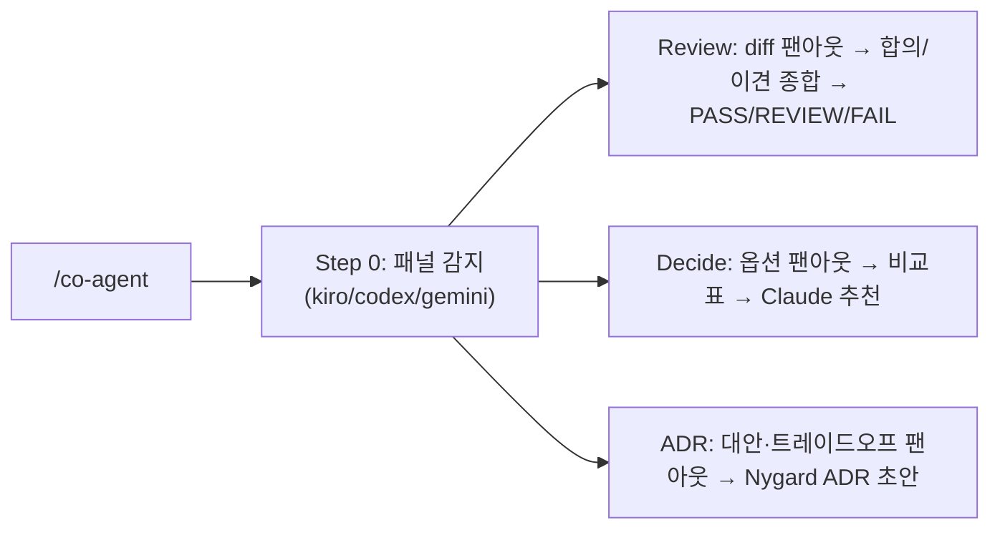

# co-agent 개요

co-agent는 **다른 AI 에이전트(Kiro CLI, Codex, Gemini)와 협업**해 second opinion을 받고, **Claude가 의장(chair)으로 최종 종합**하는 플러그인입니다. 세 가지 모드를 제공합니다: 멀티-AI 리뷰, 의사결정 보조, ADR 협업.

## 구성 요소

### 에이전트 (1개)

| 에이전트 | 설명 | 출력물 |
|----------|------|--------|
| `co-agent` | 멀티-AI 패널 의장 — 리뷰/의사결정/ADR 프롬프트를 외부 AI에 팬아웃하고 Claude가 종합 | 리뷰 보고서 / 의사결정표 / ADR |

### 스킬 (1개)

| 스킬 | 설명 |
|------|------|
| `co-agent` | 3-모드 멀티-AI 협업 (review · decide · adr) |

## 사전 요구사항 (선택적 — 있는 것만 사용)

외부 AI CLI 중 **설치된 것만** 패널로 활용합니다. 하나도 없으면 Claude 단독 수행 + 그 사실을 명시 (절대 hard-fail 안 함).

| AI | CLI | 비고 |
|----|-----|------|
| Kiro | `kiro-cli` | `KIRO_API_KEY` 필요 (Pro/Pro+/Power) |
| Codex | `codex` | `codex exec -s read-only` |
| Gemini | `gemini` | `gemini -p … -o text` |

## 세 가지 모드

| 모드 | 트리거 | 동작 |
|------|--------|------|
| **Review** | "코드/아키텍처 리뷰", "second opinion" | 같은 리뷰 프롬프트를 패널에 병렬 팬아웃 → Claude가 합의/이견 종합 + Well-Architected → PASS/REVIEW/FAIL |
| **Decide** | "잘 모르겠어", "의사결정", "help me decide" | 결정+옵션을 패널에 질의 → 비교표(옵션×AI) → Claude 단일 추천 + 결정 트레이드오프 |
| **ADR** | "ADR 협업" | 패널에서 대안·트레이드오프·리스크 수집 → Claude가 Nygard ADR 초안 (project-init `/add-adr` 연동) |

## 의장 원칙 (Chair Principle)

- 외부 AI는 **자문**, **Claude가 최종 결정·작성**.
- 핵심 포인트는 **출처 표기**("Gemini가 지적함"), **이견은 숨기지 않고 표면화**.
- CLI 누락/에러 → 해당 AI 스킵·기록 후 진행. 단일 AI에 차단되지 않음.
- 모든 AI에 **동일 프롬프트** → 답변 비교 가능.

## 판정 기준 (Review 모드)

| 판정 | 조건 | 결과 |
|------|------|------|
| **PASS** | CRITICAL 0개, HIGH ≤ 2개 | 통과 |
| **REVIEW** | CRITICAL 0개, HIGH ≥ 3개 | 수동 승인 필요 |
| **FAIL** | CRITICAL ≥ 1개 | 머지 차단 + 수정 권고 |

## Auto-Invocation 키워드

| 한국어 | English |
|--------|---------|
| 다른 AI 협업 | collaborate with other AI |
| 코드 리뷰 | code review |
| 잘 모르겠어 / 의사결정 | help me decide |
| ADR 협업 | co-author ADR |
| second opinion | second opinion |
