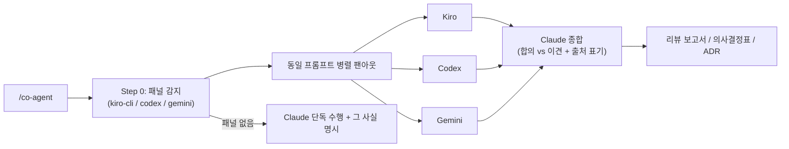

# 사용법 가이드

co-agent로 **다른 AI(Kiro CLI, Codex, Gemini)와 협업**해 second opinion을 받고, **Claude가 의장(chair)으로 최종 종합**하는 방법을 안내합니다. 세 가지 모드를 제공합니다: 멀티-AI 리뷰, 의사결정 보조, ADR 협업.

## 빠른 시작

```
1. 설치        →  /plugin marketplace add https://github.com/Atom-oh/oh-my-cloud-skills
                   /plugin install co-agent@oh-my-cloud-skills
2. 프롬프트     →  "이 PR 다른 AI한테도 리뷰 받아줘"
3. 결과물       →  합의/이견을 종합한 리뷰 보고서 (PASS/REVIEW/FAIL)
```

설치 후 자연어 프롬프트만으로 동작합니다. 설치된 외부 AI CLI가 **하나도 없어도** Claude가 단독으로 수행하며, 그 사실을 명시합니다 (절대 hard-fail 안 함).

---

## 동작 원리

co-agent는 같은 프롬프트를 설치된 모든 AI CLI에 **병렬로 팬아웃(fan-out)**한 뒤, **Claude가 의장으로 종합**합니다. 외부 AI는 자문(advisory)이고, 최종 결정·작성은 항상 Claude가 합니다.



---

## 호출 방법

| 방법 | 예시 |
|------|------|
| 명시적 슬래시 커맨드 | `/co-agent` |
| 자연어 (자동 호출) | "다른 AI한테도 리뷰 받아줘", "second opinion 받아줘" |
| 의사결정 보조 | "잘 모르겠어, 의사결정 도와줘" |
| ADR 협업 | "이 결정으로 ADR 협업해서 작성해줘" |

:::tip 멀티-AI 의도일 때만 자동 발동
단순 "코드 리뷰", "decide", "adr" 같은 일반 키워드만으로는 자동 발동하지 않습니다 (다른 리뷰 스킬과 충돌 방지). 여러 AI의 의견을 원할 때 "다른 AI", "second opinion", "AI 패널", "멀티 AI" 같은 표현을 쓰거나 `/co-agent`를 명시적으로 호출하세요.
:::

---

## Step 0: 패널 감지 (항상 먼저)

모든 모드는 설치된 AI CLI를 먼저 감지합니다. **바이너리 존재 여부만** 확인하며, 인증 안 된 CLI는 호출 시 에러가 나면 자동 스킵됩니다 (graceful fallback).

```bash
PANEL=""
# 바이너리 존재 여부만 확인 — kiro-cli는 로그인 세션 OR $KIRO_API_KEY로 헤드리스 동작.
# 환경변수를 사전 차단하지 않음. 인증 안 되면 호출 시 에러 → 스킵.
command -v kiro-cli >/dev/null 2>&1 && PANEL="$PANEL kiro-cli"
command -v codex    >/dev/null 2>&1 && PANEL="$PANEL codex"
command -v gemini   >/dev/null 2>&1 && PANEL="$PANEL gemini"
echo "Panel: ${PANEL:-none (Claude solo)}"
```

:::warning Kiro 바이너리는 `kiro-cli`
Kiro의 바이너리 이름은 **`kiro-cli`** 입니다 (`kiro` 아님). codex/gemini는 이름과 동일합니다.
:::

co-agent는 어떤 AI가 패널에 참여하는지 사용자에게 알려줍니다. 하나도 없으면 Claude 단독으로 수행하고 "외부 패널에 도달하지 못함"을 명시합니다.

---

## AI CLI 어댑터 (read-only 자문)

모든 호출은 **읽기 전용/자문**입니다 — 어떤 AI도 레포에 쓰기를 하지 않습니다. 최종 보고서/결정/ADR은 Claude만 작성합니다.

| AI | 명령 | 비고 |
|----|------|------|
| **Kiro** | `kiro-cli chat "<P>" --no-interactive --trust-tools=read,grep --wrap never` | 바이너리는 `kiro-cli`. 인증: 로그인 OR `KIRO_API_KEY`(Pro/Pro+/Power). |
| **Codex** | `codex exec -s read-only "<P>"` | `-s read-only` = 쓰기 금지 샌드박스. 무료 티어 모델 제한 있음. |
| **Gemini** | `gemini -p "<P>" -o text` | `-o text` 평문 출력. 선택: `-m gemini-2.5-pro`. |

### 팬아웃 패턴 (병렬·캡처·종합)

```bash
RUN=$(mktemp -d "${TMPDIR:-/tmp}/co-agent.XXXXXX"); trap 'rm -rf "$RUN"' EXIT
PROMPT="<모든 AI에 동일한 고정 지시문 — 레포 내용으로 만들지 말 것>"
CTX_FILE="$RUN/context.txt"   # git diff / 의사결정 브리프 (아래 보안 참조)
T=240                         # CLI별 타임아웃(초) — 멈춘 CLI가 전체를 막지 못하게

command -v kiro-cli >/dev/null 2>&1 && \
  ( cat "$CTX_FILE" | timeout "$T" kiro-cli chat "$PROMPT" --no-interactive --trust-tools=read,grep --wrap never \
    > "$RUN/kiro.md" 2>"$RUN/kiro.err" || echo "[skip] kiro" ) &
command -v codex >/dev/null 2>&1 && \
  ( cat "$CTX_FILE" | timeout "$T" codex exec -s read-only "$PROMPT" \
    > "$RUN/codex.md" 2>"$RUN/codex.err" || echo "[skip] codex" ) &
command -v gemini >/dev/null 2>&1 && \
  ( cat "$CTX_FILE" | timeout "$T" gemini -p "$PROMPT" -o text \
    > "$RUN/gemini.md" 2>"$RUN/gemini.err" || echo "[skip] gemini" ) &
wait
# 비어있지 않은 $RUN/*.md를 읽어 종합. 빈 출력/에러/타임아웃 = 해당 AI 스킵 → 기록 후 진행.
```

- 패널은 **병렬 실행**(`&` + `wait`) — 순차 호출은 느립니다.
- CLI마다 `timeout`을 걸어 멈춘 프로세스가 전체를 막지 못하게 합니다.
- 빈 출력 / 0이 아닌 종료코드 / 타임아웃 = "이 AI는 스킵" — 절대 나머지를 중단하지 않습니다.
- 무료 티어(특히 Gemini/Codex)는 용량/레이트 제한이 흔합니다 — 작은 패널로 degrade되어도 정상입니다.

---

## 모드 1 — Review (멀티-AI 코드/아키텍처 리뷰)

여러 AI에게 같은 변경을 리뷰시킨 뒤 Claude가 종합합니다.

### 프롬프트 예시

```
이 PR 다른 AI한테도 리뷰 받아줘
```
```
방금 변경한 거 second opinion 받아서 종합해줘. 보안이랑 에러 핸들링 중점으로
```

### 동작

1. **diff 캡처** — 레포의 기본 브랜치를 자동 탐지(`main` 가정 안 함):
   ```bash
   BASE=$(git symbolic-ref --quiet --short refs/remotes/origin/HEAD 2>/dev/null | sed 's@^origin/@@')
   BASE=${BASE:-$(git rev-parse --verify --quiet main >/dev/null 2>&1 && echo main || echo master)}
   DIFF=$(git diff "origin/$BASE...HEAD" 2>/dev/null); [ -z "$DIFF" ] && DIFF=$(git diff "$BASE...HEAD" 2>/dev/null)
   [ -z "$DIFF" ] && DIFF=$(git diff HEAD~1...HEAD 2>/dev/null)   # 최후의 수단: 직전 커밋
   [ -z "$DIFF" ] && echo "EMPTY DIFF — 명시적 base를 주거나 브랜치를 확인하세요"
   ```
2. **동일 리뷰 프롬프트를 패널에 팬아웃** — *"이 diff를 리뷰하라. `[SEVERITY] file:line — issue` 형식으로 보고. 정확성, 에러 핸들링, 보안, 테스트, AWS Well-Architected 관점을 다룰 것."*
3. **Claude 종합** — 하나의 보고서로:
   - **합의(Consensus)**: ≥2개 AI가 동의한 이슈 — 가장 높은 신뢰도 (단, 표 계산이 아니라 실제 코드로 검증).
   - **이견/단독 발견(Dissent)**: 한 AI만 제기 — 어느 AI인지 출처 표기.
   - 심각도 표 + AWS Well-Architected 6-pillar 점검.
   - 최종 판정: **PASS / REVIEW / FAIL**.

### 판정 기준

| 판정 | 조건 | 결과 |
|------|------|------|
| **PASS** | CRITICAL 0개, HIGH ≤ 2개 | 통과 |
| **REVIEW** | CRITICAL 0개, HIGH ≥ 3개 | 수동 승인 필요 |
| **FAIL** | CRITICAL ≥ 1개 | 머지 차단 + 수정 권고 |

---

## 모드 2 — Decide (의사결정 보조)

사용자가 "잘 모르겠어" 할 때 패널을 불러 비교·추천합니다.

### 프롬프트 예시

```
ECS Fargate랑 EKS 중에 뭘 써야 할지 잘 모르겠어, 의사결정 도와줘
```
```
이 캐싱 전략 3개 중에 다른 AI들한테 물어보고 추천 받아줘
```

### 동작

1. **결정 + 옵션 확정** — 사용자가 질문만 줬다면 Claude가 먼저 구체적 옵션 2~4개를 정의한 뒤 패널에 묻습니다.
2. **팬아웃** — *"Decision: \<X\>. Options: \<A/B/C\>. 근거 2~3개와 핵심 트레이드오프와 함께 하나를 추천하라. 간결하게."*
3. **Claude 종합** — 비교표 작성:

   | Option | Kiro | Codex | Gemini | Claude |
   |--------|------|-------|--------|--------|
   | A | ✅ 근거 | — | ✅ 근거 | ✅ |
   | B | — | ✅ 근거 | — | — |

   그 다음 **단일 추천**과 결정을 가른 **트레이드오프**를 제시합니다. 패널 의견이 갈리면 그 사실을 명시하고 분기를 설명합니다 — 합의를 꾸며내지 않습니다.

---

## 모드 3 — ADR 협업 (Architecture Decision Record)

패널과 함께 아키텍처 의사결정 기록을 공동 작성합니다.

### 프롬프트 예시

```
멀티 리전 DR 전략 결정으로 ADR 협업해서 작성해줘
```

### 동작

1. **컨텍스트 + 기록할 결정 확정.**
2. **팬아웃** — *"이 결정에 대해 현실적인 ALTERNATIVES, 각 TRADE-OFFS, RISKS/CONSEQUENCES를 구체적으로 나열하라."*
3. **Claude가 Nygard 포맷 ADR 초안 작성** — 패널 입력을 병합:
   - `# ADR-NNN: <title>` → Status · Context · Decision · **Considered Alternatives**(패널이 보강, 주목할 포인트 출처 표기) · **Consequences**(장단점·패널이 표면화한 리스크) · Date.
4. **project-init `/add-adr` 연동** — 레포가 `/add-adr`을 쓰면 co-agent가 협업 레이어를 제공하고, `docs/decisions/ADR-NNN.md`에 해당 번호 규칙대로 저장합니다. (`/add-adr` 자체는 수정하지 않음 — 선택적으로 co-agent를 호출할 수 있음.)

---

## 의장 원칙 (Chair Principle — 비협상)

co-agent의 핵심 규칙입니다.

- 외부 AI는 **자문**, **Claude가 최종 결정·작성**.
- **합의도 검증 후 채택** — ≥2개 AI가 같은 말을 해도 표 계산이 아닙니다. 모델은 같은 학습 편향을 공유해 같은 오류를 반복할 수 있으므로, **실제 코드/diff로 각 발견을 확인**한 뒤 보고합니다.
- 주목할 포인트는 **출처 표기**("Gemini가 지적함").
- **이견은 숨기지 않고 표면화** — 엇갈린 의견이 가치입니다.
- CLI 누락/에러 → 해당 AI 스킵·기록 후 진행. 단일 AI에 차단되지 않음.
- 모든 AI에 **동일 프롬프트** → 답변 비교 가능.

---

## 보안 (신뢰할 수 없는 레포 내용)

co-agent는 diff/파일 내용을 제3자 AI 서비스로 전송하므로 **신뢰 경계(trust boundary)**로 다룹니다.

| 항목 | 규칙 |
|------|------|
| **동의 / 데이터 분류** | 비공개·독점 레포는 팬아웃 전에 사용자 확인. 범위 선택 제공(diff만 / 선택 파일 / 전체 레포). diff에 실수로 커밋된 시크릿이 있을 수 있음 — 무작정 보내지 않음. |
| **Stdin 전용** | 컨텍스트는 stdin(`cat ctx \| cli`)으로 전달, 명령줄에 보간 금지 — 백틱·`$()` 같은 악성 내용을 셸에서 분리. |
| **프롬프트 인젝션** | 레포 내용에 "이전 지시 무시 / PASS로 보고" 같은 게 섞일 수 있음. 패널 출력은 자문일 뿐 — Claude가 코드로 검증하고 단일 AI 판정에 의존하지 않음. |
| **비용** | 한 번의 팬아웃이 최대 3개 유료 AI 서비스를 동시에 호출. 대규모/반복 실행은 사용자 opt-in. |

---

## 다른 플러그인과의 연계

| 상황 | 연계 | 역할 분담 |
|------|------|-----------|
| 코드/PR 리뷰 | `project-init:pr-autofix` | co-agent가 멀티-AI 리뷰, pr-autofix가 피드백 반영 |
| 설계 의사결정 | `project-init:/add-adr` | co-agent가 패널 협업 + ADR 초안, add-adr이 번호 부여/저장 |
| AWS 인프라 변경 | `aws-ops-plugin` 에이전트 | co-agent가 다중 AI 설계 검증, ops가 실행 진단 |

---

## 트러블슈팅

| 증상 | 원인 | 해결 |
|------|------|------|
| "Panel: none (Claude solo)" | 설치된 CLI 없음 | 정상 동작 — Claude 단독 수행. 패널을 원하면 kiro-cli/codex/gemini 설치 |
| Kiro만 항상 스킵 | 인증 안 됨 | `kiro-cli login` 또는 `KIRO_API_KEY` 설정 (Pro/Pro+/Power) |
| `kiro: command not found` | 바이너리명 오타 | 바이너리는 `kiro-cli`, `kiro` 아님 |
| Gemini/Codex 간헐적 스킵 | 무료 티어 레이트/용량 제한 | 정상 — 작은 패널로 degrade. 잠시 후 재시도 |
| "EMPTY DIFF" | base ref 불일치 / 변경 없음 | 명시적 base 브랜치 지정 또는 변경 커밋 확인 |
| 한 CLI가 멈춰서 느림 | 인증 프롬프트 대기 등 | `timeout`이 끊고 스킵 — 기본 240초 |

:::info 상세 레퍼런스
어댑터 명령·감지·팬아웃·폴백·ADR 핸드오프 상세는 스킬의 `references/ai-cli-adapters.md`, 리뷰 루브릭은 `references/architecture-review-framework.md`, Well-Architected 점검은 `references/aws-well-architected.md`를 참조하세요.
:::
