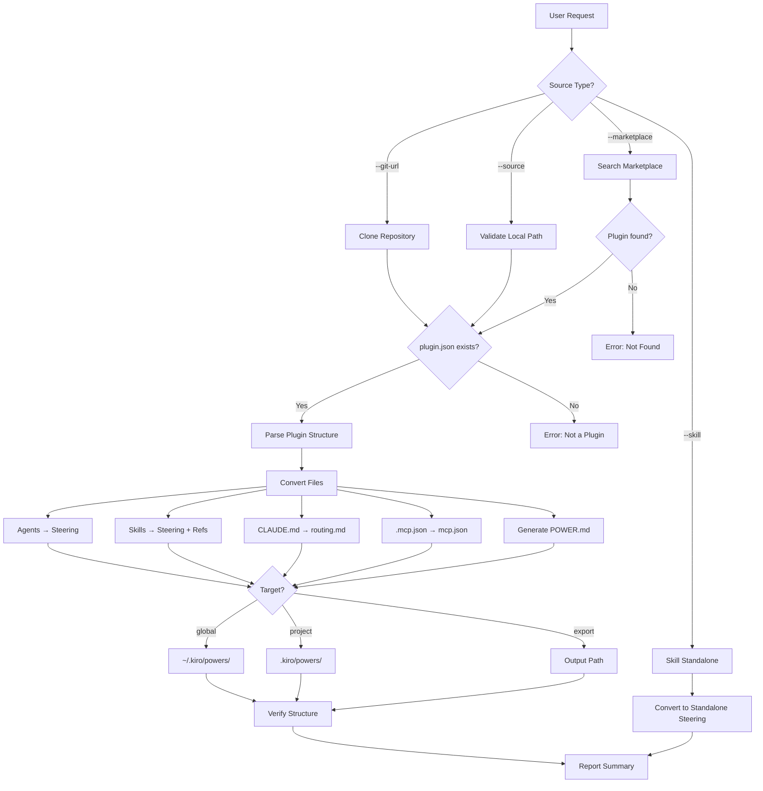

# Kiro Converter Agent

Claude Code 플러그인을 Kiro Power 포맷으로 변환하는 전문 에이전트입니다. 구조 변환, frontmatter 변환, MCP 설정 마이그레이션, 키워드 통합 등을 처리합니다.

:::info 비파괴적 변환
이 에이전트는 원본 Claude Code 플러그인을 절대 수정하거나 삭제하지 않습니다. Kiro Power 파일은 별도 위치에 생성되며, 두 포맷이 공존할 수 있습니다.
:::

## 기본 정보

| 항목 | 값 |
|------|-----|
| 이름 | `kiro-converter-agent` |
| 모델 | sonnet |
| 도구 | Read, Write, Glob, Grep, Bash, AskUserQuestion |

## 트리거 키워드

### 영어
- "convert to kiro"
- "kiro power"
- "kiro convert"
- "export to kiro"
- "claude to kiro"
- "install kiro power"
- "kiro install"

### 한국어
- "키로 변환"
- "키로 파워"
- "키로 설치"

## 핵심 기능

### 1. Multi-Source Input

다양한 소스에서 플러그인을 입력받습니다.

| 소스 타입 | 플래그 | 설명 |
|----------|--------|------|
| GitHub URL | `--git-url` | 원격 저장소 클론 (브랜치/태그 지정 가능) |
| 로컬 경로 | `--source` | 로컬 플러그인 디렉토리 |
| 마켓플레이스 | `--marketplace` | 플러그인 이름으로 검색 |
| 개별 스킬 | `--skill` | 단일 스킬 디렉토리만 변환 |

### 2. Format Conversion

Claude Code의 agent/skill 마크다운 파일을 Kiro steering 파일로 변환합니다.

| 소스 | 대상 | 주요 변경 |
|------|------|----------|
| `.claude-plugin/plugin.json` | `POWER.md` | name/description → frontmatter; 키워드 통합 |
| `CLAUDE.md` | `steering/routing.md` | `inclusion: always` frontmatter 추가 |
| `agents/*.md` | `steering/<agent>.md` | `tools`, `model` 제거; `inclusion: auto` 추가 |
| `skills/*/SKILL.md` | `steering/<skill>.md` | `triggers[]`를 description에 병합; `inclusion: auto` 추가 |
| `skills/*/references/*.md` | `steering/ref-*.md` | `inclusion: manual` frontmatter 추가 |
| `.mcp.json` | `mcp.json` | `type` 제거; `autoApprove`, `disabled` 추가 |

### 3. MCP Migration

`.mcp.json`을 Kiro 호환 `mcp.json`으로 변환합니다.

**변경 사항:**
- `type` 필드 제거 (Kiro는 `command`/`url` 존재 여부로 타입 추론)
- `autoApprove: []` 추가 (기본값: 빈 배열)
- `disabled: false` 추가 (기본값: false)

### 4. Keyword Aggregation

다양한 소스에서 키워드를 수집하여 `POWER.md`에 통합합니다.

**키워드 수집 소스:**
1. 플러그인 이름 (하이픈 및 공백 버전)
2. Agent description의 `Triggers on "..." requests` 패턴
3. Skill의 `triggers:` 배열
4. CLAUDE.md의 키워드 테이블

**처리:**
- 대소문자 보존 중복 제거
- 알파벳순 정렬
- 2자 미만 또는 50자 초과 항목 필터링

### 5. Large Asset Handling

10MB를 초과하는 디렉토리를 감지하고 특별 처리합니다.

**처리 방식:**
- 다운로드 스크립트 생성 (`scripts/download-assets.sh`)
- `.gitignore`에 해당 디렉토리 추가
- 대용량 파일을 power 출력에 복사하지 않음

### 6. Target Installation

세 가지 설치 대상을 지원합니다.

| 대상 | 경로 | 용도 |
|------|------|------|
| `global` | `~/.kiro/powers/<name>/` | 모든 Kiro 프로젝트에서 사용 |
| `project` | `.kiro/powers/<name>/` | 현재 프로젝트에서만 사용 |
| `export` | 사용자 지정 경로 | 공유 또는 수동 설치용 |

## 결정 트리



## 특수 케이스 처리

| 케이스 | 처리 방식 |
|--------|----------|
| `model: opus` 에이전트 | `model` 제거, description에 `(Advanced reasoning)` 추가 |
| 10MB 초과 디렉토리 | 다운로드 스크립트 생성, `.gitignore` 추가 |
| 한국어/영어 키워드 | 모든 언어 변형을 POWER.md keywords에 포함 |
| `.mcp.json` 없음 | `mcp.json` 생성 생략 |
| `{plugin-dir}/...` 경로 참조 | power-relative 경로로 변환 |

## 사용 예시

### GitHub URL에서 변환

```
convert https://github.com/atomoh/oh-my-cloud-skills plugins/aws-ops-plugin to kiro
```

### 로컬 플러그인 변환

```
키로 변환 ./plugins/aws-content-plugin
```

### 마켓플레이스 플러그인 변환

```
convert aws-ops-plugin to kiro power and install globally
```

## 출력 형식

변환 완료 후 다음과 같은 요약 리포트가 출력됩니다.

```
============================================================
  Kiro Power Conversion Complete
============================================================
  Source:       ./plugins/aws-ops-plugin
  Output:       /tmp/aws-ops-power
  Target:       export
============================================================
  Agents:       9
  Skills:       5
  References:   15
  MCP config:   Yes
============================================================

  Steering (agents):
    steering/eks-agent.md
    steering/network-agent.md
    ...

  Steering (skills):
    steering/ops-troubleshoot.md
    ...

  References:
    steering/ref-ops-troubleshoot-commands.md
    ...
```

## 참조 파일

- `references/kiro-power-format.md` - Kiro Power 디렉토리 구조 및 포맷 명세
- `references/conversion-rules.md` - 상세 변환 규칙 및 엣지 케이스 처리
