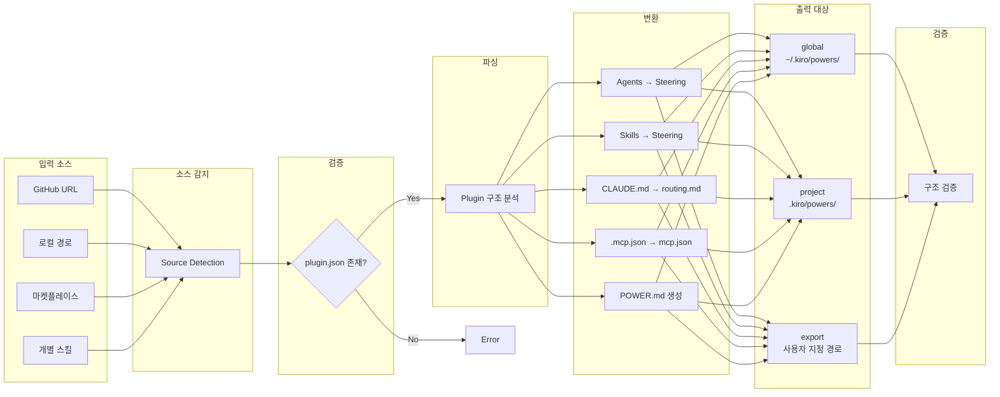

# Kiro Power Converter 개요

Kiro Power Converter는 Claude Code 플러그인을 Kiro Power 포맷으로 변환하는 도구입니다. GitHub URL, 로컬 경로, 마켓플레이스 이름, 개별 스킬 등 다양한 입력 소스를 지원하며, 변환된 결과물을 전역(global), 프로젝트(project), 또는 내보내기(export) 대상으로 출력할 수 있습니다.

:::warning 중요: 공존 모델 (Coexistence)
Kiro Power Converter는 **기존 Claude Code 플러그인을 절대 삭제하거나 수정하지 않습니다**. 변환 과정에서 원본 플러그인은 그대로 유지되며, Kiro Power 포맷의 새로운 파일들이 별도 위치에 생성됩니다.

**Claude Code와 Kiro는 공존합니다:**
- 동일한 프로젝트에서 Claude Code 플러그인과 Kiro Power를 동시에 사용할 수 있습니다
- 변환은 **추가(additive)** 작업이며, **대체(replacement)** 작업이 아닙니다
- 원본 `.claude-plugin/` 디렉토리는 변경되지 않습니다
:::

## 주요 기능

| 기능 | 설명 |
|------|------|
| Multi-Source Input | GitHub URL, 로컬 경로, 마켓플레이스, 개별 스킬 지원 |
| Format Conversion | Claude agent/skill 마크다운을 Kiro steering 파일로 변환 |
| MCP Migration | `.mcp.json`을 Kiro 호환 `mcp.json`으로 변환 |
| Keyword Aggregation | 모든 소스에서 트리거 키워드를 추출하여 `POWER.md`에 통합 |
| Large Asset Handling | 10MB 초과 디렉토리는 다운로드 스크립트 생성 |
| Target Installation | global, project, export 세 가지 설치 대상 지원 |

## 변환 워크플로우



## 지원하는 입력 소스

### GitHub URL

원격 Git 저장소에서 플러그인을 클론하여 변환합니다. 브랜치나 태그 지정이 가능하며, 저장소 내 특정 하위 디렉토리의 플러그인도 지정할 수 있습니다.

```bash
--git-url https://github.com/user/repo --plugin-path plugins/my-plugin
```

### 로컬 경로

로컬 파일 시스템에 존재하는 플러그인 디렉토리를 직접 지정합니다. `.claude-plugin/plugin.json` 파일이 존재해야 합니다.

```bash
--source ./plugins/aws-ops-plugin
```

### 마켓플레이스 이름

플러그인 이름으로 마켓플레이스를 검색하여 변환합니다. `plugins/` 및 `~/.claude/plugins/` 디렉토리에서 검색합니다.

```bash
--marketplace aws-ops-plugin
```

### 개별 스킬

플러그인 전체가 아닌 특정 스킬 디렉토리만 standalone steering 파일로 변환합니다.

```bash
--skill ./plugins/aws-ops-plugin/skills/ops-troubleshoot
```

## 지원하는 출력 대상

| 대상 | 경로 | 용도 |
|------|------|------|
| `global` | `~/.kiro/powers/<name>/` | 모든 Kiro 프로젝트에서 사용 |
| `project` | `.kiro/powers/<name>/` | 현재 프로젝트에서만 사용 |
| `export` | 사용자 지정 경로 | 공유 또는 수동 설치용 |

## Claude Code Plugin vs Kiro Power 비교

| 항목 | Claude Code Plugin | Kiro Power |
|------|-------------------|------------|
| 매니페스트 | `.claude-plugin/plugin.json` | `POWER.md` |
| Agent 포맷 | `agents/*.md` (tools/model 포함) | `steering/*.md` (inclusion 포함) |
| Skill 포맷 | `skills/*/SKILL.md` (triggers 포함) | `steering/*.md` (triggers가 description에 통합) |
| MCP 설정 | `.mcp.json` (type 필드 포함) | `mcp.json` (type 필드 없음) |
| 전역 설치 | `~/.claude/plugins/` | `~/.kiro/powers/` |
| 프로젝트 설치 | `.claude/plugins/` | `.kiro/powers/` |
| 활성화 방식 | description의 키워드 | frontmatter의 `inclusion` 타입 |

:::info Kiro Power란?
Kiro Power는 Kiro IDE를 위한 모듈형 기능 패키지입니다. Claude Code 플러그인과 유사한 개념이지만 다른 구조와 설정 포맷을 사용합니다. 자세한 내용은 [Kiro 공식 문서](https://kiro.dev)를 참조하세요.
:::

## 공존 아키텍처

Kiro Power Converter는 **비파괴적(non-destructive)** 변환 방식을 사용합니다:

```
프로젝트/
├── .claude-plugin/          # 원본 유지 (변경 없음)
│   └── plugin.json
├── CLAUDE.md                # 원본 유지 (변경 없음)
├── agents/                  # 원본 유지 (변경 없음)
├── skills/                  # 원본 유지 (변경 없음)
│
└── [변환 출력 위치]         # 새로 생성되는 Kiro Power 파일
    ├── POWER.md
    ├── mcp.json
    └── steering/
```

변환 출력 위치는 `--target` 옵션에 따라 결정됩니다:
- `global`: `~/.kiro/powers/<name>/` (원본 프로젝트 외부)
- `project`: `.kiro/powers/<name>/` (원본과 별도 디렉토리)
- `export`: 사용자 지정 경로 (원본과 완전히 분리)
