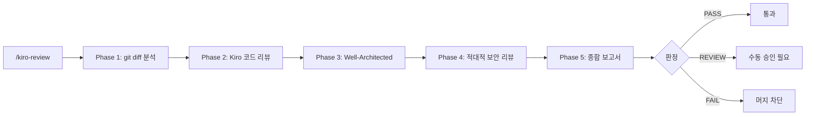

# Kiro Review 개요

Kiro Review는 Kiro CLI를 활용한 종합 아키텍처 심층 리뷰 플러그인입니다. 코드 리뷰, 적대적 보안 감사, AWS Well-Architected 평가, Spec-driven 설계 검증을 제공합니다.

## 구성 요소

### 에이전트 (1개)

| 에이전트 | 설명 | 출력물 |
|----------|------|--------|
| `kiro-review-agent` | 종합 아키텍처 심층 리뷰 (코드 + 보안 + WAF + Spec) | 리뷰 보고서 |

### 스킬 (1개)

| 스킬 | 설명 |
|------|------|
| `kiro-review` | Kiro CLI 기반 5-Phase 종합 리뷰 워크플로우 |

## 사전 요구사항

- `kiro-cli-plugin` 설치 필요

```bash
/plugin marketplace add https://github.com/whchoi98/kiro-cli-plugin
```

## 워크플로우



### 5-Phase 상세

| Phase | 이름 | 방식 | 설명 |
|-------|------|------|------|
| 1 | 코드 변경 분석 | 자체 | git diff 기반 변경 범위 파악, 파일 타입별 리뷰 초점 분류 |
| 2 | 코드 리뷰 | Kiro CLI 위임 | `/kiro-cli:review`로 일반 코드 리뷰 위임 |
| 3 | Well-Architected | 자체 | 6개 필러 (운영, 보안, 안정성, 성능, 비용, 지속가능성) 평가 |
| 4 | 적대적 보안 | Kiro CLI 위임 | `/kiro-cli:review --adversarial` OWASP Top 10 + AWS 특화 |
| 5 | 종합 보고서 | 자체 | PASS / REVIEW / FAIL 판정 |

## 판정 기준

| 판정 | 조건 | 결과 |
|------|------|------|
| **PASS** | CRITICAL 0개, HIGH < 3개 | 통과 |
| **REVIEW** | CRITICAL 0개, HIGH ≥ 3개 | 수동 승인 필요 |
| **FAIL** | CRITICAL ≥ 1개 | 머지 차단 + 수정 권고 |

## Auto-Invocation 키워드

| 한국어 | English |
|--------|---------|
| 아키텍처 리뷰 | architecture review |
| 심층 리뷰 | deep review |
| 코드 리뷰 | code review |
| 적대적 리뷰 | adversarial review |
| 보안 리뷰 | security review |
| 설계 검증 | design validation |
