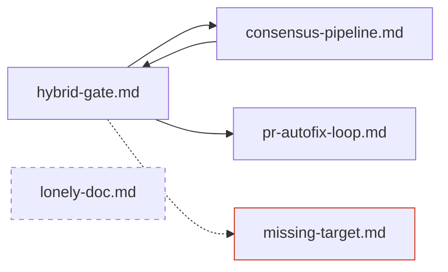

# atlas: graph

Render the wiki's navigation graph — the frontmatter `related:` edges between docs —
and report the two things that degrade it: broken links (an edge to a doc that does
not exist) and orphans (a doc no other doc points at).

Resolve paths first:

```bash
SK="${CLAUDE_PLUGIN_ROOT}/skills/atlas/scripts"
ROOT="$(git rev-parse --show-toplevel)"
```

`--root` takes the REPOSITORY root, never the wiki directory (the scripts derive the
wiki directory from config). Always pass `--root "$ROOT"`.

## Step 1: Collect the data

```bash
python3 "$SK/atlas_index.py" --list --root "$ROOT"
python3 "$SK/atlas_index.py" --validate --root "$ROOT"
```

`--list` prints one JSON object per doc, one per line — read `relpath`, `title`,
`description`, and `related` from each to build the node and edge sets.

`--validate` is the one atlas entry point that exits **1** on problems — it exists to
be a gate, so do not treat its non-zero exit as a script failure. Its output uses two
prefixes with different weights:

- `error:` — a hard problem (schema break, or a `related` edge whose target doc does
  not exist). These block the sync commit and must be fixed.
- `advisory:` — an orphan: no other doc lists it in `related`. Advisory, not a hard
  error — a fresh or single-doc wiki legitimately has orphans, and forcing fake edges
  to silence the advisory would be worse than the orphan.

Keep that distinction in your report; a user needs to know which kind they have.

## Step 2: Render the Mermaid graph

Emit one node per doc (labelled with its relpath) and one directed edge per `related`
entry. Mark broken-edge targets and orphan nodes visibly. Shape:



Conventions: a solid arrow is a resolving `related` edge; a dotted arrow ending at a
red node is a broken link (the target has no doc); a dashed-border node with no
inbound arrows is an orphan. Sanitize node ids if a relpath contains characters
Mermaid rejects (subdirectory slashes are the common case — map `sub/deep.md` to an
id like `sub_deep_md` and keep the real relpath as the label).

## Step 3: Report

After the diagram, a text summary:

1. **Counts** — docs, edges, broken links, orphans.
2. **Broken links** — one line each: `error:` source doc, missing target. Suggest the
   likely fix (typo in the relpath, or a doc renamed without updating siblings).
3. **Orphans** — one line each, flagged as advisory. Suggest which existing doc could
   plausibly gain a `related` edge to it, but only where a real relationship exists.
4. **Schema errors**, if `--validate` printed any `error:` lines about frontmatter —
   these docs are also invisible to drift detection until fixed, which is the more
   urgent consequence.

This command's own `allowed-tools` (`Read, Bash`) is deliberately read-only — it
reports the graph, it does not edit it. If the user asks to fix a broken link or add an
edge on an EXISTING doc, that's a direct frontmatter edit (`Read` + `Edit` the doc's
`related` list, outside this command's own restricted tool set) followed by
`atlas_index.py --write` to regenerate the INDEX — not a job for `/atlas:add-doc`, which
creates a brand-new page (its Step 3 touching a sibling's `related` list is a side
effect of adding that new page, not a general link-repair entry point). Only route to
`/atlas:add-doc` when the actual ask is a new page.
