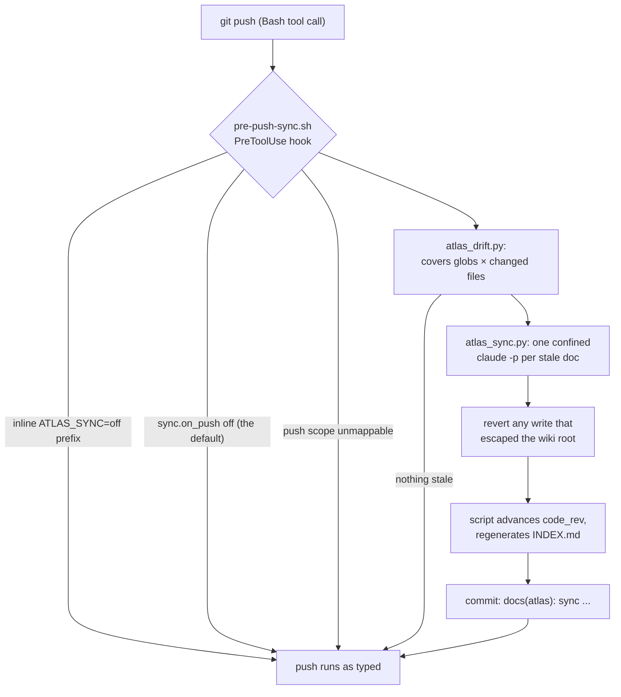

# atlas — a repo wiki that stays true to the code

Cramming detail into `CLAUDE.md` blows up per-session context; scattering it into
`docs/` makes it unfindable. `atlas` keeps per-topic markdown under a wiki root
(default `docs/atlas/`), each page carrying frontmatter that lets a session judge
relevance from `INDEX.md` alone: `description` for selection, `covers` globs for
territory, `related` for graph navigation, and `code_rev` as the drift anchor. A doc
is stale exactly when a file matching one of its `covers` globs changed between its
`code_rev` and `HEAD` — an O(changed files × docs) git computation with no LLM pass,
cheap enough to run on every push.

> Field-by-field schema and verified glob semantics: `references/frontmatter-schema.md`.
> The skeletons the init and add-doc commands write: `references/atlas-templates.md`.
> The full safety argument for the unattended fixer: `references/headless-sync.md`.

## Commands

| Command | What it does | Backed by |
|---------|--------------|-----------|
| `/atlas:init` | Scan the repo, propose a doc set for approval, write skeletons, generate `INDEX.md`, offer to enable push-time sync | `atlas_index.py --write` |
| `/atlas:sync` | Detect drift on demand and run the auto-fix (start with `--dry-run`) | `atlas_drift.py`, `atlas_sync.py` |
| `/atlas:add-doc` | Add one doc skeleton with pre-filled frontmatter, refresh the index | `atlas_index.py --write` |
| `/atlas:graph` | Mermaid view of `related` edges; report orphans and broken links | `atlas_index.py --validate`, `--list` |
| `/atlas:configure` | Inspect or change `root` and the `sync.*` settings | `atlas_config.py` |

## The frontmatter that drives it

```yaml
---
title: co-agent hybrid gate
description: How the hybrid gate fans out finders, triages, and closes verify rounds.
covers: ["plugins/co-agent/skills/co-agent/references/hybrid-gate.md", "plugins/co-agent/**/scripts/gate_*.py"]
related: [consensus-pipeline.md, pr-autofix-loop.md]
code_rev: 566db30
updated: 2026-08-19
---
```

`covers` globs are matched so `*` stops at a path separator and `**` spans them —
`docs/atlas/*.md` does not match `docs/atlas/sub/deep.md`. A doc with a schema error,
empty `covers`, or an unresolvable `code_rev` is skipped with a stderr advisory, never
silently treated as fresh. Full field reference: `references/frontmatter-schema.md`.

## Workflow

The push-time path, end to end. Every early exit is fail-open: the push proceeds
untouched, with at most a stderr advisory.



The commit created in the last step is picked up by the `git push` that then runs —
that is why the hook point is `PreToolUse(Bash)` and not a git-native `pre-push` hook,
which fires after the pushed ref list is already computed. Pushes typed directly in a
terminal are not intercepted; that coverage gap is accepted by design.

## Running the scripts directly

All five scripts (`atlas_config.py`, `atlas_index.py`, `atlas_drift.py`,
`atlas_sync.py`, `hook_match.py`) live under this skill's `scripts/` directory.
On the four that take one, **`--root DIR` means the repository root, not the wiki
root** — the wiki root is derived as `<repo root>/<config root>` (default
`docs/atlas`). Omit the flag and each script resolves the repo root itself via
`git rev-parse --show-toplevel`.

```bash
# detect stale docs: every doc's OWN code_rev..HEAD, never a push-range subset
# (read-only, always exit 0)
python3 "${CLAUDE_PLUGIN_ROOT}/skills/atlas/scripts/atlas_drift.py" --json

# preview a sync: prints per-doc what WOULD be sent; spawns no `claude` process and
# writes nothing (it still runs a few read-only `git` calls to compute the preview)
python3 "${CLAUDE_PLUGIN_ROOT}/skills/atlas/scripts/atlas_sync.py" --dry-run

# schema + graph check — the ONE gate in the plugin: exits 1 on any problem
python3 "${CLAUDE_PLUGIN_ROOT}/skills/atlas/scripts/atlas_index.py" --validate

# regenerate the INDEX table between its AUTO-MANAGED markers
python3 "${CLAUDE_PLUGIN_ROOT}/skills/atlas/scripts/atlas_index.py" --write

# opt in to push-time auto-fix — this IS the consent (see the next section)
python3 "${CLAUDE_PLUGIN_ROOT}/skills/atlas/scripts/atlas_config.py" set sync on_push on
```

An explicit `--range A..B` on `atlas_drift.py` or `atlas_sync.py` overrides which ref
counts as "now" — only the right-hand side (`B`) is used; each doc always uses its OWN
`code_rev` as the left bound, never a shared one, because gating on a shared range used
to let real drift go permanently unreviewed once some other covered file advanced the
same doc's anchor. Omit the flag to use literal `HEAD`.
`atlas_config.py show` prints the effective merged settings and their source.

## Consent and fail-open

- `sync.on_push` defaults to **false**. Turning it on sends the diff of each stale
  doc's covered files to Anthropic on every push — the toggle is the consent, and a
  git-tracked `.claude/atlas.local.json` cannot flip it (the key is dropped from any
  tracked or symlink-aliased override; the other keys still apply).
- Skip one push inline: `ATLAS_SYNC=off git push ...`.
- Everything in the push path exits 0 on failure — missing `claude` binary, timeout,
  unresolvable range, nested re-entry, internal error — with a stderr advisory. Only
  `atlas_index.py --validate` is allowed to exit non-zero, because it exists to gate.
- The headless fixer runs with `--allowedTools Read,Grep,Glob,Edit` and an explicit
  deny list; the actual enforcement is a `--settings` `PreToolUse` hook that confines
  `Edit`, `Read`, `Grep`, AND `Glob` alike to the wiki root by realpath (a post-hoc
  git-based scan runs too, as defense-in-depth for the write side, but can't see a
  write to an existing gitignored file or a path outside the git working tree at all
  — `references/headless-sync.md`).

## Output

- Zero stale docs: no output at all, exit 0 — the everyday case.
- A successful sync prints `atlas-sync: synced <doc>` per repaired doc on stdout and
  ends with `atlas-sync: committed: docs(atlas): sync <doc relpaths> to <short sha>`.
- Skips and failures go to stderr as one-line advisories naming the doc and reason
  (schema errors, empty `covers`, unresolvable `code_rev`, uncommitted local edits,
  timeout, out-of-root writes reverted).
- `--json` on `atlas_drift.py` emits one work packet per stale doc per line
  (`doc`, `doc_path`, `code_rev`, `head`, `matched`, `range`); on `atlas_sync.py` it
  emits one status object per doc (`doc`, `status`, `reason`).

## References

- `references/frontmatter-schema.md` — every frontmatter field, what breaks when it
  is wrong, verified glob-matching semantics, and why `code_rev` anchors the mechanic
- `references/atlas-templates.md` — the doc and `INDEX.md` skeletons, plus guidance
  for drafting `covers` globs without silent gaps or unowned overlap
- `references/headless-sync.md` — the literal headless invocation, why deny beats
  allow, write confinement, prompt injection, and the fail-open contract
