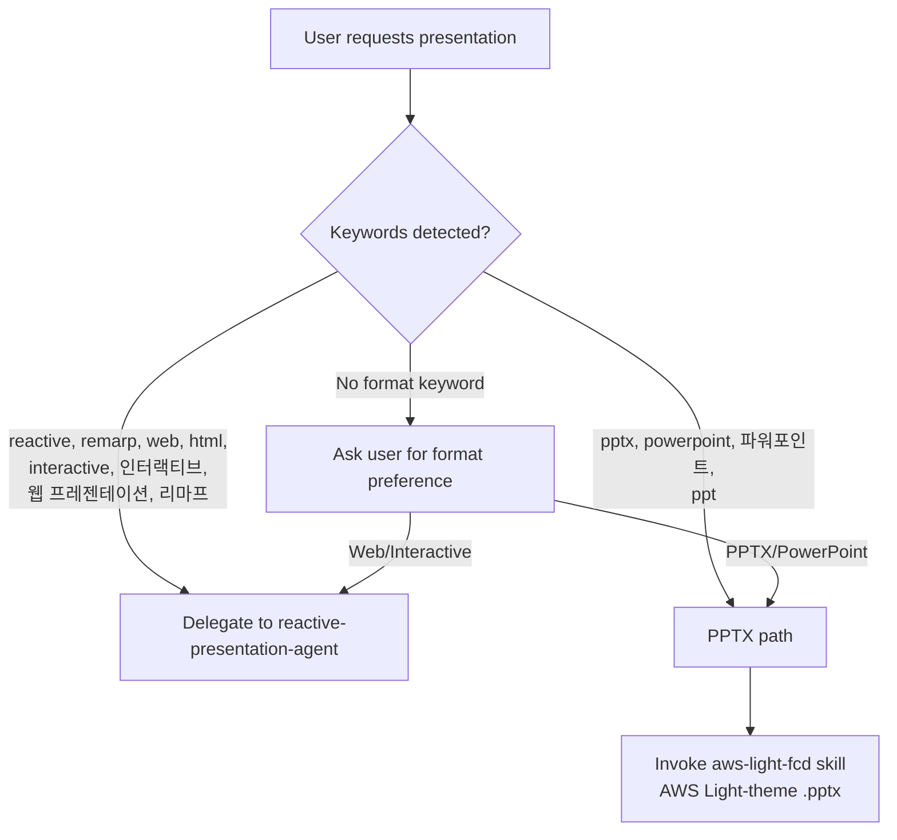

# Presentation Agent (Dispatcher)

A lightweight dispatcher that determines the presentation format and routes to the appropriate specialist agent.

---

## Routing Logic

```mermaid
graph TD
    A[User requests presentation] --> B{Keywords detected?}
    B -->|reactive, remarp, web, html,<br/>interactive, 인터랙티브,<br/>웹 프레젠테이션, 리마프| C[Delegate to reactive-presentation-agent]
    B -->|pptx, powerpoint, 파워포인트,<br/>ppt| D[PPTX path]
    B -->|No format keyword| E[Ask user for format preference]
    E -->|Web/Interactive| C
    E -->|PPTX/PowerPoint| D
    D --> G[Invoke aws-light-fcd skill<br/>AWS Light-theme .pptx]
```

---

## Step 1: Keyword Detection

Scan the user's request for format-specific keywords:

### Web/Interactive keywords (immediate delegation)
- English: "reactive", "remarp", "web", "html", "interactive", "web-based", "browser", "canvas animation"
- Korean: "인터랙티브", "웹 프레젠테이션", "웹 슬라이드", "리마프", "HTML 슬라이드"

If any web/interactive keyword is detected, **immediately delegate** to `reactive-presentation-agent` without asking further questions.

### PPTX keywords (PPTX path)
- English: "pptx", "powerpoint", "ppt", "office", "download as file"
- Korean: "파워포인트", "PPT", "피피티"

If PPTX keyword is detected, proceed to Step 3 (PPTX path).

---

## Step 2: Ask Format Preference

If no format keyword is detected, ask the user:

> Please choose a presentation format:
>
> 1. **Web-based interactive** — an HTML presentation that runs in the browser. Supports interactive elements like Canvas animations, quizzes, and tab switching. Deployable immediately via GitHub Pages.
> 2. **PPTX (PowerPoint)** — a downloadable .pptx file. Suited to offline presentations and internal sharing.
>
> (Choose 1 or 2, or describe your preference)

- **Option 1 (Web)** → delegate to `reactive-presentation-agent`
- **Option 2 (PPTX)** → proceed to Step 3

---

## Step 3: PPTX Path → `aws-light-fcd` skill

Native PowerPoint decks are produced by the **`aws-light-fcd` skill** (bundled in this
plugin). Don't hand-roll `python-pptx` — invoke the skill, which builds polished AWS
Light-theme `.pptx` files via PptxGenJS with a validated design system (Pretendard
typography, 11 layout builders, AWS architecture-diagram kit, and the shared 811-icon
library), then embeds fonts so the deck renders identically everywhere.

> Proceeding with PPTX (PowerPoint). Using the `aws-light-fcd` skill to generate an AWS Light-theme .pptx deck.

To proceed, **invoke the `aws-light-fcd` skill** and pass through the user's request
(topic/source doc, language, presenter, rough slide count). The skill handles layout
selection, build, QA rendering, and font embedding.

> Fallback: only if `aws-light-fcd` is unavailable, fall back to basic `python-pptx`
> generation (title slide, content slides, section headers).

---

## Delegation Protocol

When delegating to `reactive-presentation-agent`:
- Pass through the user's original request unchanged
- Do not re-ask questions that the specialist agent will ask
- Simply state: "Proceeding with the web-based interactive presentation." and invoke the agent
