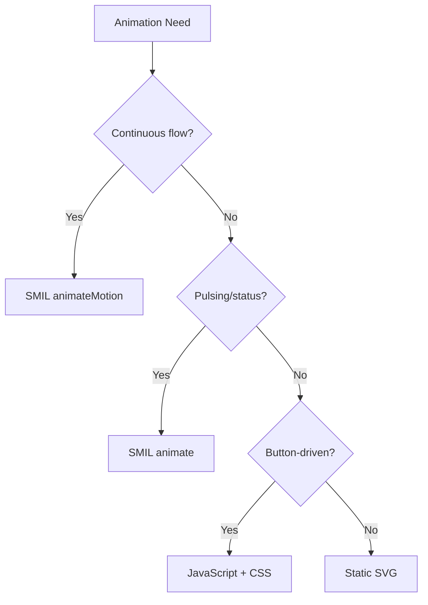

# Animated Diagram Skill

Create dynamic animated diagrams using SVG with SMIL animations. Produces self-contained HTML files with traffic flow visualizations, pulsing effects, interactive legends, and responsive scaling.

## When to Use

- Traffic flow visualization (request paths through AWS services)
- Service interaction diagrams with animated connections
- Deployment pipelines with step-by-step animation
- Real-time monitoring dashboards with animated status indicators
- **Interactive scenarios** — Scaling (EKS, ASG), Blue/Green deployment, failover simulations with button-driven state transitions

## Architecture

Each animated diagram is a self-contained HTML file with three layers:

1. **Background Layer** — Static architecture (Draw.io PNG export or inline SVG)
2. **Animation Layer** — SVG overlay with SMIL `<animateMotion>` and `<animate>` elements
3. **Interactive Layer** — JavaScript legend toggles for animation groups

## Color Standards

| Traffic Type | Color | Hex |
|-------------|-------|-----|
| Outbound | Red | `#DD344C` |
| Inbound | Blue | `#147EBA` |
| AWS Internal | Orange | `#FF9900` |
| Success/Active | Green | `#1B660F` |
| Warning | Yellow | `#F2C94C` |
| Background | Squid Ink | `#232F3E` |

## Quick Start

1. Create static architecture with architecture-diagram-agent (or inline SVG)
2. Define traffic paths as orthogonal SVG `<path>` elements
3. Add animated dots using `<animateMotion>` following the paths
4. Add pulsing effects on key nodes using `<animate>`
5. Wrap in responsive HTML with interactive legend

## Templates

- `templates/traffic-flow.html` — SMIL traffic flow template with legend toggles
- `templates/interactive-scaling.html` — Interactive EKS hybrid node bursting with Scale Out/In buttons (JavaScript + CSS transitions)

## SMIL Animation Example

Minimal traffic flow with animated dot following a path:

```html
<svg viewBox="0 0 400 200" xmlns="http://www.w3.org/2000/svg">
  <!-- Traffic path (ALB → Lambda → DynamoDB) -->
  <path id="flow1" d="M50,100 H150 V50 H300"
        fill="none" stroke="#FF9900" stroke-width="2" stroke-dasharray="5,3"/>

  <!-- Animated dot following path -->
  <circle r="6" fill="#147EBA">
    <animateMotion dur="3s" repeatCount="indefinite">
      <mpath href="#flow1"/>
    </animateMotion>
  </circle>

  <!-- Pulsing status indicator -->
  <circle cx="300" cy="50" r="10" fill="#1B660F">
    <animate attributeName="opacity" values="1;0.4;1" dur="1.5s" repeatCount="indefinite"/>
  </circle>
</svg>
```

## Interactive Scenario Example

Button-driven state machine for scaling scenarios:

```javascript
const states = { idle: 0, scalingOut: 1, scaled: 2, scalingIn: 3 };
let current = states.idle;

document.getElementById('scaleOut').onclick = () => {
  if (current === states.idle) {
    current = states.scalingOut;
    animateScaleOut().then(() => current = states.scaled);
  }
};
```

## Decision Tree



## Quick Start Commands

```bash
# Open animation in default browser
open animation.html

# Serve locally for development
python3 -m http.server 8080
# Then visit http://localhost:8080/animation.html
```

## Quality Review (필수 — 생략 불가)

콘텐츠 완성 후 배포/완료 선언 전에 반드시:
1. content-review-agent 호출 → `review content at [파일경로]`
2. FAIL/REVIEW 판정 시 수정 후 재리뷰 (최대 3회)
3. PASS (≥85점) 획득 후에만 완료 선언

> ⚠️ 이 단계를 건너뛰고 완료를 선언하는 것은 금지됩니다.

## Diagram Types

| Type | Technique | When to Use |
|------|-----------|-------------|
| **Traffic Flow** | SMIL `<animateMotion>` | Continuous request/data flow visualization |
| **Pulsing Status** | SMIL `<animate>` | Monitoring dashboards, health indicators |
| **Interactive Scenario** | JavaScript + CSS | Button-driven scaling, deployment, failover |

For interactive scenarios, the agent uses JavaScript-based state machines with `requestAnimationFrame` and CSS transitions instead of SMIL. See the agent definition for the full Interactive Animation Pattern guide.

## References

- `references/smil-animation-guide.md` — SMIL animation syntax and patterns
- `references/aws-diagram-patterns.md` — AWS architecture color coding and layout conventions
