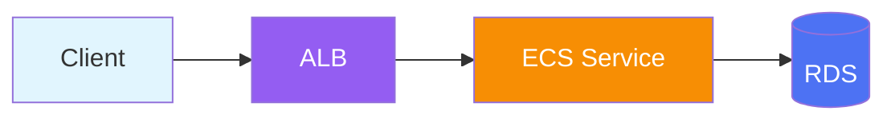

# GitBook Component Patterns

Ready-to-use patterns for GitBook's rich content components.

---

## Hints (Callouts)

Four styles available:

```markdown

**Tip**: General information or helpful tip.



**Done**: Confirmation that an action succeeded.



**Warning**: Something to be cautious about.



**Critical**: Breaking change or security concern.

```

---

## Tabs

Group related content into switchable tabs:

```markdown


```bash
sudo apt install kubectl
curl -LO https://dl.k8s.io/release/stable.txt
```



```bash
brew install kubectl
```



```powershell
choco install kubernetes-cli
```


```

---

## Code Blocks

### Basic

````markdown
```yaml
apiVersion: v1
kind: Service
metadata:
  name: my-service
```
````

### With Title and Line Numbers

```markdown

```yaml
apiVersion: apps/v1
kind: Deployment
metadata:
  name: web-app
spec:
  replicas: 3
```

```

### With Highlighted Lines

```markdown

```yaml
apiVersion: v1
kind: ConfigMap
metadata:
  name: app-config    # This line is important
data:
  key: value
```

```

---

## Images

### Standard

```markdown

```

### With Caption

```markdown
<figure><figcaption><p>Figure 1: System Architecture Overview</p></figcaption></figure>
```

### Sized Image

```markdown
<figure><figcaption><p>Monitoring Dashboard</p></figcaption></figure>
```

---

## Expandable Sections

```markdown
<details>
<summary>Advanced Configuration Options</summary>

You can configure additional parameters:

| Parameter | Default | Description |
|-----------|---------|-------------|
| `timeout` | `30s` | Request timeout |
| `retries` | `3` | Max retry attempts |

</details>
```

---

## Embedded Content

### Files (Downloadable)

```markdown

Download the CloudFormation template

```

### Videos

```markdown

Demo walkthrough video

```

### External Pages

```markdown

AWS Lambda Documentation

```

---

## Tables

### Standard

```markdown
| Service | Purpose | Cost Model |
|---------|---------|------------|
| Lambda | Compute | Per-invocation |
| S3 | Storage | Per-GB stored |
| DynamoDB | Database | Per-RCU/WCU |
```

### With Alignment

```markdown
| Left | Center | Right |
|:-----|:------:|------:|
| Text | Text | 100 |
| Text | Text | 200 |
```

---

## Diagrams

### Embed Draw.io PNG (Static)

```markdown

```

### Embed Animated SVG (Interactive)

For animated diagrams created by animated-diagram-agent, use an iframe:

```html
<iframe src="../.gitbook/assets/traffic-flow.html" width="100%" height="500" frameborder="0" style="border-radius: 8px; border: 1px solid #3d4f5f;"></iframe>
```

### Mermaid (Inline)

GitBook supports Mermaid diagrams natively:

````markdown

````

---

## Page Templates

### Overview Page

```markdown
---
description: High-level overview of the system architecture
---

# Architecture Overview

## Context

Brief description of the system and its purpose.


This architecture supports up to 10,000 concurrent users.


## Components


| Component | Service | Purpose |
|-----------|---------|---------|
| Frontend | CloudFront + S3 | Static hosting |
| API | API Gateway + Lambda | REST API |
| Database | DynamoDB | Data storage |

## Data Flow

1. User requests are routed through CloudFront
2. API calls are handled by API Gateway
3. Lambda functions process business logic
4. Data is persisted in DynamoDB

## Next Steps

* [Component Details](components.md)
* [Deployment Guide](../operations/deployment.md)
```

### How-To Page

```markdown
# Deploy to Production

## Prerequisites

* AWS CLI configured
* Terraform installed (v1.5+)
* Access to the production AWS account

## Steps

### 1. Initialize Terraform

```bash
cd infrastructure/
terraform init
```

### 2. Review Plan

```bash
terraform plan -var-file=prod.tfvars
```


Always review the plan before applying to production.


### 3. Apply Changes

```bash
terraform apply -var-file=prod.tfvars
```

### 4. Verify Deployment

```bash
aws ecs list-services --cluster production
```

## Troubleshooting

<details>
<summary>Terraform state lock error</summary>

If you get a state lock error, check if another deployment is in progress:

```bash
terraform force-unlock <LOCK_ID>
```

</details>
```
