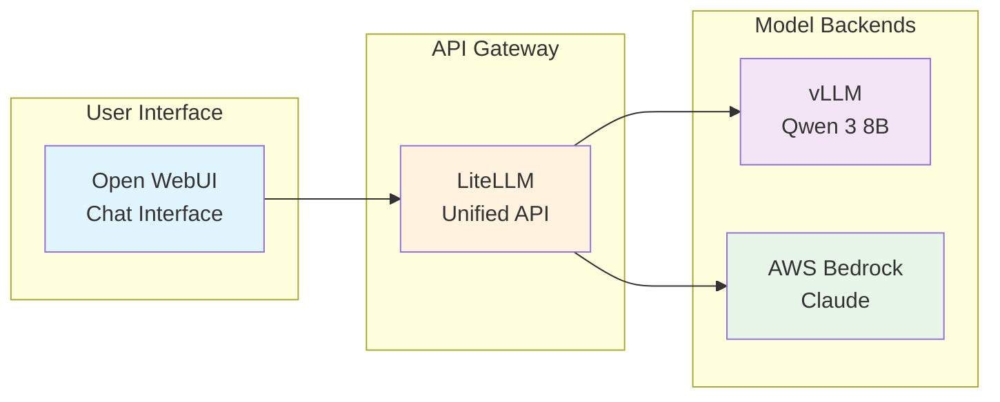
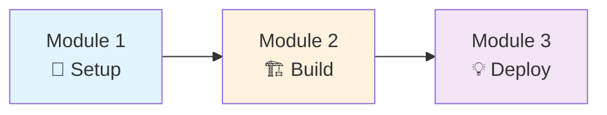
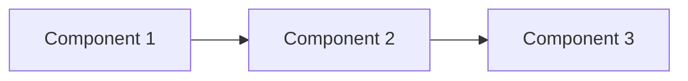

# Workshop Creator Skill

AWS Workshop Studio 형식의 워크샵 프로젝트를 생성하고 콘텐츠를 작성하는 스킬입니다.

---

## Usage

```bash
/workshop-creator [command] [options]
```

### Commands

| Command | Description | Example |
|---------|-------------|---------|
| `init` | 새 워크샵 프로젝트 초기화 | `/workshop-creator init my-workshop` |
| `add-module` | 모듈 추가 | `/workshop-creator add-module --title "EKS 설정"` |
| `add-lab` | 랩 추가 | `/workshop-creator add-lab --module 030 --title "클러스터 생성"` |
| `translate` | 번역 (ko↔en) | `/workshop-creator translate --from ko --to en` |
| `validate` | 구조 검증 | `/workshop-creator validate` |

---

## Workshop Structure

### Directory Layout

```
workshop-name/
├── contentspec.yaml              # Workshop Studio 설정
├── content/                      # 워크샵 콘텐츠
│   ├── index.ko.md              # 홈페이지 (한국어)
│   ├── index.en.md              # 홈페이지 (영어)
│   ├── introduction/            # 소개
│   │   ├── index.ko.md
│   │   ├── index.en.md
│   │   └── getting-started/
│   │       └── index.en.md
│   ├── module1-topic/           # 모듈 1
│   │   ├── index.ko.md          # 모듈 인덱스
│   │   ├── index.en.md
│   │   ├── subtopic1/
│   │   │   └── index.en.md
│   │   └── subtopic2/
│   │       └── index.en.md
│   └── summary/                 # 요약
│       └── index.en.md
├── static/                      # 정적 파일
│   ├── images/
│   │   ├── module-1/           # 모듈별 이미지
│   │   └── diagrams/
│   ├── code/                   # 코드 샘플
│   └── iam-policy.json         # IAM 정책
└── assets/                     # S3 에셋
```

### Naming Conventions

| Item | Pattern | Example |
|------|---------|---------|
| 모듈 폴더 | `moduleN-topic` | `module1-interacting-with-models` |
| 서브 폴더 | `topic-name` | `getting-started`, `vllm`, `bedrock` |
| 파일 (한국어) | `name.ko.md` | `index.ko.md` |
| 파일 (영어) | `name.en.md` | `index.en.md` |
| 이미지 | `/static/images/module-N/name.png` | `/static/images/module-1/logs.png` |

---

## Front Matter (Required)

```yaml
---
title: "페이지 제목"
weight: 10
---
```

| 속성 | 타입 | 필수 | 기본값 | 설명 |
|------|------|------|--------|------|
| `title` | string | **필수** | - | 페이지 제목 (네비게이션에 표시) |
| `weight` | number | 선택 | - | 정렬 순서 (낮을수록 먼저 표시) |
| `hidden` | boolean | 선택 | `false` | `true`면 네비게이션에서 숨김 |

> ⚠️ **주의**: `chapter` 속성은 Workshop Studio에서 지원하지 않습니다. 사용하지 마세요.

상세 내용: `reference/front-matter.md` 참조

---

## Workshop Studio Directives

Workshop Studio는 Hugo shortcode가 **아닌** 자체 Directive 문법을 사용합니다.

### Alert (알림 박스)

```markdown
::alert[This action cannot be undone]{type="warning"}

::alert[Setup complete!]{header="Success" type="success"}

:::alert{header="Prerequisites" type="warning"}
Before starting:
1. AWS account with admin access
2. AWS CLI installed
:::
```

| Type | 용도 |
|------|------|
| `info` | 일반 정보 (기본값) |
| `success` | 성공/완료 메시지 |
| `warning` | 주의/경고 |
| `error` | 에러/위험 |

### Code (코드 블록)

```markdown
:::code{language=bash showCopyAction=true}
kubectl get pods -n vllm
:::

:::code{language=yaml highlightLines=4-6}
apiVersion: v1
kind: Service
metadata:
  name: my-service
  namespace: vllm
spec:
  ports:
    - port: 8000
:::

::code[aws s3 ls]{showCopyAction=true copyAutoReturn=true}
```

| Property | 설명 |
|----------|------|
| `language` | 언어 (bash, python, yaml, typescript 등) |
| `showCopyAction` | 복사 버튼 표시 |
| `copyAutoReturn` | 복사 시 자동 개행 추가 |
| `highlightLines` | 강조할 라인 (예: `4-6,10`) |
| `showLineNumbers` | 라인 번호 표시 |

### Tabs (탭 그룹)

```markdown
::::tabs

:::tab{label="AWS Console"}
1. Navigate to S3 service
2. Click "Create bucket"
:::

:::tab{label="AWS CLI"}
:::code{language=bash showCopyAction=true}
aws s3 mb s3://my-bucket
:::
:::

::::
```

**코드 블록 포함 시 (추가 콜론 필요):**

```markdown
:::::tabs{variant="container"}

::::tab{id="python" label="Python"}
:::code{language=python}
import boto3
s3 = boto3.client('s3')
:::
::::

::::tab{id="javascript" label="JavaScript"}
:::code{language=javascript}
const AWS = require('aws-sdk');
const s3 = new AWS.S3();
:::
::::

:::::
```

| Tabs Property | 설명 |
|---------------|------|
| `variant` | `default` 또는 `container` |
| `groupId` | 여러 탭 그룹 동기화 |
| `activeTabId` | 기본 활성 탭 |

| Tab Property | 설명 |
|--------------|------|
| `id` | 탭 식별자 |
| `label` | 탭 라벨 |
| `disabled` | 비활성화 여부 |

### Image (이미지)

```markdown
:image[Architecture diagram]{src="/static/images/diagrams/architecture.png" width=800}

:image[Screenshot]{src="/static/images/module-1/console.png" width=600 height=400}


```

### Mermaid Diagrams

아키텍처 시각화에 Mermaid를 적극 활용하세요:

````markdown

````

### Expand (접이식 섹션)

```markdown
::::expand{header="자세히 보기"}
숨겨진 내용
- 목록
- 코드
::::
```

---

## Content Templates

### Homepage (index.en.md)

```markdown
---
title: "Workshop Title"
weight: 0
---

Welcome to this hands-on workshop!

## 🎯 What You'll Build

By the end of this workshop, you'll have:
- Accomplishment 1
- Accomplishment 2

## 🚀 Your Learning Journey



## 📚 Module Overview

### Module 1: Topic
Brief description...

### Module 2: Topic
Brief description...

## 🛠️ Technologies You'll Master

::::tabs

:::tab{label="Infrastructure"}
- Amazon EKS
- AWS Lambda
:::

:::tab{label="Frameworks"}
- LangChain
- FastAPI
:::

::::

## ✅ Prerequisites

- ✓ Basic Kubernetes knowledge
- ✓ AWS account access
- ✓ Python experience

::alert[**No AI/ML expertise required!** We'll explain concepts as we build.]{type="info"}

---

**[Get Started →](/introduction/)**
```

### Module Index Page

```markdown
---
title: "Module 1: Interacting with Models"
weight: 20
---

Welcome to the first module! You'll learn...

## Learning Objectives

By the end of this module, you will:

- 🎯 **Objective 1** - Description
- 💬 **Objective 2** - Description
- ⚡ **Objective 3** - Description

## Module Overview

#### 1. [First Topic](./topic1)
Description of what they'll learn...

#### 2. [Second Topic](./topic2)
Description of what they'll learn...

## Architecture Context



## Prerequisites Check

:::code{language=bash showCopyAction=true}
# Verify your environment
kubectl get pods -n workshop
aws sts get-caller-identity
:::

::alert[**Tip**: Keep a terminal open throughout this module.]{type="info"}

---

**[Next: First Topic →](./topic1)**
```

### Lab Content Page (Hands-On Steps)

```markdown
---
title: "vLLM - Self-Hosted Model Serving"
weight: 22
---

In this section, we'll explore how models run on Kubernetes.

## 🛠️ Hands-On: Explore Your Running Models

### Step 1: See Your Models in Action

:::code{language=bash showCopyAction=true}
# Check what models are running
kubectl get pods -n vllm

# See the deployments
kubectl get deployments -n vllm -o wide
:::

You should see pods like `model-xxx` - these are your running models!

### Step 2: Examine Configuration

:::code{language=bash showCopyAction=true}
# View the deployment config
cat /workshop/components/model.yaml
:::

### Step 3: Watch Logs in Real-Time

Open a second terminal and run:

:::code{language=bash showCopyAction=true}
kubectl logs -f --tail=0 -n vllm deployment/model-name
:::

Now send a message in the UI and watch the logs!


**What you're seeing:**
- 📨 **Request received**: Your prompt being processed
- 🧠 **Model thinking**: Token generation metrics
- ⚡ **Performance stats**: Throughput and latency

## 🔍 Technical Deep Dive (Optional)

::alert[All YAML files are in `/workshop/components/` for detailed exploration.]{type="info"}

:::::tabs

::::tab{label="Namespace"}
:::code{language=yaml showCopyAction=true}
apiVersion: v1
kind: Namespace
metadata:
  name: vllm
:::
::::

::::tab{label="Deployment"}
:::code{language=yaml showCopyAction=true}
apiVersion: apps/v1
kind: Deployment
metadata:
  name: model
  namespace: vllm
spec:
  replicas: 1
  # ... more config
:::
::::

:::::

---

## Key Takeaways

✅ **Kubernetes Native**: Models deployed using standard K8s resources

✅ **Observable**: Real-time logs show model processing

✅ **Configurable**: YAML manifests control all behavior

## What's Next?

You've seen self-hosted models. Next, we'll explore managed alternatives.

---

**[Next: AWS Bedrock →](../bedrock)**
```

---

## Best Practices

### ✅ DO

1. **Mermaid 다이어그램 사용** - 아키텍처 시각화
2. **이모지 활용** - 섹션 구분 및 가독성
3. **실제 명령어 제공** - 복사 가능한 코드 블록
4. **단계별 검증** - 각 단계 후 확인 방법
5. **Key Takeaways** - 모든 섹션 끝에 요약
6. **네비게이션 링크** - 명확한 이전/다음 링크

### ❌ DON'T

1. **Hugo shortcode 사용 금지**: `{}` ❌
2. **chapter 속성 사용 금지**: `chapter: true` ❌
3. **하드코딩된 계정 ID 금지**
4. **검증 없는 단계 작성 금지**
5. **긴 코드를 heredoc으로 작성 금지**

---

## Contentspec.yaml

```yaml
version: 2.0

defaultLocaleCode: en-US
localeCodes:
  - en-US
  - ko-KR

params:
  workshop_title: "Workshop Title"
  workshop_duration: "2 hours"
  difficulty_level: "intermediate"
  target_audience: "engineers"
  prerequisites:
    - "Basic Kubernetes knowledge"
    - "AWS CLI configured"
  workshop_objectives:
    - "Objective 1"
    - "Objective 2"
  technologies:
    - "Amazon EKS"
    - "AWS Lambda"

awsAccountConfig:
  accountSources:
    - WorkshopStudio
  regionConfiguration:
    deployableRegions:
      optional:
        - us-east-1
        - us-west-2
        - ap-northeast-2
    minAccessibleRegions: 1
    maxAccessibleRegions: 3
  participantRole:
    managedPolicies: []
    iamPolicies:
      - static/iam-policy.json

infrastructure:
  cloudformationTemplates:
    - templateLocation: static/workshop.yaml
      label: Workshop
      participantVisibleStackOutputs:
        - URL
      parameters:
        - templateParameter: InstanceType
          defaultValue: "t3.large"
```

---

## Magic Variables

CloudFormation 파라미터 및 IAM Policy에서 사용:

| 변수 | 설명 |
|------|------|
| `{{.ParticipantRoleArn}}` | 참가자 IAM 역할 ARN |
| `{{.AssetsBucketName}}` | 자산 S3 버킷 이름 |
| `{{.AssetsBucketPrefix}}` | 자산 버킷 접두사 |
| `{{.TeamID}}` | 팀 고유 ID |
| `{{.AccountId}}` | AWS 계정 ID |
| `{{.AWSRegion}}` | 배포된 AWS 리전 |

---

## CloudFormation Infrastructure

워크샵 인프라는 CloudFormation으로 프로비저닝합니다.

### 기본 구조

```
static/
├── workshop.yaml       # 메인 CloudFormation 템플릿
└── iam-policy.json    # 참가자 IAM 정책
```

### 주요 리소스 패턴

| 리소스 | 용도 | 예시 |
|--------|------|------|
| EC2 + SSM | Code Editor 인스턴스 | Ubuntu/AL2023 with VS Code |
| CloudFront | HTTPS 접근 제공 | Distribution for EC2 origin |
| Lambda | 커스텀 리소스 | cfnresponse 패턴 |
| Step Functions | 장시간 작업 오케스트레이션 | SSM Document 실행 |
| SSM Document | 인스턴스 부트스트랩 | 패키지 설치, 환경 설정 |

### CloudFormation 템플릿 기본 구조

```yaml
Description: Workshop infrastructure. Version 1.0.0

Parameters:
  InstanceType:
    Type: String
    Default: t4g.medium

Conditions:
  IsGraviton: !Not [!Equals [...]]

Mappings:
  ArmImage:
    AmazonLinux-2023:
      ImageId: "{{resolve:ssm:/aws/service/ami-amazon-linux-latest/al2023-ami-kernel-default-arm64}}"

Resources:
  # EC2, IAM, Lambda, CloudFront 등

Outputs:
  URL:
    Description: Workshop URL
    Value: !Sub https://${CloudFrontDistribution.DomainName}
```

### 검증 도구

```bash
# cfn-lint 설치 및 실행
pip install cfn-lint
cfn-lint static/workshop.yaml

# cfn_nag 설치 및 실행
gem install cfn-nag
cfn_nag_scan --input-path static/workshop.yaml
```

상세 내용: `reference/cloudformation-reference.md` 참조

---

## Workflow

```
1. /workshop-creator init my-workshop
   ↓
2. contentspec.yaml 및 기본 구조 생성
   ↓
3. CloudFormation 인프라 템플릿 작성 (static/workshop.yaml)
   ↓
4. IAM 정책 작성 (static/iam-policy.json)
   ↓
5. Homepage 작성 (Mermaid 다이어그램 포함)
   ↓
6. 모듈별 콘텐츠 작성 (단계별 hands-on)
   ↓
7. 이미지/스크린샷 추가
   ↓
8. cfn-lint / cfn_nag로 CloudFormation 검증
   ↓
9. workshop-review-agent로 콘텐츠 검토
```

---

## Reference Documents

| 문서 | 설명 |
|------|------|
| `reference/alert-reference.md` | Alert directive 상세 |
| `reference/code-reference.md` | Code directive 상세 (40+ 언어) |
| `reference/tabs-reference.md` | Tabs directive 상세 |
| `reference/image-reference.md` | Image directive 상세 |
| `reference/front-matter.md` | Front Matter 속성 |
| `reference/contentspec-complete.md` | contentspec.yaml 전체 설정 |
| `reference/cloudformation-reference.md` | CloudFormation 인프라 템플릿 가이드 |

### 실제 워크샵 예제

- `/Users/atomoh/github/workshop/eks-genai-accelerator-from-llms-to-scalable-agent-systems/` - GenAI on EKS 워크샵
