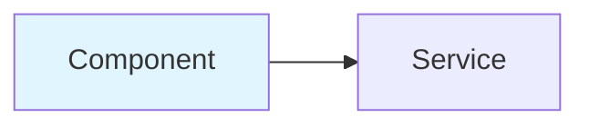

# Workshop Creator Skill

Creates AWS Workshop Studio-format workshop projects and writes their content.

---

## Usage

| Command | Description | Example |
|---------|-------------|---------|
| `init` | Initialize a new workshop project | `/workshop-creator init my-workshop` |
| `add-module` | Add a module | `/workshop-creator add-module --title "EKS Setup"` |
| `add-lab` | Add a lab | `/workshop-creator add-lab --module 030 --title "Create Cluster"` |
| `translate` | Translate (ko↔en) | `/workshop-creator translate --from ko --to en` |
| `validate` | Validate structure | `/workshop-creator validate` |

---

## Directory Layout

```
workshop-name/
├── contentspec.yaml              # Workshop Studio configuration
├── content/
│   ├── index.ko.md              # Homepage (Korean)
│   ├── index.en.md              # Homepage (English)
│   ├── introduction/
│   │   └── index.en.md
│   ├── module1-topic/           # Module 1
│   │   ├── index.en.md          # Module index
│   │   └── subtopic1/
│   │       └── index.en.md
│   └── summary/
│       └── index.en.md
├── static/
│   ├── images/module-N/         # Per-module images
│   ├── code/                    # Code samples
│   └── iam-policy.json
└── assets/                      # S3 assets
```

## Naming Conventions

| Item | Pattern | Example |
|------|---------|---------|
| Module folder | `moduleN-topic` | `module1-interacting-with-models` |
| File (Korean) | `name.ko.md` | `index.ko.md` |
| File (English) | `name.en.md` | `index.en.md` |
| Image | `/static/images/module-N/name.png` | `/static/images/module-1/logs.png` |

---

## Front Matter

```yaml
---
title: "Page Title"
weight: 10
---
```

| Attribute | Required | Description |
|------|------|------|
| `title` | **Required** | Page title (shown in navigation) |
| `weight` | Optional | Sort order (lower comes first) |
| `hidden` | Optional | `true` hides it from navigation |

> **Note**: the `chapter` attribute is not supported by Workshop Studio.

Details: `references/front-matter.md`

---

## Workshop Studio Directives

Workshop Studio uses its own directive syntax. Do not use Hugo shortcodes.

### Alert

```markdown
::alert[This action cannot be undone]{type="warning"}

:::alert{header="Prerequisites" type="warning"}
Before starting:
1. AWS account with admin access
2. AWS CLI installed
:::
```

| Type | Purpose |
|------|------|
| `info` | General information (default) |
| `success` | Success/completion |
| `warning` | Caution/warning |
| `error` | Error/danger |

Details: `references/alert-reference.md`

### Code

```markdown
:::code{language=bash showCopyAction=true}
kubectl get pods -n vllm
:::

:::code{language=yaml highlightLines=4-6}
apiVersion: v1
kind: Service
metadata:
  name: my-service
:::
```

| Property | Description |
|----------|------|
| `language` | Language (bash, python, yaml, etc.) |
| `showCopyAction` | Show a copy button |
| `highlightLines` | Lines to highlight (e.g. `4-6,10`) |

Details: `references/code-reference.md`

### Tabs

When a tab contains code, the number of colons must increase (based on nesting level, e.g. `:::::tabs`).

Details: `references/tabs-reference.md`

### Image

```markdown
:image[Architecture]{src="/static/images/diagrams/arch.png" width=800}
```

Details: `references/image-reference.md`

### Mermaid

```markdown

```mermaid
graph LR
    A[Component] --> B[Service]
    style A fill:#e1f5fe
```
```

### Expand

```markdown
::::expand{header="View details"}
Hidden content
::::
```

Details: `references/directives-complete.md`

---

## Best Practices

**Goal**: content participants can follow without a facilitator — after every hands-on step, include a verification method (expected output), copyable commands (`showCopyAction=true`), Key Takeaways at the end of each section, clear previous/next links, and visualize architecture with Mermaid.

**Platform contract (renderer behavior, not just style)**:
1. Hugo shortcodes (`{}`) are not rendered and appear as raw text — use only Workshop Studio directives
2. `chapter: true` is not a valid front matter attribute
3. No hardcoded account IDs/credentials (use `AWS::AccountId` Ref, etc. — the account differs per event)
4. Put long code files in `static/code/` instead of a heredoc (heredocs are fragile with quoting and variable expansion)

---

## Infrastructure

Workshop infrastructure is provisioned via CloudFormation.

```
static/
├── workshop.yaml       # CloudFormation template
└── iam-policy.json     # Participant IAM policy
```

Validation:
```bash
cfn-lint static/workshop.yaml
cfn_nag_scan --input-path static/workshop.yaml
```

Details: `references/infrastructure-guide.md`, `references/cloudformation-reference.md`

---

## Event Params & Central Account

Reference this when you need to inject values into infrastructure or share state across teams.

| Layer/Feature | Defined in | Purpose |
|-----------|-----------|------|
| `params` | Top level of `contentspec.yaml` | Text variables for markdown content (`:param` directive) |
| CFN `parameters` + `userOverridable` | `infrastructure.cloudformationTemplates[]` | Infrastructure values the event operator can override |
| Magic Variables | Auto-injected | Workshop Studio-computed values such as TeamID, ParticipantRoleArn |
| `centralAccountInfrastructure` | Top level of `contentspec.yaml` (optional) | A shared account separate from the teams — only when shared resources/gamification are needed |

Details: `references/event-params-guide.md` (the 3 layers of variable injection), `references/central-account-guide.md` (central account)

---

## Workflow

1. `/workshop-creator init my-workshop` — initialize the project
2. Configure `contentspec.yaml` — region, IAM, parameters, and (if needed) event overrides/central account
3. Write the CloudFormation template — `static/workshop.yaml`
4. Write the homepage — including a Mermaid diagram
5. Write per-module content — step-by-step hands-on
6. Add images/screenshots
7. Validate with `cfn-lint` / `cfn_nag`
8. Review the content with `content-review-agent`

---

## Output Format

Output the exact Directory Layout structure shown above. Each file conforms to Workshop Studio format, and `.ko.md` / `.en.md` files are generated per the locales defined in `contentspec.yaml` (the front matter `weight` must match between the locale pair for a given page — a mismatch throws off the navigation order).

---

## Reference Documents

| Document | Description |
|------|------|
| `references/front-matter.md` | Front matter attributes |
| `references/alert-reference.md` | Alert directive details |
| `references/code-reference.md` | Code directive (40+ languages) |
| `references/tabs-reference.md` | Tabs directive details |
| `references/image-reference.md` | Image directive details |
| `references/directives-complete.md` | Full directive list |
| `references/workshop-templates.md` | Content templates (Homepage, Module, Lab) |
| `references/infrastructure-guide.md` | Contentspec.yaml, Magic Variables, CloudFormation |
| `references/contentspec-complete.md` | Full contentspec.yaml configuration |
| `references/cloudformation-reference.md` | CloudFormation infrastructure patterns |
| `references/central-account-guide.md` | Central account (centralAccountInfrastructure, data flow, lifecycle) |
| `references/event-params-guide.md` | Event parameters / variable injection (params, userOverridable, Magic Variables, Outputs) |
| `references/workshop-assets-guide.md` | Asset management (Repository/S3 Assets, scanning, ASU, EC2 key pairs) |
| `references/event-quotas-guide.md` | Account quotas, Grants, Required Resources, cost, ODCR |
| `references/event-operations-guide.md` | Participant surveys, content file structure, Autostart, fraud prevention, Opportunity ID |
| `references/platform-features-guide.md` | MCP Server, Atlas Agent, Content Quality Program |
| `references/supported-services-guide.md` | Supported/unsupported services, GPU/instance constraints, Marketplace/Bedrock support scope |
