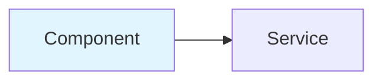

# Workshop Creator Skill

AWS Workshop Studio 형식의 워크샵 프로젝트를 생성하고 콘텐츠를 작성합니다.

---

## Usage

| Command | Description | Example |
|---------|-------------|---------|
| `init` | 새 워크샵 프로젝트 초기화 | `/workshop-creator init my-workshop` |
| `add-module` | 모듈 추가 | `/workshop-creator add-module --title "EKS 설정"` |
| `add-lab` | 랩 추가 | `/workshop-creator add-lab --module 030 --title "클러스터 생성"` |
| `translate` | 번역 (ko↔en) | `/workshop-creator translate --from ko --to en` |
| `validate` | 구조 검증 | `/workshop-creator validate` |

---

## Directory Layout

```
workshop-name/
├── contentspec.yaml              # Workshop Studio 설정
├── content/
│   ├── index.ko.md              # 홈페이지 (한국어)
│   ├── index.en.md              # 홈페이지 (영어)
│   ├── introduction/
│   │   └── index.en.md
│   ├── module1-topic/           # 모듈 1
│   │   ├── index.en.md          # 모듈 인덱스
│   │   └── subtopic1/
│   │       └── index.en.md
│   └── summary/
│       └── index.en.md
├── static/
│   ├── images/module-N/         # 모듈별 이미지
│   ├── code/                    # 코드 샘플
│   └── iam-policy.json
└── assets/                      # S3 에셋
```

## Naming Conventions

| Item | Pattern | Example |
|------|---------|---------|
| 모듈 폴더 | `moduleN-topic` | `module1-interacting-with-models` |
| 파일 (한국어) | `name.ko.md` | `index.ko.md` |
| 파일 (영어) | `name.en.md` | `index.en.md` |
| 이미지 | `/static/images/module-N/name.png` | `/static/images/module-1/logs.png` |

---

## Front Matter

```yaml
---
title: "페이지 제목"
weight: 10
---
```

| 속성 | 필수 | 설명 |
|------|------|------|
| `title` | **필수** | 페이지 제목 (네비게이션에 표시) |
| `weight` | 선택 | 정렬 순서 (낮을수록 먼저) |
| `hidden` | 선택 | `true`면 네비게이션에서 숨김 |

> **주의**: `chapter` 속성은 Workshop Studio에서 지원하지 않습니다.

상세: `references/front-matter.md`

---

## Workshop Studio Directives

Workshop Studio는 자체 Directive 문법을 사용합니다. Hugo shortcode는 사용 금지.

### Alert

```markdown
::alert[This action cannot be undone]{type="warning"}

:::alert{header="Prerequisites" type="warning"}
Before starting:
1. AWS account with admin access
2. AWS CLI installed
:::
```

| Type | 용도 |
|------|------|
| `info` | 일반 정보 (기본값) |
| `success` | 성공/완료 |
| `warning` | 주의/경고 |
| `error` | 에러/위험 |

상세: `references/alert-reference.md`

### Code

```markdown
:::code{language=bash showCopyAction=true}
kubectl get pods -n vllm
:::

:::code{language=yaml highlightLines=4-6}
apiVersion: v1
kind: Service
metadata:
  name: my-service
:::
```

| Property | 설명 |
|----------|------|
| `language` | 언어 (bash, python, yaml 등) |
| `showCopyAction` | 복사 버튼 표시 |
| `highlightLines` | 강조할 라인 (예: `4-6,10`) |

상세: `references/code-reference.md`

### Tabs

코드 포함 시 콜론 개수 증가 필요 (중첩 수준에 따라 `:::::tabs`).

상세: `references/tabs-reference.md`

### Image

```markdown
:image[Architecture]{src="/static/images/diagrams/arch.png" width=800}
```

상세: `references/image-reference.md`

### Mermaid

```markdown

```mermaid
graph LR
    A[Component] --> B[Service]
    style A fill:#e1f5fe
```
```

### Expand

```markdown
::::expand{header="자세히 보기"}
숨겨진 내용
::::
```

상세: `references/directives-complete.md`

---

## Best Practices

**목표**: 참가자가 진행자 없이 따라갈 수 있는 콘텐츠 — 모든 hands-on 단계 뒤에 확인 방법(기대 출력), 복사 가능한 명령(`showCopyAction=true`), 섹션 끝 Key Takeaways, 명확한 이전/다음 링크, 아키텍처는 Mermaid로 시각화.

**플랫폼 계약 (스타일이 아니라 렌더러 동작)**:
1. Hugo shortcode(`{}`)는 렌더링되지 않고 그대로 노출됨 — Workshop Studio directive만 사용
2. `chapter: true`는 유효한 front matter 속성이 아님
3. 하드코딩된 계정 ID/자격증명 없이 (`AWS::AccountId` Ref 등 — 이벤트마다 계정이 다름)
4. 긴 코드 파일은 heredoc 대신 `static/code/`에 파일로 (heredoc은 인용·변수 확장에 깨지기 쉬움)

---

## Infrastructure

워크샵 인프라는 CloudFormation으로 프로비저닝합니다.

```
static/
├── workshop.yaml       # CloudFormation 템플릿
└── iam-policy.json     # 참가자 IAM 정책
```

검증:
```bash
cfn-lint static/workshop.yaml
cfn_nag_scan --input-path static/workshop.yaml
```

상세: `references/infrastructure-guide.md`, `references/cloudformation-reference.md`

---

## Event Params & Central Account

인프라에 값을 주입하거나 팀 간 공유 상태가 필요할 때 참조.

| 계층/기능 | 정의 위치 | 용도 |
|-----------|-----------|------|
| `params` | `contentspec.yaml` 최상위 | 마크다운 콘텐츠 텍스트 변수 (`:param` 디렉티브) |
| CFN `parameters` + `userOverridable` | `infrastructure.cloudformationTemplates[]` | 이벤트 운영자가 오버라이드 가능한 인프라 값 |
| Magic Variables | 자동 주입 | TeamID, ParticipantRoleArn 등 Workshop Studio 계산 값 |
| `centralAccountInfrastructure` | `contentspec.yaml` 최상위 (선택) | 팀과 분리된 공유 계정 — 공유 리소스/게이미피케이션이 필요할 때만 |

상세: `references/event-params-guide.md` (변수 주입 3계층), `references/central-account-guide.md` (중앙 계정)

---

## Workflow

1. `/workshop-creator init my-workshop` — 프로젝트 초기화
2. `contentspec.yaml` 설정 — 리전, IAM, 파라미터, (필요 시) 이벤트 오버라이드/중앙 계정
3. CloudFormation 템플릿 작성 — `static/workshop.yaml`
4. Homepage 작성 — Mermaid 다이어그램 포함
5. 모듈별 콘텐츠 작성 — 단계별 hands-on
6. 이미지/스크린샷 추가
7. `cfn-lint` / `cfn_nag` 검증
8. `content-review-agent`로 콘텐츠 검토

---

## Output Format

위 Directory Layout 구조 그대로 출력합니다. 각 파일은 Workshop Studio 형식을 준수하며, `contentspec.yaml`에 정의된 로케일별로 `.ko.md` / `.en.md` 파일을 생성합니다 (front matter `weight`는 로케일 쌍 간 일치 — 다르면 네비게이션 순서가 어긋남).

---

## Reference Documents

| 문서 | 설명 |
|------|------|
| `references/front-matter.md` | Front Matter 속성 |
| `references/alert-reference.md` | Alert directive 상세 |
| `references/code-reference.md` | Code directive (40+ 언어) |
| `references/tabs-reference.md` | Tabs directive 상세 |
| `references/image-reference.md` | Image directive 상세 |
| `references/directives-complete.md` | 전체 directive 목록 |
| `references/workshop-templates.md` | 콘텐츠 템플릿 (Homepage, Module, Lab) |
| `references/infrastructure-guide.md` | Contentspec.yaml, Magic Variables, CloudFormation |
| `references/contentspec-complete.md` | contentspec.yaml 전체 설정 |
| `references/cloudformation-reference.md` | CloudFormation 인프라 패턴 |
| `references/central-account-guide.md` | 중앙 계정 (centralAccountInfrastructure, 데이터 흐름, 라이프사이클) |
| `references/event-params-guide.md` | 이벤트 파라미터 / 변수 주입 (params, userOverridable, Magic Variables, Outputs) |
| `references/workshop-assets-guide.md` | 에셋 관리 (Repository/S3 Assets, 스캔, ASU, EC2 키페어) |
| `references/event-quotas-guide.md` | 계정 할당량, Grant, Required Resources, 비용, ODCR |
| `references/event-operations-guide.md` | 참가자 서베이, 콘텐츠 파일 구조, Autostart, 사기 방지, Opportunity ID |
| `references/platform-features-guide.md` | MCP Server, Atlas Agent, Content Quality Program |
| `references/supported-services-guide.md` | 지원/미지원 서비스, GPU/인스턴스 제약, Marketplace/Bedrock 지원 범위 |
