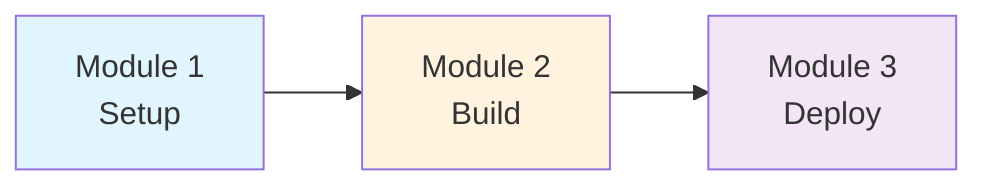
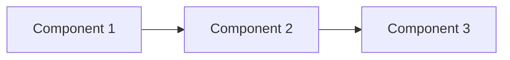

# Workshop Content Templates

Reusable templates for Workshop Studio pages.

---

## Homepage (index.en.md)

```markdown
---
title: "Workshop Title"
weight: 0
---

Welcome to this hands-on workshop!

## What You'll Build

By the end of this workshop, you'll have:
- Accomplishment 1
- Accomplishment 2

## Your Learning Journey



## Module Overview

### Module 1: Topic
Brief description...

### Module 2: Topic
Brief description...

## Technologies You'll Master

::::tabs

:::tab{label="Infrastructure"}
- Amazon EKS
- AWS Lambda
:::

:::tab{label="Frameworks"}
- LangChain
- FastAPI
:::

::::

## Prerequisites

- Basic Kubernetes knowledge
- AWS account access
- Python experience

::alert[**No AI/ML expertise required!** We'll explain concepts as we build.]{type="info"}

---

**[Get Started →](/introduction/)**
```

---

## Module Index Page

```markdown
---
title: "Module 1: Interacting with Models"
weight: 20
---

Welcome to the first module! You'll learn...

## Learning Objectives

By the end of this module, you will:

- **Objective 1** - Description
- **Objective 2** - Description
- **Objective 3** - Description

## Module Overview

#### 1. [First Topic](./topic1)
Description of what they'll learn...

#### 2. [Second Topic](./topic2)
Description of what they'll learn...

## Architecture Context



## Prerequisites Check

:::code{language=bash showCopyAction=true}
# Verify your environment
kubectl get pods -n workshop
aws sts get-caller-identity
:::

::alert[**Tip**: Keep a terminal open throughout this module.]{type="info"}

---

**[Next: First Topic →](./topic1)**
```

---

## Lab Content Page (Hands-On Steps)

```markdown
---
title: "vLLM - Self-Hosted Model Serving"
weight: 22
---

In this section, we'll explore how models run on Kubernetes.

## Hands-On: Explore Your Running Models

### Step 1: See Your Models in Action

:::code{language=bash showCopyAction=true}
# Check what models are running
kubectl get pods -n vllm

# See the deployments
kubectl get deployments -n vllm -o wide
:::

You should see pods like `model-xxx` - these are your running models!

### Step 2: Examine Configuration

:::code{language=bash showCopyAction=true}
# View the deployment config
cat /workshop/components/model.yaml
:::

### Step 3: Watch Logs in Real-Time

Open a second terminal and run:

:::code{language=bash showCopyAction=true}
kubectl logs -f --tail=0 -n vllm deployment/model-name
:::

Now send a message in the UI and watch the logs!


**What you're seeing:**
- **Request received**: Your prompt being processed
- **Model thinking**: Token generation metrics
- **Performance stats**: Throughput and latency

## Technical Deep Dive (Optional)

::alert[All YAML files are in `/workshop/components/` for detailed exploration.]{type="info"}

:::::tabs

::::tab{label="Namespace"}
:::code{language=yaml showCopyAction=true}
apiVersion: v1
kind: Namespace
metadata:
  name: vllm
:::
::::

::::tab{label="Deployment"}
:::code{language=yaml showCopyAction=true}
apiVersion: apps/v1
kind: Deployment
metadata:
  name: model
  namespace: vllm
spec:
  replicas: 1
  # ... more config
:::
::::

:::::

---

## Key Takeaways

- **Kubernetes Native**: Models deployed using standard K8s resources
- **Observable**: Real-time logs show model processing
- **Configurable**: YAML manifests control all behavior

## What's Next?

You've seen self-hosted models. Next, we'll explore managed alternatives.

---

**[Next: AWS Bedrock →](../bedrock)**
```

---

## Summary/Cleanup Page

```markdown
---
title: "Summary & Cleanup"
weight: 100
---

Congratulations on completing the workshop!

## What You Accomplished

- Accomplishment 1
- Accomplishment 2
- Accomplishment 3

## Key Learnings

| Topic | Key Takeaway |
|-------|--------------|
| Topic 1 | What you learned |
| Topic 2 | What you learned |

## Cleanup Instructions

::alert[Clean up your resources to avoid ongoing charges.]{type="warning"}

### Option 1: CloudFormation (Recommended)

:::code{language=bash showCopyAction=true}
aws cloudformation delete-stack --stack-name workshop-stack
:::

### Option 2: Manual Cleanup

1. Delete EKS cluster
2. Remove IAM roles
3. Delete S3 buckets

## Next Steps

- [AWS Documentation](https://docs.aws.amazon.com/)
- [Related Workshop](https://workshops.aws/)

## Feedback

::alert[Please provide feedback to help us improve!]{type="info"}
```
