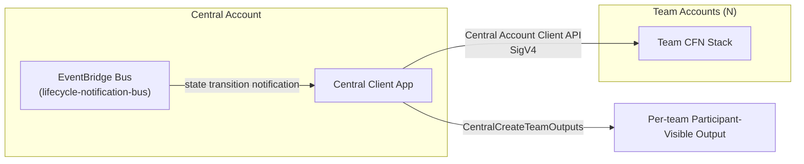

# Central Account Guide

How to deploy a single, per-event **shared account** separate from participant (team) accounts, to
implement cross-team shared resources, gamification, and API-based interactions.

---

## What is a central account / when to use it

Workshop Studio supports at most **one** Central Account per workshop. A central account is an AWS account
provisioned separately from team accounts that can interact with team accounts via API during the event.

| Use case | Description |
|-----------|------|
| Shared backend resources | dashboards, leaderboards, shared datasets used by all teams together |
| Load generation/traffic injection | a load generator that sends traffic to team accounts |
| Progress verification | checks internal state in team accounts to judge participant progress |
| Gamification | dynamically generates results shown to participants when they complete checkpoints |

**Cost/constraints**: a central account consumes **one extra** account from the operator's account quota
during event provisioning. Up to 5 CloudFormation templates can be deployed to the central account (the
same limit as team infrastructure).

If you don't need shared resources, team infrastructure (`infrastructure`) alone is sufficient without a
central account — use it only when you actually need cross-team interaction/shared state, to avoid
unnecessarily consuming an extra account.

---

## contentspec schema — `centralAccountInfrastructure`

```yaml
# [optional] define only when using a central account
centralAccountInfrastructure:
  cloudformationTemplates:
    # must be located under static/, max 5
    - templateLocation: static/cfn/central-stack.yaml
      label: Central Account Stack

      # [optional] tags applied to the stack
      tags:
        - key: Environment
          value: Workshop

      # [optional] specify only the particular Outputs to expose to participants
      participantVisibleStackOutputs:
        - LeaderboardUrl

      # [optional] expose all Outputs/Exports to participants (default false)
      participantAllStackOutputsVisible: false

      # [optional] template parameters — Magic Variables can be used
      parameters:
        - templateParameter: NotificationBusArn
          defaultValue: "{{.NotificationBusArn}}"
        - templateParameter: WSEventsAPIEndpoint
          defaultValue: "{{.WSEventsAPIEndpoint}}"
        - templateParameter: WksEventsRegion
          defaultValue: "{{.WSEventsAPIRegion}}"
```

Uses the same field structure as `infrastructure.cloudformationTemplates`, differing only in that the
target account is the central account rather than a team. The same Outputs/Exports exposure rules
(`participantVisibleStackOutputs` / `participantAllStackOutputsVisible`) apply — details:
`references/event-params-guide.md`.

---

## Central CloudFormation Magic Variables

Of the team Magic Variables, `{{.AssetsBucketName}}` and `{{.AssetsBucketPrefix}}` can be used as-is in the
central account too, and the following 4 are added specifically for the central account.

| Variable | Description | Example |
|------|------|------|
| `{{.NotificationBusArn}}` | ARN of the EventBridge bus receiving lifecycle notifications | `arn:aws:events:us-east-1:123456789012:event-bus/lifecycle-notification-bus` |
| `{{.WSEventsAPIEndpoint}}` | Central Account Client API endpoint hostname (no scheme) | `events-api.us-east-1.prod.workshops.aws` |
| `{{.WSEventsAPIRegion}}` | region of the above API | `us-east-1` |
| `{{.TeamSize}}` | maximum participants per team | `5` |

Full Magic Variable list: `references/contentspec-complete.md`.

---

## Central ↔ participant account data flow



### Pattern 1 — pushing values to teams via the Central Account Client API

A separate set of APIs callable only from within the central account (not callable from team accounts;
requires SigV4 signing + an IAM role within the central account). Representative operations:

| Operation | Purpose |
|-----------|------|
| `CentralListTeams` / `CentralGetTeam` | list/inspect teams within an event |
| `CentralGetEventTeamCredentials` | issue STS credentials for a specific team account's Ops role (direct access to team account resources) |
| `CentralListTeamOutputs` | fetch a team's CFN Outputs + Outputs created by the central app |
| `CentralCreateTeamOutputs` / `CentralUpdateTeamOutputs` / `CentralDeleteTeamOutputs` | create/update/delete per-team custom Outputs visible to participants (e.g. marking checkpoint completion) |

Rate limits: Write/List 100 TPM (transactions per minute), Read 400 TPM, Delete 50 TPM. Constraints: 1
central account and 1 central client app per event; Outputs/Exports created by CFN cannot be modified or
deleted via the API.

### Pattern 2 — receiving lifecycle events via NotificationBus

The central account's EventBridge bus (`lifecycle-notification-bus`) receives a notification whenever a
team/event state transition occurs (transitioning to the same state does not fire a notification). By
default, a rule named `cloudwatch-log-rule` logs all notifications (`source: com.workshopstudio`) to a
CloudWatch Log Group (`/aws/events/lifecycle-notification-logs`).

| DetailType | Fired when |
|------------|-----------|
| `team` | team state transition: `deployment_queued` → `deployment_success`/`deployment_failed` → `terminate_success` |
| `event` | event state transition: `start_success`, `pause_success` |
| `event_parameters` | an event parameter value changes (when the operator adjusts a value at runtime) — details: `references/event-params-guide.md` |

Using this notification as a trigger, you can build a flow where, for example, once a team deploys
successfully, the central app calls `CentralCreateTeamOutputs` to produce a participant-visible result for
that team.

### Pattern 3 — authenticating to the Central Account Client API

If using boto3, download the separate service model (C2J) to a local `models/` path, register it, then
create a low-level client. API operation names are PascalCase (`CentralGetEvent`), but the boto3 method
maps to snake_case (`central_get_event()`). SigV4 signing from an IAM role within the central account is
sufficient for authentication, and calls can be made even while the event is paused, as long as the
central account deployment has completed.

> **Note — External Event Lifecycle Notifications (beta)**: there is a separate beta feature
> (`infrastructure.externalLifecycleNotificationBusArn`) that lets any AWS account's EventBridge bus receive
> the same family of notifications (plus `event_created`/`event_updated`/`event_canceled` pre-deployment
> notifications) without a central account. This beta feature requires separate approval and a security
> review from the Workshop Studio team, so consider it instead of a central account if you only need
> external integration without compute resources.

---

## Deployment/teardown order

1. When event provisioning starts → the central account (if defined) is leased/deployed **before** teams
2. If central account deployment fails → no teams are provisioned/deployed and the entire event fails
3. If central account deployment succeeds → team account leasing/deployment proceeds (in batches of 10)
4. When the event is terminated → the central account is torn down and returned along with the team accounts

---

## Full example

```yaml
# contentspec.yaml
infrastructure:
  cloudformationTemplates:
    - templateLocation: static/cfn/team-stack.yaml
      label: Team Infra
      parameters:
        - templateParameter: ParticipantRoleArn
          defaultValue: "{{.ParticipantRoleArn}}"

centralAccountInfrastructure:
  cloudformationTemplates:
    - templateLocation: static/cfn/central-stack.yaml
      label: Central Stack
      participantVisibleStackOutputs:
        - LeaderboardUrl
      parameters:
        - templateParameter: NotificationBusArn
          defaultValue: "{{.NotificationBusArn}}"
        - templateParameter: WSEventsAPIEndpoint
          defaultValue: "{{.WSEventsAPIEndpoint}}"
        - templateParameter: WksEventsRegion
          defaultValue: "{{.WSEventsAPIRegion}}"
```

`static/cfn/central-stack.yaml` skeleton — an EventBridge rule + Lambda subscribing to the NotificationBus:

```yaml
AWSTemplateFormatVersion: '2010-09-09'
Parameters:
  NotificationBusArn:
    Type: String
  WSEventsAPIEndpoint:
    Type: String
  WksEventsRegion:
    Type: String

Resources:
  TeamDeployedRule:
    Type: AWS::Events::Rule
    Properties:
      EventBusName: !Select [1, !Split ["/", !Ref NotificationBusArn]]
      EventPattern:
        source: ["com.workshopstudio"]
        detail-type: ["team"]
        detail:
          state: ["deployment_success"]
      Targets:
        - Arn: !GetAtt OnTeamDeployedFunction.Arn
          Id: OnTeamDeployed

  OnTeamDeployedFunctionRole:
    Type: AWS::IAM::Role
    Properties:
      AssumeRolePolicyDocument:
        Version: "2012-10-17"
        Statement:
          - Effect: Allow
            Principal:
              Service: lambda.amazonaws.com
            Action: sts:AssumeRole
      ManagedPolicyArns:
        - arn:aws:iam::aws:policy/service-role/AWSLambdaBasicExecutionRole

  OnTeamDeployedFunction:
    Type: AWS::Lambda::Function
    Properties:
      Runtime: python3.12
      Handler: index.handler
      Role: !GetAtt OnTeamDeployedFunctionRole.Arn
      Environment:
        Variables:
          WKS_ENDPOINT: !Ref WSEventsAPIEndpoint
          WKS_ENDPOINT_REGION: !Ref WksEventsRegion
      Code:
        ZipFile: |
          def handler(event, context):
              team_id = event["detail"]["teamId"]
              # call CentralCreateTeamOutputs via the boto3 workshopstudio-central client
              # to create a participant-visible Output
              return {"teamId": team_id}

  OnTeamDeployedPermission:
    Type: AWS::Lambda::Permission
    Properties:
      Action: lambda:InvokeFunction
      FunctionName: !Ref OnTeamDeployedFunction
      Principal: events.amazonaws.com
      SourceArn: !GetAtt TeamDeployedRule.Arn
```

---

## Checklist

- [ ] Have you first considered whether this can be solved without a central account (it consumes an extra account quota)?
- [ ] Does `centralAccountInfrastructure.cloudformationTemplates` have 5 or fewer entries?
- [ ] Is only the Output you want participants to see specified in `participantVisibleStackOutputs` (default is not exposed)?
- [ ] Are central account API calls made only with SigV4 + an IAM role within the central account — never directly from team accounts?
- [ ] Is the NotificationBus rule filtered on the `source: com.workshopstudio` pattern?
- [ ] Is lifecycle-notification-based logic designed on the premise that it only fires on state transitions (prev≠new)?
