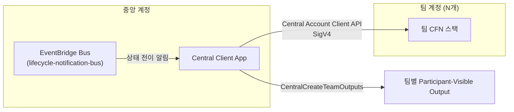

# Central Account Guide (중앙 계정 가이드)

이벤트당 하나, 참가자(팀) 계정과 분리된 **공유 계정**을 배포해 팀 간 공유 리소스·게이미피케이션·API 기반 상호작용을 구현하는 방법.

---

## 중앙 계정이란 / 언제 사용하나

Workshop Studio는 워크샵당 최대 **1개**의 중앙 계정(Central Account)을 지원한다. 중앙 계정은 팀 계정과 별도로 프로비저닝되는 AWS 계정으로, 이벤트 진행 중 팀 계정들과 API로 상호작용할 수 있다.

| 사용 사례 | 설명 |
|-----------|------|
| 공유 백엔드 리소스 | 모든 팀이 함께 사용하는 대시보드, 리더보드, 공용 데이터셋 |
| 부하 생성/트래픽 주입 | 팀 계정으로 트래픽을 보내는 로드 제너레이터 |
| 진행도 검증 | 팀 계정 내부 상태를 확인해 참가자의 진행 상황을 판정 |
| 게이미피케이션 | 체크포인트 완료 시 참가자에게 보이는 결과를 동적으로 생성 |

**비용/제약**: 중앙 계정은 이벤트 프로비저닝 시 운영자의 계정 할당량에서 **추가로 1개**를 소비한다. 중앙 계정에는 최대 5개의 CloudFormation 템플릿을 배포할 수 있다(팀 인프라와 동일한 제한).

공유 리소스가 필요 없다면 중앙 계정 없이 팀 인프라(`infrastructure`)만으로 충분하다 — 불필요하게 계정을 추가 소비하지 않도록 실제로 팀 간 상호작용/공유 상태가 필요한 경우에만 사용한다.

---

## contentspec 스키마 — `centralAccountInfrastructure`

```yaml
# [선택] 중앙 계정을 사용할 때만 정의
centralAccountInfrastructure:
  cloudformationTemplates:
    # static/ 하위에 위치해야 함, 최대 5개
    - templateLocation: static/cfn/central-stack.yaml
      label: Central Account Stack

      # [선택] 스택에 적용할 태그
      tags:
        - key: Environment
          value: Workshop

      # [선택] 참가자에게 노출할 특정 Output만 지정
      participantVisibleStackOutputs:
        - LeaderboardUrl

      # [선택] 모든 Output/Export를 참가자에게 노출 (기본값 false)
      participantAllStackOutputsVisible: false

      # [선택] 템플릿 파라미터 — Magic Variable 사용 가능
      parameters:
        - templateParameter: NotificationBusArn
          defaultValue: "{{.NotificationBusArn}}"
        - templateParameter: WSEventsAPIEndpoint
          defaultValue: "{{.WSEventsAPIEndpoint}}"
        - templateParameter: WksEventsRegion
          defaultValue: "{{.WSEventsAPIRegion}}"
```

`infrastructure.cloudformationTemplates`와 동일한 필드 구조를 쓰지만, 대상 계정이 팀이 아니라 중앙 계정이라는 점만 다르다. Outputs/Exports 노출 규칙(`participantVisibleStackOutputs` / `participantAllStackOutputsVisible`)도 동일하게 적용된다 — 상세: `references/event-params-guide.md`.

---

## Central CloudFormation Magic Variables

팀용 Magic Variable 중 `{{.AssetsBucketName}}`, `{{.AssetsBucketPrefix}}`는 중앙 계정에서도 그대로 쓸 수 있고, 아래 4개가 중앙 계정 전용으로 추가된다.

| 변수 | 설명 | 예시 |
|------|------|------|
| `{{.NotificationBusArn}}` | 라이프사이클 알림을 수신하는 EventBridge 버스 ARN | `arn:aws:events:us-east-1:123456789012:event-bus/lifecycle-notification-bus` |
| `{{.WSEventsAPIEndpoint}}` | Central Account Client API 엔드포인트 호스트명 (스킴 없음) | `events-api.us-east-1.prod.workshops.aws` |
| `{{.WSEventsAPIRegion}}` | 위 API의 리전 | `us-east-1` |
| `{{.TeamSize}}` | 팀당 최대 참가자 수 | `5` |

전체 Magic Variable 목록: `references/contentspec-complete.md`.

---

## 중앙 ↔ 참가자 계정 데이터 흐름



### 패턴 1 — Central Account Client API로 팀에 값 전달

중앙 계정 내부에서만 호출 가능한 별도 API 세트다 (팀 계정에서는 호출 불가, SigV4 서명 + 중앙 계정 내 IAM 역할 필요). 대표 오퍼레이션:

| Operation | 용도 |
|-----------|------|
| `CentralListTeams` / `CentralGetTeam` | 이벤트 내 팀 목록/상세 조회 |
| `CentralGetEventTeamCredentials` | 특정 팀 계정의 Ops 역할 STS 자격 증명 발급 (팀 계정 리소스에 직접 접근) |
| `CentralListTeamOutputs` | 팀의 CFN Output + 중앙 앱이 생성한 Output 조회 |
| `CentralCreateTeamOutputs` / `CentralUpdateTeamOutputs` / `CentralDeleteTeamOutputs` | 팀별로 참가자에게 보이는 커스텀 Output 생성/수정/삭제 (체크포인트 완료 표시 등) |

레이트 리밋: Write/List 100 TPM(분당 트랜잭션), Read 400 TPM, Delete 50 TPM. 제약: 이벤트당 중앙 계정 1개·중앙 클라이언트 앱 1개, CFN이 생성한 Output/Export는 API로 수정·삭제 불가.

### 패턴 2 — NotificationBus로 라이프사이클 이벤트 수신

중앙 계정의 EventBridge 버스(`lifecycle-notification-bus`)는 팀/이벤트 상태 전이가 있을 때마다 알림을 받는다 (동일 상태로의 전이는 발생하지 않음). 기본적으로 `cloudwatch-log-rule`이라는 규칙이 모든 알림(`source: com.workshopstudio`)을 CloudWatch Log Group(`/aws/events/lifecycle-notification-logs`)에 기록한다.

| DetailType | 발생 조건 |
|------------|-----------|
| `team` | 팀 상태 전이: `deployment_queued` → `deployment_success`/`deployment_failed` → `terminate_success` |
| `event` | 이벤트 상태 전이: `start_success`, `pause_success` |
| `event_parameters` | 이벤트 파라미터 값 변경 (운영자가 런타임에 값을 조정했을 때) — 상세: `references/event-params-guide.md` |

이 알림을 트리거로 삼아, 예를 들어 팀이 성공적으로 배포되면 중앙 앱이 `CentralCreateTeamOutputs`로 해당 팀에 참가자용 결과를 만들어주는 흐름을 구성할 수 있다.

### 패턴 3 — Central Account Client API 인증

boto3로 사용할 경우 별도 서비스 모델(C2J)을 로컬 `models/` 경로에 내려받아 등록한 뒤 저수준 클라이언트를 생성한다. API 오퍼레이션명은 PascalCase(`CentralGetEvent`)지만 boto3 메서드는 snake_case(`central_get_event()`)로 매핑된다. 인증은 중앙 계정 내 IAM 역할의 SigV4 서명만으로 충분하며, 이벤트가 일시정지 상태여도 중앙 계정 배포가 완료되어 있으면 호출할 수 있다.

> **참고 — External Event Lifecycle Notifications (베타)**: 중앙 계정 없이도 임의의 AWS 계정 EventBridge 버스로 동일 계열의 알림(+ `event_created`/`event_updated`/`event_canceled` 사전 배포 알림)을 받을 수 있는 별도 베타 기능(`infrastructure.externalLifecycleNotificationBusArn`)이 있다. Workshop Studio 팀의 별도 승인·보안 검토를 거쳐야 활성화되는 베타 기능이므로, 계산 리소스 없이 외부 통합만 필요하면 중앙 계정 대신 검토할 수 있다.

---

## 배포·정리 순서

1. 이벤트 프로비저닝 시작 → 중앙 계정(정의된 경우) 리스·배포가 **팀보다 먼저** 실행
2. 중앙 계정 배포 실패 → 어떤 팀도 프로비저닝/배포되지 않고 이벤트 전체가 실패 처리
3. 중앙 계정 배포 성공 → 팀 계정 리스·배포 진행 (10개 단위 배치)
4. 이벤트 종료(Terminate) → 팀 계정과 함께 중앙 계정도 정리되어 반환

---

## 전체 예제

```yaml
# contentspec.yaml
infrastructure:
  cloudformationTemplates:
    - templateLocation: static/cfn/team-stack.yaml
      label: Team Infra
      parameters:
        - templateParameter: ParticipantRoleArn
          defaultValue: "{{.ParticipantRoleArn}}"

centralAccountInfrastructure:
  cloudformationTemplates:
    - templateLocation: static/cfn/central-stack.yaml
      label: Central Stack
      participantVisibleStackOutputs:
        - LeaderboardUrl
      parameters:
        - templateParameter: NotificationBusArn
          defaultValue: "{{.NotificationBusArn}}"
        - templateParameter: WSEventsAPIEndpoint
          defaultValue: "{{.WSEventsAPIEndpoint}}"
        - templateParameter: WksEventsRegion
          defaultValue: "{{.WSEventsAPIRegion}}"
```

`static/cfn/central-stack.yaml` 뼈대 — NotificationBus를 구독하는 EventBridge 규칙 + Lambda:

```yaml
AWSTemplateFormatVersion: '2010-09-09'
Parameters:
  NotificationBusArn:
    Type: String
  WSEventsAPIEndpoint:
    Type: String
  WksEventsRegion:
    Type: String

Resources:
  TeamDeployedRule:
    Type: AWS::Events::Rule
    Properties:
      EventBusName: !Select [1, !Split ["/", !Ref NotificationBusArn]]
      EventPattern:
        source: ["com.workshopstudio"]
        detail-type: ["team"]
        detail:
          state: ["deployment_success"]
      Targets:
        - Arn: !GetAtt OnTeamDeployedFunction.Arn
          Id: OnTeamDeployed

  OnTeamDeployedFunctionRole:
    Type: AWS::IAM::Role
    Properties:
      AssumeRolePolicyDocument:
        Version: "2012-10-17"
        Statement:
          - Effect: Allow
            Principal:
              Service: lambda.amazonaws.com
            Action: sts:AssumeRole
      ManagedPolicyArns:
        - arn:aws:iam::aws:policy/service-role/AWSLambdaBasicExecutionRole

  OnTeamDeployedFunction:
    Type: AWS::Lambda::Function
    Properties:
      Runtime: python3.12
      Handler: index.handler
      Role: !GetAtt OnTeamDeployedFunctionRole.Arn
      Environment:
        Variables:
          WKS_ENDPOINT: !Ref WSEventsAPIEndpoint
          WKS_ENDPOINT_REGION: !Ref WksEventsRegion
      Code:
        ZipFile: |
          def handler(event, context):
              team_id = event["detail"]["teamId"]
              # boto3 workshopstudio-central 클라이언트로
              # CentralCreateTeamOutputs 호출해 참가자용 Output 생성
              return {"teamId": team_id}

  OnTeamDeployedPermission:
    Type: AWS::Lambda::Permission
    Properties:
      Action: lambda:InvokeFunction
      FunctionName: !Ref OnTeamDeployedFunction
      Principal: events.amazonaws.com
      SourceArn: !GetAtt TeamDeployedRule.Arn
```

---

## 체크리스트

- [ ] 중앙 계정 없이 해결 가능한지 먼저 검토 (계정 할당량 추가 소비)
- [ ] `centralAccountInfrastructure.cloudformationTemplates`는 5개 이하
- [ ] 참가자에게 보여줄 Output만 `participantVisibleStackOutputs`에 명시 (기본값은 비노출)
- [ ] 중앙 계정 API 호출은 SigV4 + 중앙 계정 내 IAM 역할로만 — 팀 계정에서 직접 호출 불가
- [ ] NotificationBus 규칙은 `source: com.workshopstudio` 패턴으로 필터링
- [ ] 라이프사이클 알림 기반 로직은 상태 전이(prev≠new) 시에만 발생함을 전제로 설계
