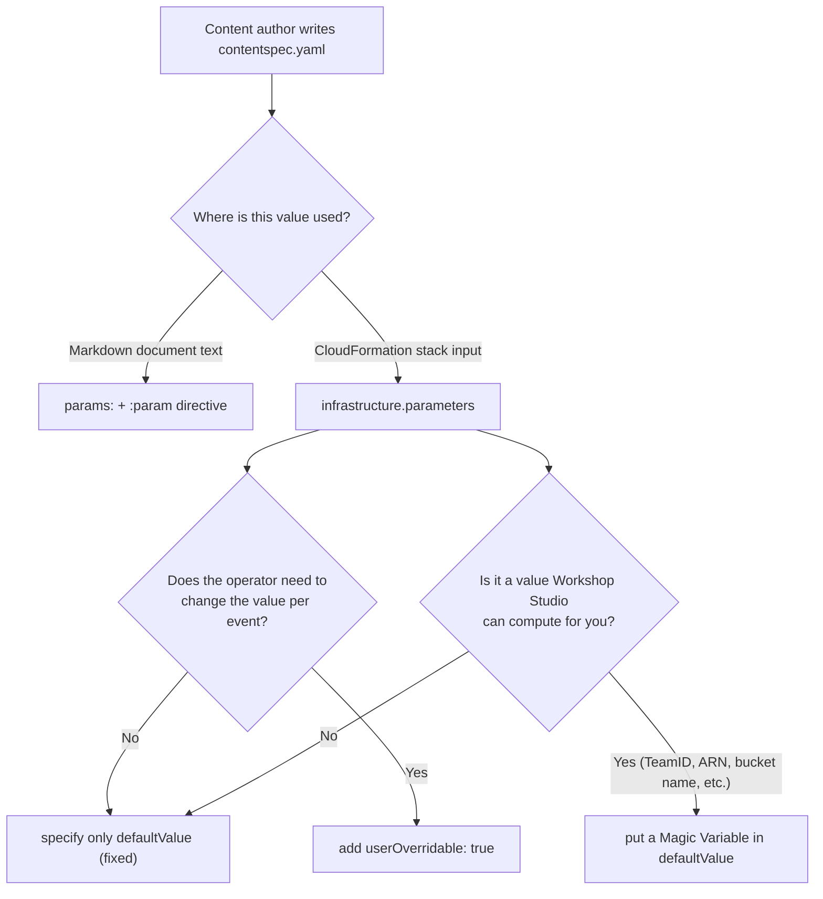

# Event Params & Variable Injection Guide

This document lays out the 3 layers by which values are defined in `contentspec.yaml` and injected/
overridden at event creation/operation time. The three layers are independent and serve different
purposes, so be careful not to mix them up.

---

## Overview of the 3 layers of variable injection

| Layer | Defined in | When the value changes | Used for |
|------|-----------|------------------|--------|
| ① `params` | top level of `contentspec.yaml` | fixed at build time (only the content author can change it) | markdown content (`:param` directive) |
| ② CFN `parameters` | `infrastructure.cloudformationTemplates[].parameters` | fixed at build time, or if `userOverridable: true`, **the event operator can override it per event** | CloudFormation stack parameters |
| ③ Magic Variables | computed automatically by Workshop Studio | automatically injected with a different value per event/team | CFN parameter `defaultValue`, IAM policy JSON |



---

## ① `params` — content variables (fixed at build time)

`params` is a **free-form YAML dictionary**. Scalars, nested objects, and arrays are all allowed, with no fixed schema.

```yaml
params:
  clusterName: workshop-cluster
  region: ap-northeast-2
  contact:
    name: John Doe
    email: john@example.com
  levels:
    - 100
    - 200
    - 300
```

Reference it in content with the `:param` directive:

```markdown
Cluster name: :param{key="clusterName"}
Contact: :param{key=contact.name}
Difficulty: :param{key=levels[0]}
Fallback for a missing value: :param{key=missingKey defaultValue="N/A"}
```

- dot (`.`) notation for nested keys, bracket/dot notation (`levels[0]` or `levels.0`) for array index access
- the `defaultValue` attribute sets a fallback when the key is missing (renders as `undefined` if not specified)
- substituted **before** markdown parsing, so it works even in regions markdown doesn't parse, such as code blocks or link hrefs
- site-wide global values: `globals.baseUrl` (static content base URL, includes a trailing `/`), `globals.locale`
- **completely unrelated to CloudFormation** — `params` values are not automatically passed as CFN parameters. Use ② to pass a value to CFN.

---

## ② CFN `parameters` — infrastructure variables (event operators can override)

```yaml
infrastructure:
  cloudformationTemplates:
    - templateLocation: static/cfn/workshop-stack.yaml
      label: Workshop Infra
      parameters:
        # fixed value — the operator cannot change it
        - templateParameter: InstanceType
          defaultValue: t3.large

        # the operator can override it when creating/configuring the event
        - templateParameter: ParticipantCapacity
          defaultValue: '10'
          userOverridable: true

        # combining a Magic Variable with userOverridable is also possible
        - templateParameter: ClusterName
          defaultValue: workshop-cluster
          userOverridable: true
```

`userOverridable: true` is the actual schema switch corresponding to the "event environment variable
injection" exposed to operators at event creation time. A required CFN parameter with no `defaultValue`
must be defined here, or the build will fail.

> **From an operator's perspective**: a parameter with only `defaultValue` is a fixed value baked into the
> content and deployed identically for every event. Only parameters marked `userOverridable: true` can
> receive different values per event — turn this flag on whenever you want the operator to be able to set
> different capacity, different names, etc. per account.

### Event parameter change notifications

If an operator changes a parameter value on a running event, and a central account exists, a lifecycle
notification with DetailType `event_parameters` fires (details: `references/central-account-guide.md`).
The payload carries the current parameter values as typed values (`string`/`int`/`bool`/`stringList`) —
useful for central account infrastructure that needs to react to runtime configuration changes. The exact
mapping between this notification flow and `userOverridable` parameters is not documented in detail in the
content-author docs, so it's safest to understand the two concepts together as "operator-adjustable
values" while still treating them as separate mechanisms.

---

## ③ Magic Variables — automatically injected values

Values Workshop Studio automatically computes and injects into `defaultValue` at event/team provisioning
time. For the full list and the team/central distinction, see `references/contentspec-complete.md`. If you
need the region, use the standard CloudFormation pseudo parameter rather than a Magic Variable:

```yaml
Resources:
  MyBucket:
    Type: AWS::S3::Bucket
    Properties:
      BucketName: !Sub "workshop-${AWS::AccountId}-${AWS::Region}"
```

> `{{.AWSRegion}}` is not in the official Magic Variable list — always get the region via
> `!Ref AWS::Region` / `${AWS::Region}`.

---

## Exposing stack outputs to participants — Outputs & Exports

CloudFormation `Outputs` (keys unique within a stack) and `Exports` (keys unique across all content, for
cross-stack references) are **not visible** to participants by default. Workshop Studio's content build
validation allows at most 50 Outputs and 50 Exports per template — this is Workshop Studio's own limit
imposed on content builds, not CloudFormation's own (larger) service quota. Operators can always see all
Outputs/Exports from the (Events → Team → Stack Deployments) screen.

```yaml
infrastructure:
  cloudformationTemplates:
    - templateLocation: static/cfn/workshop-stack.yaml
      label: Workshop Infra
      # Method 1: expose only a specific Output to participants
      participantVisibleStackOutputs:
        - WorkshopUrl
      # Method 2: expose all Outputs/Exports of this template (default false)
      participantAllStackOutputsVisible: false
```

Participants see only exposed values in the event page's "Event Outputs" section (OutputKey/Value/Stack
name/Description/Type). Since the `:param` directive only reads `params`, there is no official directive
to pull a stack Output directly into markdown — to "explain" a value to participants, use the Output
exposure settings, and if you need a value referenceable from content text, define it separately in `params`.

---

## End-to-end example — the full path of a single `ClusterName`

```yaml
# contentspec.yaml
params:
  clusterNameHint: "e.g. my-eks-cluster"

infrastructure:
  cloudformationTemplates:
    - templateLocation: static/cfn/eks-stack.yaml
      label: EKS Cluster
      parameters:
        - templateParameter: ClusterName
          defaultValue: workshop-cluster
          userOverridable: true          # the operator can change the cluster name per event
        - templateParameter: ParticipantRoleArn
          defaultValue: "{{.ParticipantRoleArn}}"   # auto-injected via a Magic Variable
      participantVisibleStackOutputs:
        - ClusterEndpoint                # Output to expose to participants
```

1. The author defines the `ClusterName` parameter and `ClusterEndpoint` Output in `static/cfn/eks-stack.yaml`
2. At content build time, `defaultValue: workshop-cluster` applies as the default, and because
   `userOverridable: true`, the operator can change it to a different name when configuring the event
3. At deployment, `ParticipantRoleArn` is auto-injected by Workshop Studio, which computes the actual ARN per team
4. The `ClusterEndpoint` Output is in `participantVisibleStackOutputs`, so it's exposed on the participant's Event Outputs screen
5. In markdown, only the separate `params` value is shown as text, e.g. `Cluster name hint: :param{key="clusterNameHint"}` (to expose the actual deployed cluster name itself, use the Output exposure settings)

---

## Anti-patterns

- ❌ **Storing secret values in plaintext in `params` or a CFN `defaultValue`** — both remain in the build
  artifact as-is. Secrets should be accessed via Secrets Manager/SSM SecureString + an IAM policy.
- ❌ **Hardcoding account IDs/ARNs** — always use a Magic Variable (`{{.ParticipantRoleArn}}`,
  `{{.AccountId}}`, etc.) or a CFN pseudo parameter.
- ❌ **Forgetting `userOverridable` on a value that needs an operator override** — if a value needs to
  differ per event but only a fixed `defaultValue` is specified, every event deploys with the same value.
- ❌ **Indiscriminately exposing every Output via `participantAllStackOutputsVisible: true`** — this can
  expose internal-diagnostic Outputs to participants too. Curate only the needed Outputs via
  `participantVisibleStackOutputs`.
- ❌ **Expecting a `params` value to be passed to CFN** — `params` is for content text only and is not
  connected to the infrastructure layer.
