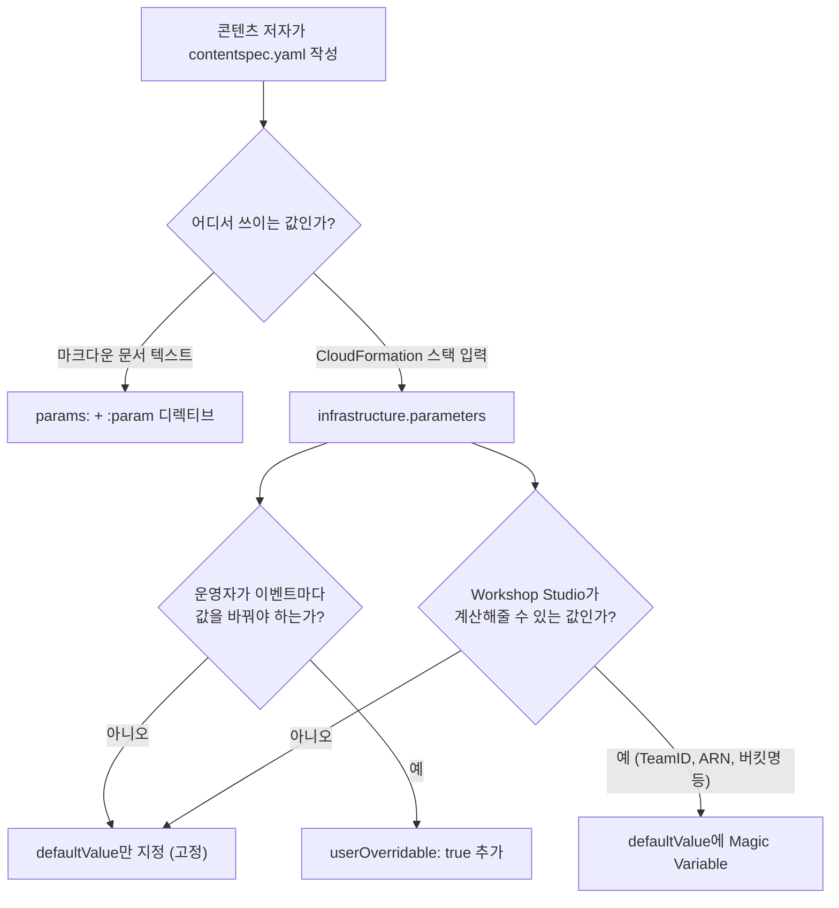

# Event Params & Variable Injection Guide (이벤트 파라미터 / 변수 주입 가이드)

`contentspec.yaml`에서 값을 정의하고, 이벤트 생성/운영 시점에 주입·오버라이드하는 3가지 레이어를 정리한다. 세 레이어는 서로 독립적이며 목적이 다르므로 섞어 쓰지 않도록 주의한다.

---

## 변수 주입 3계층 개요

| 계층 | 정의 위치 | 값이 바뀌는 시점 | 사용처 |
|------|-----------|------------------|--------|
| ① `params` | `contentspec.yaml` 최상위 | 빌드 시 고정 (콘텐츠 저자만 수정) | 마크다운 콘텐츠 (`:param` 디렉티브) |
| ② CFN `parameters` | `infrastructure.cloudformationTemplates[].parameters` | 빌드 시 고정 값, `userOverridable: true`면 **이벤트 운영자가 이벤트별로 오버라이드** | CloudFormation 스택 파라미터 |
| ③ Magic Variables | Workshop Studio가 자동 계산 | 이벤트/팀마다 자동으로 다른 값 주입 | CFN 파라미터 `defaultValue`, IAM 정책 JSON |



---

## ① `params` — 콘텐츠 변수 (빌드 시 고정)

`params`는 **자유 형식 YAML 딕셔너리**다. 스칼라, 중첩 객체, 배열 모두 허용되며 고정된 스키마가 없다.

```yaml
params:
  clusterName: workshop-cluster
  region: ap-northeast-2
  contact:
    name: John Doe
    email: john@example.com
  levels:
    - 100
    - 200
    - 300
```

콘텐츠에서 `:param` 디렉티브로 참조한다:

```markdown
클러스터 이름: :param{key="clusterName"}
담당자: :param{key=contact.name}
난이도: :param{key=levels[0]}
없는 값 대체: :param{key=missingKey defaultValue="N/A"}
```

- 점(`.`) 표기로 중첩 키, 대괄호/점 표기(`levels[0]` 또는 `levels.0`)로 배열 인덱스 접근
- `defaultValue` 속성으로 키가 없을 때 기본값 지정 (지정하지 않으면 `undefined`로 렌더링)
- 마크다운 파싱 **이전에** 치환되므로 코드 블록, 링크 href 등 마크다운이 파싱되지 않는 영역에서도 사용 가능
- 사이트 전역 값: `globals.baseUrl`(정적 콘텐츠 베이스 URL, 끝에 `/` 포함), `globals.locale`
- **CloudFormation과는 완전히 무관** — `params`의 값은 CFN 파라미터로 자동 전달되지 않는다. CFN에 값을 넘기려면 ②를 사용한다.

---

## ② CFN `parameters` — 인프라 변수 (이벤트 운영자 오버라이드 가능)

```yaml
infrastructure:
  cloudformationTemplates:
    - templateLocation: static/cfn/workshop-stack.yaml
      label: Workshop Infra
      parameters:
        # 고정값 — 운영자가 바꿀 수 없음
        - templateParameter: InstanceType
          defaultValue: t3.large

        # 운영자가 이벤트 생성/구성 시 오버라이드 가능
        - templateParameter: ParticipantCapacity
          defaultValue: '10'
          userOverridable: true

        # Magic Variable + userOverridable 조합도 가능
        - templateParameter: ClusterName
          defaultValue: workshop-cluster
          userOverridable: true
```

`userOverridable: true`가 이벤트 생성 시 운영자에게 노출되는 "이벤트 환경변수 주입"에 해당하는 실제 스키마 스위치다. 기본값(`defaultValue`)이 없는 필수 CFN 파라미터는 반드시 여기서 정의해야 하며, 그렇지 않으면 빌드가 실패한다.

> **운영자 관점**: `defaultValue`만 있는 파라미터는 콘텐츠에 고정된 값으로, 모든 이벤트에서 동일하게 배포된다. `userOverridable: true`가 붙은 파라미터만 이벤트별로 다른 값을 줄 수 있다 — 계정마다 다른 용량, 다른 이름 등을 운영자가 정할 수 있게 하려면 이 플래그를 켜야 한다.

### 이벤트 파라미터 변경 알림

운영자가 실행 중인 이벤트의 파라미터 값을 변경하면, 중앙 계정이 있는 경우 `event_parameters` DetailType의 라이프사이클 알림이 발생한다 (상세: `references/central-account-guide.md`). 페이로드는 타입이 지정된 값(`string`/`int`/`bool`/`stringList`) 형태로 현재 파라미터 값들을 담는다 — 런타임 구성 변경에 반응해야 하는 중앙 계정 인프라에 유용하다. 이 알림 흐름과 `userOverridable` 파라미터가 정확히 어떻게 연결되는지는 콘텐츠 저자 문서에 세부 매핑이 공개되어 있지 않으므로, 두 개념을 "운영자가 조정 가능한 값"이라는 관점에서 함께 이해하되 별도 메커니즘으로 다루는 것이 안전하다.

---

## ③ Magic Variables — 자동 주입 값

Workshop Studio가 이벤트/팀 프로비저닝 시점에 자동으로 계산해 `defaultValue`에 주입해주는 값들이다. 전체 목록과 팀/중앙 구분은 `references/contentspec-complete.md` 참조. 리전이 필요하면 Magic Variable이 아니라 CloudFormation 표준 pseudo parameter를 쓴다:

```yaml
Resources:
  MyBucket:
    Type: AWS::S3::Bucket
    Properties:
      BucketName: !Sub "workshop-${AWS::AccountId}-${AWS::Region}"
```

> `{{.AWSRegion}}`은 공식 Magic Variable 목록에 없다 — 리전값은 항상 `!Ref AWS::Region` / `${AWS::Region}`으로 얻는다.

---

## 스택 출력을 참가자에게 노출 — Outputs & Exports

CloudFormation `Outputs`(스택 내 키 유일)와 `Exports`(콘텐츠 전체에서 키 유일, 스택 간 참조용)는 기본적으로 참가자에게 **보이지 않는다**. Workshop Studio는 콘텐츠 빌드 검증 단계에서 템플릿당 Output/Export 각각 최대 50개까지만 허용한다 — 이는 CloudFormation 자체의 서비스 쿼터(더 큰 값)가 아니라 Workshop Studio가 콘텐츠 빌드에 부과하는 자체 제한이다. 운영자는 항상 (Events → 팀 → 스택 배포) 화면에서 모든 Output/Export를 볼 수 있다.

```yaml
infrastructure:
  cloudformationTemplates:
    - templateLocation: static/cfn/workshop-stack.yaml
      label: Workshop Infra
      # 방법 1: 특정 Output만 참가자에게 노출
      participantVisibleStackOutputs:
        - WorkshopUrl
      # 방법 2: 이 템플릿의 모든 Output/Export 노출 (기본값 false)
      participantAllStackOutputsVisible: false
```

참가자는 이벤트 페이지의 "Event Outputs" 섹션에서 노출된 값만 확인한다 (OutputKey/Value/Stack name/Description/Type). `:param` 디렉티브는 `params`만 읽으므로 스택 Output을 마크다운에 직접 끌어오는 공식 디렉티브는 없다 — 참가자에게 값을 "설명"하려면 Output 노출 설정을 쓰고, 콘텐츠 텍스트에서 참조 가능한 값이 필요하면 `params`로 별도 정의한다.

---

## 엔드투엔드 예제 — `ClusterName` 하나가 흐르는 전체 경로

```yaml
# contentspec.yaml
params:
  clusterNameHint: "예: my-eks-cluster"

infrastructure:
  cloudformationTemplates:
    - templateLocation: static/cfn/eks-stack.yaml
      label: EKS Cluster
      parameters:
        - templateParameter: ClusterName
          defaultValue: workshop-cluster
          userOverridable: true          # 운영자가 이벤트마다 클러스터 이름 변경 가능
        - templateParameter: ParticipantRoleArn
          defaultValue: "{{.ParticipantRoleArn}}"   # Magic Variable로 자동 주입
      participantVisibleStackOutputs:
        - ClusterEndpoint                # 참가자에게 노출할 Output
```

1. 저자가 `static/cfn/eks-stack.yaml`에 `ClusterName` 파라미터와 `ClusterEndpoint` Output을 정의
2. 콘텐츠 빌드 시 `defaultValue: workshop-cluster`가 기본값으로 적용되고, `userOverridable: true`이므로 운영자가 이벤트 구성 시 다른 이름으로 바꿀 수 있음
3. 배포 시 `ParticipantRoleArn`은 Workshop Studio가 팀별로 실제 ARN을 계산해 자동 주입
4. `ClusterEndpoint` Output은 `participantVisibleStackOutputs`에 있으므로 참가자의 Event Outputs 화면에 노출
5. 마크다운에서는 `클러스터 이름 힌트: :param{key="clusterNameHint"}`처럼 별도의 `params` 값만 텍스트로 노출 (실제 배포된 클러스터 이름 그 자체를 노출하려면 Output 노출 설정을 이용)

---

## 안티패턴

- ❌ **시크릿 값을 `params`나 CFN `defaultValue`에 평문으로 저장** — 두 값 모두 빌드 아티팩트에 그대로 남는다. 시크릿은 Secrets Manager/SSM SecureString + IAM 정책으로 접근시켜야 한다.
- ❌ **계정 ID/ARN 하드코딩** — 항상 Magic Variable(`{{.ParticipantRoleArn}}`, `{{.AccountId}}` 등) 또는 CFN pseudo parameter를 사용한다.
- ❌ **운영자 오버라이드가 필요한 값에 `userOverridable`을 빠뜨림** — 이벤트별로 달라져야 하는데 고정 `defaultValue`만 지정하면 모든 이벤트가 동일한 값으로 배포된다.
- ❌ **모든 Output을 무분별하게 `participantAllStackOutputsVisible: true`로 노출** — 내부 진단용 Output까지 참가자에게 노출될 수 있다. 필요한 Output만 `participantVisibleStackOutputs`로 선별한다.
- ❌ **`params` 값을 CFN에 전달될 것으로 기대** — `params`는 콘텐츠 텍스트 전용이며 인프라 계층과 연결되지 않는다.
