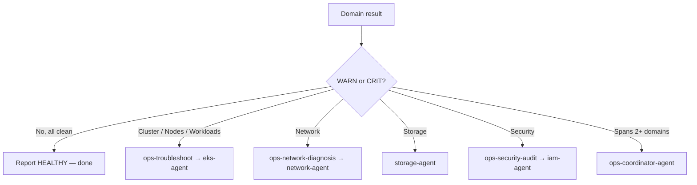

# Ops Health Check Skill

Delivers a six-domain OK/WARN/CRIT read on whether a cluster is healthy right now, for someone asking "is anything wrong?" — a concrete failure routes to `ops-troubleshoot` instead. Excellent work here answers every domain even when it is clean, attaches to each WARN or CRIT the number that triggered it, and orders recommendations by risk. This skill stays deliberately lean: it is a sweep, not a diagnosis.

## Workflow

### Step 1: Establish context

```bash
aws sts get-caller-identity --query 'Account' --output text
aws eks list-clusters --output text
```

Confirm which cluster and region the sweep targets before running anything — a health verdict on the wrong cluster is worse than none.

### Step 2: Sweep all six domains

Run every domain below even when the early ones come back clean; the report's value is that every domain was answered. Judge each result against the warning/critical thresholds in `references/metrics-thresholds.md` — that file owns the numbers, this one owns the commands. Deeper per-domain procedures live in `references/health-check-procedures.md`.

### Step 3: Report and route

Emit the report in the Output Format below, then hand any WARN/CRIT domain to its specialist (see Escalation Routing) rather than diagnosing it inside the sweep.

## Health Check Domains

### 1. Cluster Health
```bash
kubectl cluster-info
aws eks describe-cluster --name $CLUSTER_NAME --query 'cluster.{status:status,version:version,platformVersion:platformVersion}'
kubectl get componentstatuses 2>/dev/null
```

### 2. Node Health
```bash
kubectl get nodes -o wide
kubectl top nodes
kubectl get nodes -o json | jq '.items[] | {name:.metadata.name, ready:[.status.conditions[] | select(.type=="Ready") | .status][0], cpu:.status.allocatable.cpu, memory:.status.allocatable.memory}'
```

### 3. Workload Health
```bash
kubectl get pods -A --field-selector=status.phase!=Running,status.phase!=Succeeded | head -20
kubectl get deployments -A -o json | jq '.items[] | select(.status.unavailableReplicas > 0) | {name:.metadata.name, ns:.metadata.namespace, unavailable:.status.unavailableReplicas}'
kubectl get daemonsets -A -o json | jq '.items[] | select(.status.desiredNumberScheduled != .status.numberReady) | {name:.metadata.name, ns:.metadata.namespace, desired:.status.desiredNumberScheduled, ready:.status.numberReady}'
```

### 4. Network Health
```bash
kubectl get pods -n kube-system -l k8s-app=kube-dns -o wide
kubectl get pods -n kube-system -l k8s-app=aws-node -o wide
kubectl get svc -A --field-selector spec.type=LoadBalancer
```

### 5. Storage Health
```bash
kubectl get pvc -A --field-selector status.phase!=Bound
kubectl get pv --field-selector status.phase!=Bound,status.phase!=Released
kubectl get csidrivers
```

### 6. Security Health
```bash
kubectl get pods -A -o json | jq '[.items[] | select(.spec.containers[].securityContext.privileged==true) | {name:.metadata.name, ns:.metadata.namespace}]'
kubectl get networkpolicies -A
kubectl get podsecuritypolicies 2>/dev/null
```

## Escalation Routing

A WARN or CRIT domain leaves this skill with a named owner. Route by domain:



## Output Format

```
# Infrastructure Health Report

## Summary
- Overall: HEALTHY / WARNING / CRITICAL
- Checked: [timestamp]
- Cluster: [name] (v[version])

## Results

| Domain | Status | Details |
|--------|--------|---------|
| Cluster | ✅/⚠️/❌ | [Summary] |
| Nodes (N/N ready) | ✅/⚠️/❌ | [Summary] |
| Workloads | ✅/⚠️/❌ | [N unhealthy pods] |
| Network | ✅/⚠️/❌ | [Summary] |
| Storage | ✅/⚠️/❌ | [N unbound PVCs] |
| Security | ✅/⚠️/❌ | [Summary] |

## Recommendations
1. [Action item]
2. [Action item]
```

## References

- `references/health-check-procedures.md` — Detailed procedures per domain
- `references/metrics-thresholds.md` — Warning/critical thresholds
