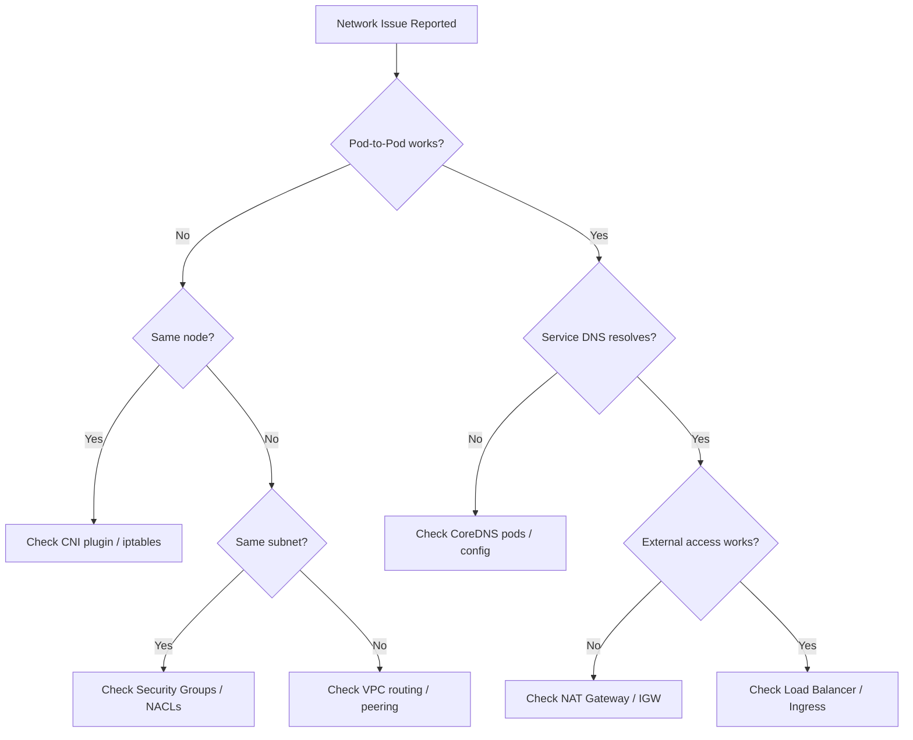

# Ops Network Diagnosis Skill

Deep network diagnostics for VPC CNI, load balancers, and DNS in EKS environments.

## Diagnosis Workflow

### Step 1: Identify the Layer
- **L3 (IP)**: IP exhaustion, subnet, routing, VPC peering
- **L4 (Transport)**: Security groups, NACLs, port connectivity
- **L7 (Application)**: Load balancer, Ingress, target health
- **DNS**: CoreDNS, Route 53, external-dns

### Step 2: Layer-Specific Diagnostics
Route to appropriate reference for detailed commands and decision trees.

### Step 3: Verify Resolution
Test connectivity end-to-end after applying fixes.

## Network Diagnosis Decision Tree



## Common Errors

| Symptom | Likely Cause | Quick Fix |
|---------|-------------|-----------|
| `dial tcp: i/o timeout` | Security group blocks port | Add inbound rule for target port |
| `no route to host` | Missing VPC route | Check route table for destination CIDR |
| `NXDOMAIN` on service | CoreDNS not running | `kubectl rollout restart -n kube-system deploy/coredns` |
| `connection refused` | Service port mismatch | Verify `targetPort` matches container port |
| IP exhaustion warnings | Subnet CIDR too small | Enable prefix delegation or add subnets |
| `504 Gateway Timeout` | Target group unhealthy | Check health check path and security groups |

## IP Exhaustion Diagnosis

```bash
# Check available IPs per subnet
aws ec2 describe-subnets --filters "Name=vpc-id,Values=$VPC_ID" \
  --query 'Subnets[].{SubnetId:SubnetId,AZ:AvailabilityZone,AvailableIPs:AvailableIpAddressCount,CIDR:CidrBlock}'

# Check ENI allocation per node
kubectl get nodes -o json | jq '.items[] | {name:.metadata.name, enis:.status.addresses | length}'

# Enable prefix delegation
kubectl set env daemonset aws-node -n kube-system ENABLE_PREFIX_DELEGATION=true
```

## Quick Connectivity Tests

```bash
# Pod-to-pod
kubectl exec -it <pod1> -- curl -s <pod2-ip>:<port>

# Pod-to-service
kubectl exec -it <pod> -- curl -s <service>.<namespace>.svc.cluster.local:<port>

# DNS resolution
kubectl exec -it <pod> -- nslookup <service>.<namespace>.svc.cluster.local

# External connectivity
kubectl exec -it <pod> -- curl -s -o /dev/null -w "%{http_code}" https://aws.amazon.com
```

## Output Format

```markdown
## Network Diagnosis Report

**Issue**: [Brief description]
**Layer**: L3/L4/L7/DNS
**Severity**: P1/P2/P3

### Findings
- [Finding 1 with evidence]
- [Finding 2 with evidence]

### Root Cause
[Explanation with supporting data]

### Resolution
1. [Step with command]
2. [Verification command + expected output]

### Prevention
- [Recommended configuration change]
```

## References

- `references/vpc-cni-troubleshooting.md` — IP management, ENI, prefix delegation
- `references/load-balancer-troubleshooting.md` — ALB/NLB setup, target health
- `references/dns-troubleshooting.md` — CoreDNS, Route 53, resolution issues
