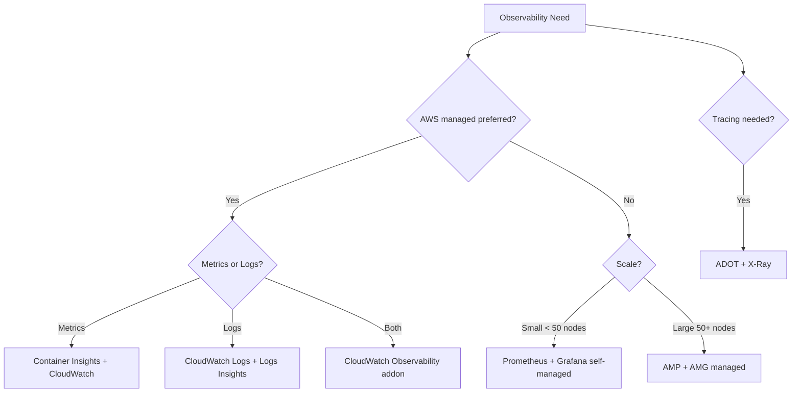

# Ops Observability Skill

Observability setup, configuration, and analysis for AWS/EKS environments.

## Workflow

### Step 1: Assess Current State
```bash
# What's collecting metrics?
kubectl get pods -n amazon-cloudwatch
kubectl get pods -n monitoring
kubectl get pods -n prometheus

# What log groups exist?
aws logs describe-log-groups --log-group-name-prefix /aws/containerinsights/$CLUSTER_NAME --query 'logGroups[].{name:logGroupName,retention:retentionInDays,size:storedBytes}'

# What alarms exist?
aws cloudwatch describe-alarms --state-value ALARM --query 'MetricAlarms[].{name:AlarmName,state:StateValue,metric:MetricName}'
```

### Step 2: Setup / Fix
Route to appropriate reference for setup procedures.

### Step 3: Create Queries and Alarms
Use reference files for query templates and threshold guidelines.

## Monitoring Stack Decision Tree



## Common Issues

| Symptom | Cause | Fix |
|---------|-------|-----|
| No metrics in CloudWatch | Addon not installed | Install amazon-cloudwatch-observability addon |
| High CloudWatch costs | Log group retention too long | Set retention to 7-30 days |
| Prometheus OOM | Too many cardinality labels | Add metric_relabel_configs to drop high-cardinality |
| Missing container metrics | IRSA not configured | Attach CloudWatchAgentServerPolicy to node role |
| Grafana dashboard empty | Wrong data source URL | Verify AMP workspace endpoint URL |
| Log group not created | Insufficient IAM permissions | Add logs:CreateLogGroup to node role |

## Essential PromQL Alerts

```yaml
# High CPU per pod
avg(rate(container_cpu_usage_seconds_total{namespace!="kube-system"}[5m])) by (pod) > 0.8

# OOMKilled detection
increase(kube_pod_container_status_restarts_total[1h]) > 3

# Persistent volume usage > 85%
kubelet_volume_stats_used_bytes / kubelet_volume_stats_capacity_bytes > 0.85
```

## Output Format

```markdown
## Observability Assessment: [Cluster Name]

### Current State
- **Metrics**: [CloudWatch/Prometheus/AMP] — [status]
- **Logs**: [CloudWatch Logs/Fluentd/Fluent Bit] — [status]
- **Tracing**: [X-Ray/ADOT] — [status]

### Issues Found
1. [Issue] — [Severity: High/Medium/Low]
   - Cause: [root cause]
   - Fix: [command or action]

### Recommendations
- [ ] [Action item with priority]

### Commands Executed
| Command | Result |
|---------|--------|
| `kubectl get pods -n monitoring` | [output summary] |
```

## Quick Reference

### Enable Container Insights
```bash
aws eks create-addon --cluster-name $CLUSTER_NAME --addon-name amazon-cloudwatch-observability --addon-version v1.5.0-eksbuild.1
```

### Essential Logs Insights Query
```sql
fields @timestamp, @message
| filter @message like /error/i
| sort @timestamp desc
| limit 50
```

### Essential Alarm
```bash
aws cloudwatch put-metric-alarm --alarm-name "$CLUSTER_NAME-high-cpu" --namespace ContainerInsights --metric-name cluster_cpu_utilization --dimensions Name=ClusterName,Value=$CLUSTER_NAME --statistic Average --period 300 --evaluation-periods 2 --threshold 80 --comparison-operator GreaterThanThreshold --alarm-actions <sns-topic-arn>
```

## References

- `references/cloudwatch-setup.md` — Container Insights, log groups, dashboards
- `references/prometheus-queries.md` — PromQL alert rules for EKS
- `references/log-analysis-queries.md` — CloudWatch Logs Insights query templates
