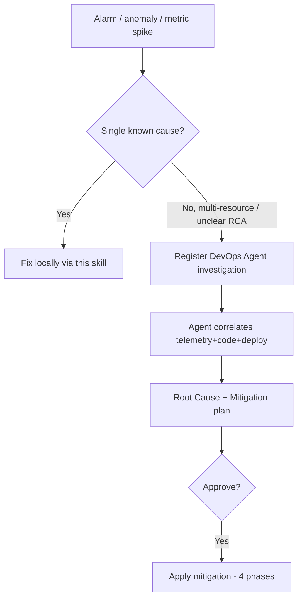

# AWS DevOps Agent Integration

**AWS DevOps Agent** is a fully managed frontier agent (GA 2026-03-31; public
preview at re:Invent 2025-12-02) **built on Amazon Bedrock AgentCore** (memory,
policies, evaluations, observability). It autonomously investigates incidents and
recommends preventative improvements — like an experienced SRE. It learns your
resource topology, correlates telemetry + code + deployment data, and works across
AWS, multicloud, and on-prem. Use this skill to **route an alarm/anomaly into a
DevOps Agent investigation** and consume its mitigation plan.

> **Human-approval boundary (verified)**: DevOps Agent "produces a mitigation plan
> but does **not** make changes to your AWS environment on its own" — execution
> always requires human approval. Treat it as a diagnosis + plan engine, not an
> auto-remediator. Vendor-reported metrics (e.g. up to 75% lower MTTR, 94% RCA
> accuracy) are AWS/preview-customer self-reported — cite as claims, not guarantees.

> Distinct from **Amazon Bedrock AgentCore** itself (GA 2025-10-13), which is the
> build-your-own-agent *platform* — DevOps Agent is the prebuilt ops agent on top of
> it. And distinct from native **CloudWatch investigations** (see
> `cloudwatch-setup.md` → AIOps): investigations are first-line RCA inside CloudWatch;
> DevOps Agent is the standalone teammate for cross-service/cross-cloud incidents.

> Service docs: https://docs.aws.amazon.com/devopsagent/latest/userguide/about-aws-devops-agent.html

## Concepts

| Concept | What it is |
|---------|-----------|
| **Agent Space** | Logical container holding account configs, tool integrations, access controls. Created via console **or** AWS CLI. |
| **Topology** | Auto-built graph of application resources + relationships, used during investigation. |
| **Backlog task** | A unit of investigation work; created on alert/ticket or programmatically. |
| **Mitigation plan** | Specific Prepare → Pre-Validate → Apply → Post-Validate steps; emitted as **agent-ready specs compatible with coding agents like Kiro**. |

## When to escalate to DevOps Agent



## Wiring CloudWatch → DevOps Agent (autonomous entry)

Connection chain: **CloudWatch Alarm → EventBridge → Lambda → DevOps Agent Webhook**.

```bash
# 1. Webhook is created in the DevOps Agent console/Agent Space (HMAC-SHA256 signed).
#    Save the unique URL + secret key (cannot be retrieved later).

# 2. Lambda forwards the incident payload to the webhook. Required schema:
#    { eventType: 'incident', incidentId, action: created|updated|closed|resolved,
#      priority: CRITICAL|HIGH|MEDIUM|LOW|MINIMAL, title, ... }

# 3. Verify the path end-to-end by forcing an alarm into ALARM:
aws cloudwatch set-alarm-state --alarm-name "$CLUSTER_NAME-high-cpu" \
  --state-value ALARM --state-reason "wiring test → DevOps Agent"
# then confirm the investigation appears in the operator web app.
```

Other entry points (verified trigger sources): **CloudWatch alarms, PagerDuty,
Dynatrace, ServiceNow, and generic webhooks**, plus **manual** operator queries
("What is causing high CPU usage?"). The agent begins investigating without a human
prompt once a configured source fires.

## Programmatic investigation (CLI)

```bash
# Trigger an investigation programmatically
aws devopsagent create-backlog-task \
  --agent-space-id <space-id> \
  --title "EKS prod: p99 latency anomaly" \
  --priority HIGH
# (optionally pass an "investigation starting point" — alarm/ASG/instance — to focus the agent)

# Approve / advance a generated mitigation plan
aws devopsagent update-backlog-task --task-id <id> --action approve-mitigation
```

> Agent Spaces and the wiring can also be provisioned via AWS CDK. Confirm exact
> parameter names against `aws devopsagent help` and the user guide, as the API
> surface is new (GA 2026).

## Interaction surfaces

| Surface | Use |
|---------|-----|
| Web operator console | "Chat with DevOps Agent" — steer investigations, browse Topology/Prevention |
| Slack | invite the DevOps Agent Slack app to the channel (e.g. `/invite @AWS DevOps Agent`) — receives investigation updates automatically |
| CLI / API | `aws devopsagent ...` — trigger/approve from CI/CD or this skill |

## Integrations (no workflow change)

- Observability: **Amazon CloudWatch**, Dynatrace, Datadog, New Relic, Splunk.
- Repos/CI-CD: GitHub Actions + repos, GitLab workflows + repos.
- **Custom MCP servers**: extend the agent with your own tools (e.g., Splunk MCP —
  enable app, create `mcp_user` role, generate `mcp`-audience token, register
  endpoint+token in DevOps Agent). This mirrors how this plugin uses `awsapi`/`awsdocs` MCP.

## Hand-off to remediation

Mitigation plans are emitted as Kiro-compatible specs (Prepare → Pre-Validate →
Apply → Post-Validate). After the agent produces an RCA, hand the spec to a coding
agent or apply via IaC. Pair with the `co-agent` plugin for a deep review of the
proposed fix before `Apply`.

## Common Issues

| Symptom | Cause | Fix |
|---------|-------|-----|
| Alarm fires but no investigation | Webhook signature mismatch | Re-check HMAC secret in Lambda env; resend test payload |
| Investigation lacks context | Topology incomplete / no starting point | Ensure account integrations attached to Agent Space; pass starting point |
| Agent can't query a tool | MCP endpoint/token invalid | Regenerate MCP token (audience `mcp`), re-register endpoint |
| Mitigation not actionable | Investigation scope too broad | Narrow starting point to the suspect alarm/resource |
