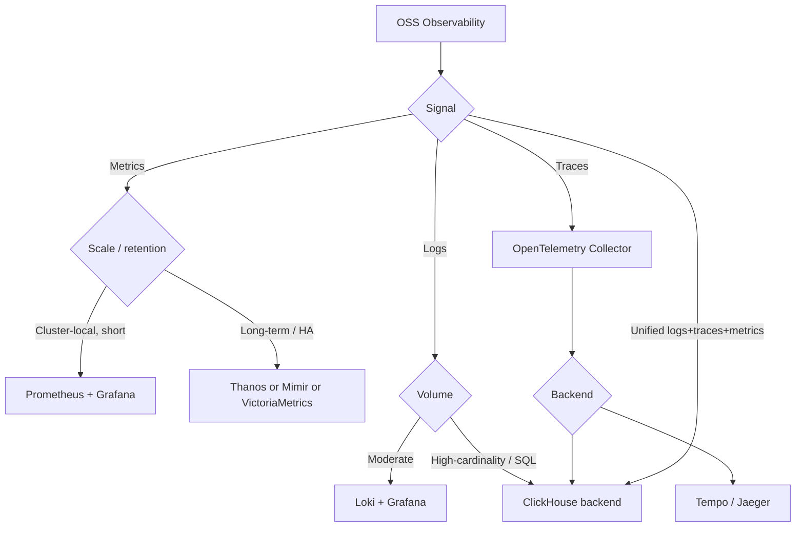

# Open-Source Observability Stack (EKS/AWS)

Commands-first runbook for self-managed OSS observability on EKS. Pairs with
`cloudwatch-setup.md` (AWS-managed) and `prometheus-queries.md` (PromQL rules).

## Stack Decision



## OpenTelemetry (collection layer — start here)

OTel is the vendor-neutral collection standard; route to any backend. On EKS,
deploy the OTel Collector as a DaemonSet (host metrics/logs) + Deployment (gateway).

```bash
# Install OpenTelemetry Operator (manages Collectors + auto-instrumentation)
helm repo add open-telemetry https://open-telemetry.github.io/opentelemetry-helm-charts
helm upgrade --install otel-operator open-telemetry/opentelemetry-operator -n observability --create-namespace

# Verify collector pods + pipelines
kubectl get opentelemetrycollectors -A
kubectl logs -n observability -l app.kubernetes.io/name=otel-collector --tail=50 | grep -iE "pipeline|exporter|error"
```

Collector pipeline shape (receivers → processors → exporters): OTLP in →
`batch` + `memory_limiter` → export to Prometheus remote-write / Loki / Tempo /
ClickHouse / CloudWatch (via `awsemf`/`awsxray` exporters — bridges OSS to AWS).

## Prometheus + Grafana (metrics)

```bash
# kube-prometheus-stack = Prometheus + Alertmanager + Grafana + node-exporter + kube-state-metrics
helm repo add prometheus-community https://prometheus-community.github.io/helm-charts
helm upgrade --install kps prometheus-community/kube-prometheus-stack -n monitoring --create-namespace

# Health checks
kubectl get pods -n monitoring
kubectl -n monitoring exec deploy/kps-grafana -- wget -qO- localhost:3000/api/health
# Prometheus targets DOWN?
kubectl -n monitoring port-forward svc/kps-kube-prometheus-stack-prometheus 9090 &
curl -s localhost:9090/api/v1/targets | jq '.data.activeTargets[] | select(.health!="up") | {job:.labels.job,err:.lastError}'
```

Long-term / HA metrics: **Thanos** (sidecar + object store on S3), **Mimir**
(horizontally scalable), or **VictoriaMetrics** (lower resource footprint).
All accept Prometheus remote-write and store blocks on S3.

## Loki (logs)

```bash
helm repo add grafana https://grafana.github.io/helm-charts
helm upgrade --install loki grafana/loki -n observability --set loki.storage.type=s3
# Promtail/Alloy ships pod logs → Loki; query in Grafana with LogQL
kubectl get pods -n observability -l app.kubernetes.io/name=loki
```

LogQL example: `{namespace="prod"} |= "error" | json | status>=500`

## ClickHouse (high-cardinality logs/traces/metrics backend)

ClickHouse is a columnar OLAP store used as a unified observability backend by
SigNoz, OpenObserve, and Uptrace — cheap storage + SQL over logs/traces/metrics.
Distinct from analytics-agent's ClickHouse (ad-hoc analytics): here it is the
telemetry sink behind an OTel pipeline.

```bash
# Altinity ClickHouse operator on EKS (pin --version — see Version Compatibility below)
helm repo add altinity https://helm.altinity.com
helm upgrade --install clickhouse-operator altinity/altinity-clickhouse-operator \
  --version <pinned-chart-version> -n observability
kubectl get chi -A   # ClickHouseInstallation custom resources

# OTel Collector → ClickHouse exporter (in collector config):
#   exporters:
#     clickhouse:
#       endpoint: tcp://clickhouse.observability.svc:9000
#       logs_table_name: otel_logs
#       traces_table_name: otel_traces

# Query telemetry directly (SQL)
kubectl -n observability exec -it chi-... -- clickhouse-client -q \
  "SELECT ServiceName, count() c FROM otel.otel_traces WHERE StatusCode='STATUS_CODE_ERROR' AND Timestamp > now()-3600 GROUP BY ServiceName ORDER BY c DESC LIMIT 10"
```

Turnkey OSS distros built on ClickHouse: **SigNoz** (`helm install signoz signoz/signoz`),
**OpenObserve**, **Uptrace** — bundle OTel ingest + UI + ClickHouse storage.

## Traces: Tempo / Jaeger

```bash
helm upgrade --install tempo grafana/tempo -n observability --set storage.trace.backend=s3
# OR Jaeger
kubectl create -f https://github.com/jaegertracing/jaeger-operator/releases/latest/download/jaeger-operator.yaml -n observability
```

## Version Compatibility (pin everything — esp. ClickHouse)

OSS observability components are **tightly version-coupled**. ClickHouse in
particular ships fast (multiple releases/month) and its telemetry schema, the OTel
ClickHouse exporter, the operator, and turnkey distros (SigNoz/OpenObserve/Uptrace)
must move together. Mixing versions causes silent schema mismatches, failed
migrations, or dropped telemetry. **Pin every version; never track `latest`.**

### Coupling map

| Component | Couples with | Failure if mismatched |
|-----------|-------------|----------------------|
| ClickHouse **server** | exporter schema, distro's tested range | `TYPE_MISMATCH` / unknown column on insert; failed migrations |
| OTel Collector **clickhouseexporter** (contrib) | ClickHouse server, OTLP schema | exporter is still evolving — table DDL/column names change between collector releases |
| Altinity **clickhouse-operator** (CHI CRD) | ClickHouse server version it provisions | CRD/feature gaps; pod won't reconcile |
| **SigNoz / OpenObserve / Uptrace** | a *bundled, tested* ClickHouse version | distro upgrades expect a specific CH version + run schema migrations on boot |
| kube-prometheus-stack | Prometheus/Grafana/CRD versions (chart `appVersion`) | CRD upgrade skew; scrape config breakage |

### Rules

```bash
# 1. ALWAYS pin Helm chart version AND record the appVersion it installs
helm upgrade --install clickhouse-operator altinity/altinity-clickhouse-operator \
  --version <chart-ver> -n observability
helm list -n observability -o json | jq '.[] | {name,chart,app_version}'   # record this

# 2. Pin ClickHouse server image explicitly in the CHI spec (don't use :latest)
#    spec.templates.podTemplates[].spec.containers[].image: clickhouse/clickhouse-server:<X.Y>
kubectl get chi -A -o jsonpath='{.items[*].spec.configuration.settings}'   # audit

# 3. For SigNoz/OpenObserve/Uptrace: pin the DISTRO chart version and let IT own
#    the ClickHouse version — do not independently upgrade ClickHouse under them.
helm show chart signoz/signoz --version <ver> | grep -E 'appVersion|version'

# 4. Pin the OTel Collector image to a release whose clickhouseexporter matches
#    your server; verify the exporter created the expected tables after deploy.
kubectl -n observability exec chi-... -- clickhouse-client -q "SHOW TABLES FROM otel"
```

### Upgrade procedure (ClickHouse-backed stacks)

1. Read the distro/exporter release notes for **schema migrations** and the
   supported ClickHouse version range.
2. Snapshot/backup ClickHouse (or rely on S3-backed `MergeTree` + TTL) before upgrade.
3. Upgrade in order: **server → operator/exporter → distro**, one step at a time,
   verifying `SHOW TABLES`/inserts between steps. Never jump multiple major versions.
4. ClickHouse supports **stable** (fast) and **LTS** releases — prefer LTS for
   observability backends to reduce churn.

> Record the pinned set (chart versions + appVersions + ClickHouse image tag) in
> the cluster's IaC/runbook so the compatibility matrix is reproducible.

## Common Issues

| Symptom | Cause | Fix |
|---------|-------|-----|
| OTel Collector dropping spans | `memory_limiter` too tight / no `batch` | Add `batch` processor, raise `memory_limiter` limit_mib |
| ClickHouse insert fails after upgrade | server/exporter schema skew | Re-pin matched versions; run distro's migration; check `SHOW TABLES FROM otel` |
| SigNoz won't start after `helm upgrade` | ClickHouse version outside distro's tested range | Roll back to the distro-bundled CH version; upgrade server only via the distro |
| Prometheus high RAM | Cardinality explosion | `metric_relabel_configs` drop labels; offload to VictoriaMetrics |
| Loki "too many outstanding requests" | Single-binary under load | Switch to simple-scalable/microservices mode, S3 backend |
| ClickHouse disk fills fast | No TTL on telemetry tables | `ALTER TABLE otel_logs MODIFY TTL Timestamp + INTERVAL 30 DAY` |
| Grafana panel empty | Wrong datasource UID/URL | Verify datasource points at Prometheus/Loki/ClickHouse svc DNS |
| Traces not correlating with logs | No shared trace_id/exemplars | Propagate W3C `traceparent`; enable exemplars in Prometheus |

## Bridging OSS ↔ AWS

- OTel Collector `awsemf` exporter → CloudWatch metrics; `awsxray` → X-Ray.
- Prometheus remote-write → **AMP** (Amazon Managed Prometheus); Grafana → **AMG**.
- This lets you keep OSS instrumentation while feeding AWS-managed backends — and
  feeds telemetry into **AWS DevOps Agent** investigations (see `aws-devops-agent.md`).

## References

- https://opentelemetry.io/docs/collector/
- https://grafana.com/docs/loki/latest/ · https://grafana.com/docs/tempo/latest/
- https://clickhouse.com/docs/en/observability
