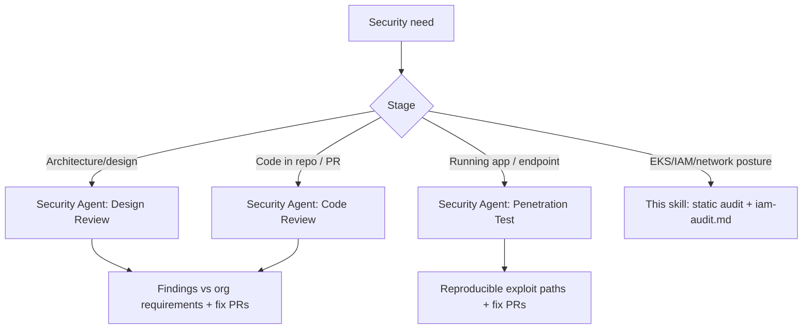

# AWS Security Agent Integration

**AWS Security Agent** is a frontier agent that proactively secures applications
across the development lifecycle — **design review**, **code review**, and
**on-demand penetration testing**. It enforces security requirements you define
once in the AWS Console and delivers proof-based findings with ready-to-merge fix
PRs. Use this skill's static EKS/IAM checks for *infrastructure posture*, and AWS
Security Agent for *application security validation*.

> Service docs: https://docs.aws.amazon.com/securityagent/latest/userguide/what-is.html

## Availability (as of 2026-05)

| Capability | Status | Notes |
|-----------|--------|-------|
| On-demand penetration testing | **GA (2026-03-31)** | Regions: N. Virginia, Oregon, Ireland, Frankfurt, Sydney, Tokyo |
| Design security review | Preview | Upload design docs → feedback vs org requirements |
| Code security review (full repo + PR) | Preview | GitHub repos or S3 source; PR comments + fix PRs |

Full **API support** to embed in CI/CD; 2-month free trial for new customers.
Operates across AWS, on-prem, hybrid, multicloud, and SaaS.

## Concepts

| Concept | What it is |
|---------|-----------|
| **Org security requirements** | Approved auth libraries, logging standards, data-access policies — defined **once in AWS Console**, enforced across every review |
| **Agent Space** | Logical container holding the repositories + configs the Security Agent can access |
| **Design review** | Pre-code: evaluates architecture docs against requirements, returns remediation guidance |
| **Code review** | Full source scan (GitHub/S3) + automated PR analysis posting findings as PR comments; can auto-generate fix PRs |
| **Penetration test** | Specialized AI agents run tailored multi-step attack chains; proof-based exploitation with reproducible attack paths + fix PRs |

## When to use which

## Workflow

1. **Define org requirements once** (AWS Console): approved authz libraries,
   logging standards, data-access policies. All reviews validate against these
   rather than generic checklists.
2. **Connect sources** — create an Agent Space and connect GitHub repos / S3
   source for code review; provide target URL + auth details + source + docs for
   pentest.
3. **Run reviews** on-demand (console) or via **API in CI/CD**:
   - Design review: upload architecture docs → prioritized remediation guidance.
   - Code review: full-repo scan, or enable automated PR analysis (findings posted
     as PR comments; optional auto fix-PRs).
   - Penetration test: agent analyzes app context, executes attack chains,
     documents impact + reproducible paths, opens fix PRs.
4. **Triage** confirmed (proof-based) findings — exploit path + impact analysis
   filter out false positives. Merge generated fix PRs or remediate.

> The exact CLI/API operation names are part of the new (2026) service surface —
> confirm against the user guide / `aws securityagent help` before scripting CI/CD
> integration. The capability model (design/code/pentest, org requirements, Agent
> Spaces, PR fixes) is stable.

## How it complements this skill

| Layer | Tool |
|-------|------|
| App design & code vulnerabilities, pentest | **AWS Security Agent** |
| EKS/IAM/RBAC/network/CIS posture | This skill (`iam-audit.md`, `network-security.md`, `compliance-checklist.md`) |
| Adversarial review of a code change/diff | `kiro-review` plugin (Kiro CLI) |

Use all three together: Security Agent for application-layer SAST/DAST/pentest,
this skill for cloud/cluster posture, and `kiro-review` for per-diff adversarial
review during PRs.

## Common Issues

| Symptom | Cause | Fix |
|---------|-------|-----|
| Findings feel generic | Org requirements not configured | Define approved libraries/logging/data policies in Console first |
| Pentest unavailable in region | Region not in GA list | Use one of the 6 GA regions or run from a supported region |
| Code review not posting on PRs | Automated PR analysis not enabled / repo not connected | Connect GitHub repo to Agent Space, enable PR analysis |
| Too many low-value items | Not using proof-based filtering | Prioritize validated (exploited) findings; pentest output is proof-based |
