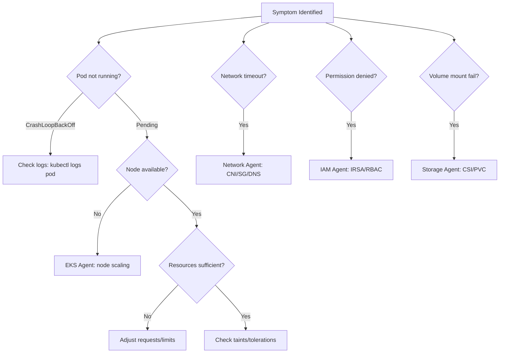

# Ops Troubleshoot Skill

A systematic troubleshooting workflow for AWS/EKS infrastructure issues.

## Workflow

### Phase 1: 5-Minute Triage Commands

```bash
# 1. Cluster health
kubectl cluster-info
kubectl get nodes -o wide

# 2. Failed workloads
kubectl get pods -A --field-selector=status.phase!=Running

# 3. Recent events (last 50)
kubectl get events -A --sort-by='.lastTimestamp' | tail -50

# 4. System pods status
kubectl get pods -n kube-system

# 5. Resource usage
kubectl top nodes
kubectl top pods -A --sort-by=memory | head -20

# 6. AWS EKS cluster status
aws eks describe-cluster --name $CLUSTER_NAME --query 'cluster.status'
```

### Phase 2: Investigation
1. Identify the symptom domain (network, auth, storage, compute, observability)
2. Route to the appropriate specialist agent
3. Collect diagnostic data using domain-specific commands
4. Cross-reference with known error patterns (see references/)

#### Symptom Routing Decision Tree



### Phase 3: Resolution
1. Apply the fix (configuration change, scaling, restart, etc.)
2. Verify the fix resolves the symptom
3. Monitor for regression (5-15 minutes)

### Phase 4: Postmortem
1. Document the incident (timeline, impact, root cause)
2. Identify preventive measures
3. Update runbooks if new pattern discovered

## Severity Classification

| Level | Response | Criteria |
|-------|----------|----------|
| P1 Critical | < 5 min | Service outage, data loss risk |
| P2 High | < 30 min | Major degradation, high error rate |
| P3 Medium | < 4 hr | Minor impact, single component |
| P4 Low | Next business day | Warning, optimization |

## Output Format

```markdown
# Incident Report
- Severity: P1/P2/P3/P4
- Duration: [start] - [end]
- Impact: [description]
- Root Cause: [description]
- Resolution: [what was done]
- Prevention: [follow-up actions]
```

## References

- `references/troubleshooting-framework.md` — Systematic approach and commands
- `references/incident-response.md` — 5-minute checklist, severity matrix
- `references/decision-trees.md` — Mermaid decision trees for common scenarios
- `references/common-errors.md` — Error message → solution mapping
