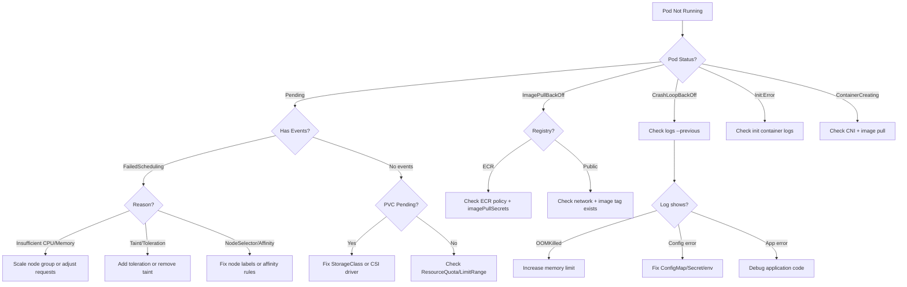
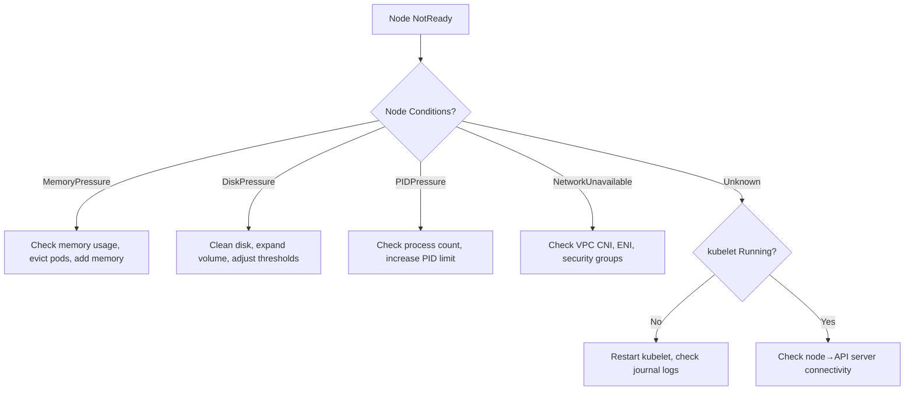
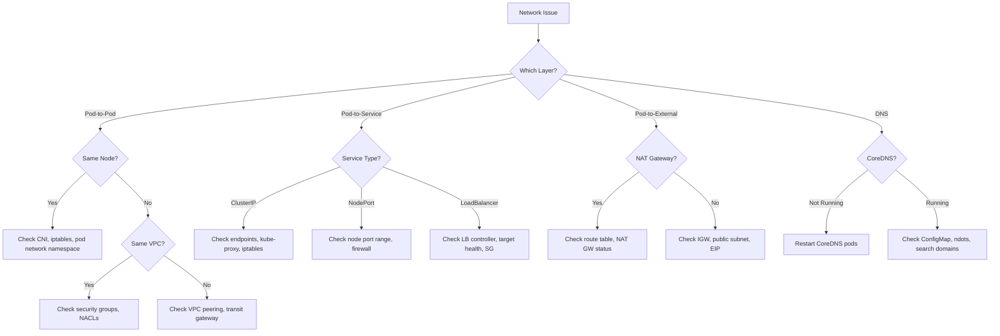
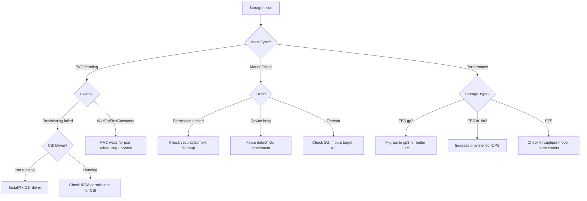

# Decision Trees

Mermaid-based decision trees for common EKS troubleshooting scenarios.

---

## Pod Not Starting

```mermaid
flowchart TD
    START[Pod Not Running] --> STATUS{Pod Status?}

    STATUS -->|Pending| PENDING{Has Events?}
    PENDING -->|FailedScheduling| SCHED{Reason?}
    SCHED -->|Insufficient CPU/Memory| SCALE[Scale node group or adjust requests]
    SCHED -->|Taint/Toleration| TAINT[Add toleration or remove taint]
    SCHED -->|NodeSelector/Affinity| AFFINITY[Fix node labels or affinity rules]
    PENDING -->|No events| PVC_CHECK{PVC Pending?}
    PVC_CHECK -->|Yes| PVC[Fix StorageClass or CSI driver]
    PVC_CHECK -->|No| QUOTA[Check ResourceQuota/LimitRange]

    STATUS -->|ImagePullBackOff| IMAGE{Registry?}
    IMAGE -->|ECR| ECR[Check ECR policy + imagePullSecrets]
    IMAGE -->|Public| PUBLIC[Check network + image tag exists]

    STATUS -->|CrashLoopBackOff| CRASH[Check logs --previous]
    CRASH --> CRASH_REASON{Log shows?}
    CRASH_REASON -->|OOMKilled| OOM[Increase memory limit]
    CRASH_REASON -->|Config error| CONFIG[Fix ConfigMap/Secret/env]
    CRASH_REASON -->|App error| APP[Debug application code]

    STATUS -->|Init:Error| INIT[Check init container logs]
    STATUS -->|ContainerCreating| CREATE[Check CNI + image pull]
```

## Node Not Ready

```mermaid
flowchart TD
    START[Node NotReady] --> CHECK{Node Conditions?}

    CHECK -->|MemoryPressure| MEM[Check memory usage, evict pods, add memory]
    CHECK -->|DiskPressure| DISK[Clean disk, expand volume, adjust thresholds]
    CHECK -->|PIDPressure| PID[Check process count, increase PID limit]
    CHECK -->|NetworkUnavailable| NET[Check VPC CNI, ENI, security groups]
    CHECK -->|Unknown| UNK{kubelet Running?}
    UNK -->|No| KUBELET[Restart kubelet, check journal logs]
    UNK -->|Yes| API[Check node→API server connectivity]
```

## Network Connectivity

```mermaid
flowchart TD
    START[Network Issue] --> LAYER{Which Layer?}

    LAYER -->|Pod-to-Pod| P2P{Same Node?}
    P2P -->|Yes| P2P_LOCAL[Check CNI, iptables, pod network namespace]
    P2P -->|No| P2P_CROSS{Same VPC?}
    P2P_CROSS -->|Yes| P2P_SG[Check security groups, NACLs]
    P2P_CROSS -->|No| P2P_PEER[Check VPC peering, transit gateway]

    LAYER -->|Pod-to-Service| SVC{Service Type?}
    SVC -->|ClusterIP| SVC_EP[Check endpoints, kube-proxy, iptables]
    SVC -->|NodePort| SVC_NP[Check node port range, firewall]
    SVC -->|LoadBalancer| SVC_LB[Check LB controller, target health, SG]

    LAYER -->|Pod-to-External| EXT{NAT Gateway?}
    EXT -->|Yes| EXT_ROUTE[Check route table, NAT GW status]
    EXT -->|No| EXT_IGW[Check IGW, public subnet, EIP]

    LAYER -->|DNS| DNS{CoreDNS?}
    DNS -->|Not Running| DNS_FIX[Restart CoreDNS pods]
    DNS -->|Running| DNS_CFG[Check ConfigMap, ndots, search domains]
```

## Storage Issue

```mermaid
flowchart TD
    START[Storage Issue] --> TYPE{Issue Type?}

    TYPE -->|PVC Pending| PVC{Events?}
    PVC -->|Provisioning failed| PROV{CSI Driver?}
    PROV -->|Not running| CSI[Install/fix CSI driver]
    PROV -->|Running| IAM[Check IRSA permissions for CSI]
    PVC -->|WaitForFirstConsumer| WAIT[PVC waits for pod scheduling - normal]

    TYPE -->|Mount Failed| MOUNT{Error?}
    MOUNT -->|Permission denied| PERM[Check securityContext fsGroup]
    MOUNT -->|Device busy| BUSY[Force detach old attachment]
    MOUNT -->|Timeout| TIMEOUT[Check SG, mount target, AZ]

    TYPE -->|Performance| PERF{Storage Type?}
    PERF -->|EBS gp2| GP3[Migrate to gp3 for better IOPS]
    PERF -->|EBS io1/io2| IOPS[Increase provisioned IOPS]
    PERF -->|EFS| EFS[Check throughput mode, burst credits]
```
