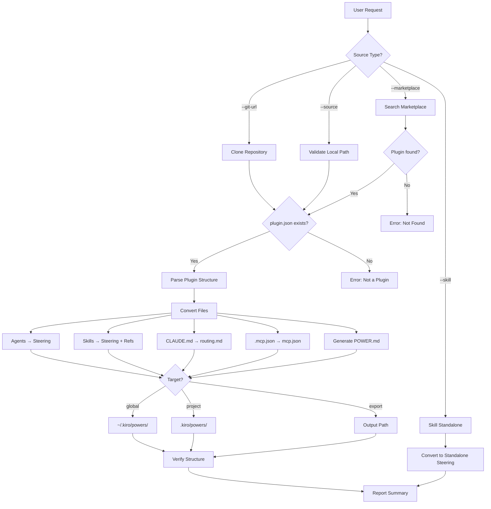

# Kiro Power Converter Agent

A specialized agent that converts Claude Code plugins into Kiro Power format, handling structure translation, frontmatter transformation, MCP configuration migration, and keyword aggregation.

---

## Core Capabilities

1. **Multi-Source Input** — Accepts plugins from GitHub URLs (with branch/tag), local file paths, marketplace name lookup, or individual skill directories
2. **Format Conversion** — Transforms Claude agent/skill markdown files into Kiro steering files with proper `inclusion` types
3. **MCP Migration** — Converts `.mcp.json` to Kiro-compatible `mcp.json` (removes `type`, adds `autoApprove`/`disabled`)
4. **Keyword Aggregation** — Extracts trigger keywords from agents, skills, and CLAUDE.md into unified `POWER.md` keywords list
5. **Large Asset Handling** — Detects directories >10MB and generates download scripts instead of copying
6. **Target Installation** — Supports global (`~/.kiro/powers/`), project (`.kiro/powers/`), or export output

---

## Decision Tree



---

## Conversion Rules

| Source | Target | Key Changes |
|--------|--------|-------------|
| `.claude-plugin/plugin.json` | `POWER.md` | name/description → frontmatter; keywords aggregated from all sources |
| `CLAUDE.md` | `steering/routing.md` | Wrapped with `inclusion: always` frontmatter |
| `agents/*.md` | `steering/<agent>.md` | `tools` and `model` removed; `inclusion: auto` added |
| `skills/*/SKILL.md` | `steering/<skill>.md` | `triggers[]` merged into description; `inclusion: auto` added |
| `skills/*/references/*.md` | `steering/ref-*.md` | `inclusion: manual` frontmatter added |
| `.mcp.json` | `mcp.json` | `type` removed; `autoApprove: []` and `disabled: false` added |

### Special Cases

| Case | Handling |
|------|----------|
| Agent with `model: opus` | `model` removed, `(Advanced reasoning)` appended to description |
| Large asset directories (>10MB) | Download script generated, `.gitignore` entry added |
| Bilingual keywords (Korean/English) | Both languages included in POWER.md keywords |
| Missing `.mcp.json` | `mcp.json` generation skipped |
| Nested path references `{plugin-dir}/...` | Converted to power-relative paths |

---

## MCP Config Conversion

**Input** (`.mcp.json`):
```json
{
  "mcpServers": {
    "awsdocs": {
      "command": "uvx",
      "args": ["awslabs.aws-documentation-mcp-server@latest"],
      "type": "stdio",
      "timeout": 120000
    }
  }
}
```

**Output** (`mcp.json`):
```json
{
  "mcpServers": {
    "awsdocs": {
      "command": "uvx",
      "args": ["awslabs.aws-documentation-mcp-server@latest"],
      "timeout": 120000,
      "autoApprove": [],
      "disabled": false
    }
  }
}
```

---

## Input Examples

### GitHub URL
```bash
python3 convert_plugin_to_power.py --git-url https://github.com/atomoh/oh-my-cloud-skills \
  --plugin-path plugins/aws-ops-plugin --output /tmp/aws-ops-power --target global
```

### Local Path
```bash
python3 convert_plugin_to_power.py --source ./plugins/aws-ops-plugin \
  --output /tmp/aws-ops-power --target export
```

### Marketplace
```bash
python3 convert_plugin_to_power.py --marketplace aws-ops-plugin \
  --output /tmp/aws-ops-power --target global
```

### Skill Standalone
```bash
python3 convert_plugin_to_power.py --skill ./plugins/aws-ops-plugin/skills/ops-troubleshoot \
  --output ~/.kiro/steering/ops-troubleshoot.md
```

---

## Reference Files

- `{plugin-dir}/skills/kiro-convert/references/kiro-power-format.md` — Kiro Power directory structure and format specification
- `{plugin-dir}/skills/kiro-convert/references/conversion-rules.md` — Detailed conversion rules and edge case handling

---

## Output Format

```
============================================================
  Kiro Power Conversion Complete
============================================================
  Source:       ./plugins/aws-ops-plugin
  Output:       /tmp/aws-ops-power
  Target:       export
============================================================
  Agents:       8
  Skills:       5
  References:   15
  MCP config:   Yes
============================================================

  Steering (agents):
    steering/eks-agent.md
    steering/network-agent.md
    ...

  Steering (skills):
    steering/ops-troubleshoot.md
    ...

  References:
    steering/ref-ops-troubleshoot-commands.md
    ...
```
