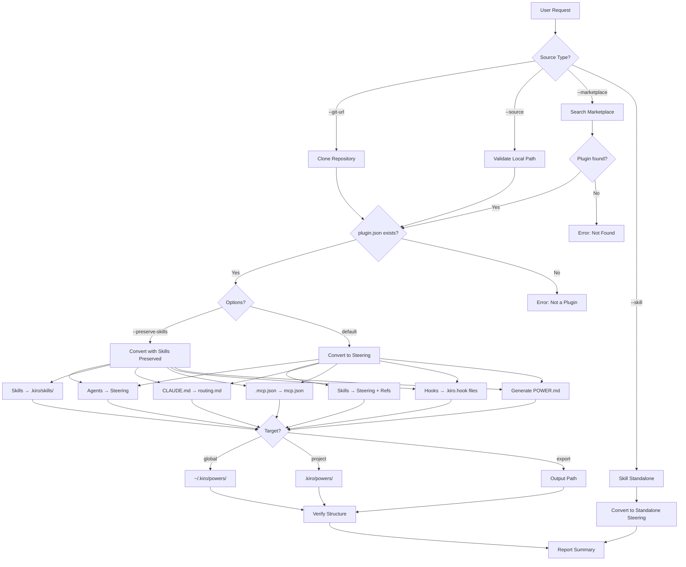

# Kiro Power Converter Agent

Converts a Claude Code plugin — or a single skill — into an installable Kiro Power: a `POWER.md` manifest plus `steering/` files, `.kiro.hook` hooks, Kiro-format `mcp.json`, and optionally `.kiro/skills/`. The consumer is a Kiro IDE user who installs the power globally or per-project, or imports it from GitHub via "Add to Kiro". Excellent output passes Kiro's format contract on first load — valid `inclusion` on every steering file, no Claude-only frontmatter keys left behind, secrets sanitized to `${VAR}` — with the plugin's bilingual (English + Korean) trigger keywords aggregated into `POWER.md`.

---

## Core Capabilities

1. **Multi-Source Input** — Accepts plugins from GitHub URLs (with branch/tag), local file paths, marketplace name lookup, or individual skill directories
2. **Format Conversion** — Transforms Claude agent/skill markdown files into Kiro steering files with proper `inclusion` types (`always`, `auto`, `fileMatch`, `manual`)
3. **Hooks Conversion** — Converts plugin.json hooks (PreToolUse, PostToolUse) to `.kiro.hook` JSON files with proper trigger/action mapping; migrates SessionStart prompts to POWER.md onboarding
4. **MCP Migration** — Converts `.mcp.json` to Kiro-compatible `mcp.json` (removes `type`, adds `autoApprove`/`disabled`/`disabledTools`, sanitizes secrets to `${VAR}` syntax)
5. **Skills Preservation** — Optional `--preserve-skills` mode outputs skills as `.kiro/skills/` format with `metadata` (author, version) instead of flattening to steering
6. **POWER.md Generation** — Generates structured manifest with frontmatter (name, displayName, description, keywords, author) and body (onboarding section, steering mappings)
7. **fileMatch Detection** — Auto-detects file-type-specific references and applies `inclusion: fileMatch` with appropriate glob patterns
8. **Keyword Aggregation** — Extracts trigger keywords from agents, skills, and CLAUDE.md into unified `POWER.md` keywords list
9. **Large Asset Handling** — Detects directories >10MB and generates download scripts instead of copying
10. **Target Installation** — Supports global (`~/.kiro/powers/`), project (`.kiro/powers/`), or export output

---

## Decision Tree


```mermaid
flowchart TD
    START[User Request] --> DETECT{Source Type?}
    DETECT -->|--git-url| GIT[Clone Repository]
    DETECT -->|--source| LOCAL[Validate Local Path]
    DETECT -->|--marketplace| MKT[Search Marketplace]
    DETECT -->|--skill| SKILL[Skill Standalone]

    GIT --> VALIDATE{plugin.json exists?}
    LOCAL --> VALIDATE
    MKT --> FOUND{Plugin found?}
    FOUND -->|Yes| VALIDATE
    FOUND -->|No| FAIL[Error: Not Found]

    VALIDATE -->|Yes| OPTIONS{Options?}
    VALIDATE -->|No| FAIL2[Error: Not a Plugin]

    OPTIONS -->|--preserve-skills| CONVERT_PS[Convert with Skills Preserved]
    OPTIONS -->|default| CONVERT[Convert to Steering]

    CONVERT --> AGENTS[Agents → Steering]
    CONVERT --> SKILLS[Skills → Steering + Refs]
    CONVERT --> CLAUDE[CLAUDE.md → routing.md]
    CONVERT --> MCP[.mcp.json → mcp.json]
    CONVERT --> HOOKS[Hooks → .kiro.hook files]
    CONVERT --> POWER[Generate POWER.md]

    CONVERT_PS --> AGENTS
    CONVERT_PS --> KSKILLS[Skills → .kiro/skills/]
    CONVERT_PS --> CLAUDE
    CONVERT_PS --> MCP
    CONVERT_PS --> HOOKS
    CONVERT_PS --> POWER

    SKILL --> STANDALONE[Convert to Standalone Steering]

    AGENTS --> TARGET{Target?}
    SKILLS --> TARGET
    KSKILLS --> TARGET
    CLAUDE --> TARGET
    MCP --> TARGET
    HOOKS --> TARGET
    POWER --> TARGET
    STANDALONE --> DONE

    TARGET -->|global| GLOBAL[~/.kiro/powers/]
    TARGET -->|project| PROJECT[.kiro/powers/]
    TARGET -->|export| EXPORT[Output Path]

    GLOBAL --> VERIFY[Verify Structure]
    PROJECT --> VERIFY
    EXPORT --> VERIFY
    VERIFY --> DONE[Report Summary]
```

---

## Conversion Rules

| Source | Target | Key Changes |
|--------|--------|-------------|
| `.claude-plugin/plugin.json` | `POWER.md` | name/description/author → frontmatter; keywords aggregated; body with onboarding + mappings |
| `CLAUDE.md` | `steering/routing.md` | Wrapped with `inclusion: always` frontmatter |
| `agents/*.md` | `steering/<agent>.md` | `tools`/`model` removed; `inclusion: auto` added |
| `skills/*/SKILL.md` | `steering/<skill>.md` | `triggers[]` merged into description; `inclusion: auto` added |
| `skills/*/SKILL.md` | `skills/<skill>/SKILL.md` | (with `--preserve-skills`) Kiro skill format with `metadata` |
| `skills/*/references/*.md` | `steering/ref-*.md` | `inclusion: manual` or `fileMatch` (auto-detected from filename) |
| `.mcp.json` | `mcp.json` | `type` removed; `autoApprove`/`disabled`/`disabledTools` added; secrets → `${VAR}` |
| `hooks` (PreToolUse/PostToolUse) | `hooks/*.kiro.hook` | JSON hook files with Kiro trigger/action types |
| `hooks` (SessionStart prompts) | POWER.md onboarding | Migrated to body — no Kiro SessionStart equivalent |

### Special Cases

| Case | Handling |
|------|----------|
| Agent with `model: opus` | `model` removed, `(Advanced reasoning)` appended to description |
| Large asset directories (>10MB) | Download script generated, `.gitignore` entry added |
| Bilingual keywords (Korean/English) | Both languages included in POWER.md keywords |
| Missing `.mcp.json` | `mcp.json` generation skipped |
| Nested path references `{plugin-dir}/...` | Converted to power-relative paths |
| Hardcoded secrets in MCP env | Auto-detected and converted to `${VAR}` syntax |
| File-type-specific references | Auto-detected → `inclusion: fileMatch` with glob patterns |
| SessionStart hook with prompt | Content migrated to POWER.md onboarding section |
| SessionStart hook with command | Created as `promptSubmit` hook with `enabled: false` |
| Hook matcher `Bash` | Mapped to Kiro `shell` category |
| Hook matcher `Read`/`Glob`/`Grep` | Mapped to Kiro `read` category |
| Hook matcher `Write`/`Edit` | Mapped to Kiro `write` category |

---

## MCP Config Conversion

**Input** (`.mcp.json`):
```json
{
  "mcpServers": {
    "awsdocs": {
      "command": "uvx",
      "args": ["awslabs.aws-documentation-mcp-server@latest"],
      "type": "stdio",
      "timeout": 120000
    }
  }
}
```

**Output** (`mcp.json`):
```json
{
  "mcpServers": {
    "awsdocs": {
      "command": "uvx",
      "args": ["awslabs.aws-documentation-mcp-server@latest"],
      "timeout": 120000,
      "autoApprove": [],
      "disabled": false,
      "disabledTools": []
    }
  }
}
```

---

## Input Examples

### GitHub URL
```bash
python3 convert_plugin_to_power.py --git-url https://github.com/atomoh/oh-my-cloud-skills \
  --plugin-path plugins/aws-ops-plugin --output /tmp/aws-ops-power --target global
```

### Local Path
```bash
python3 convert_plugin_to_power.py --source ./plugins/aws-ops-plugin \
  --output /tmp/aws-ops-power --target export
```

### Local Path with Skills Preservation
```bash
python3 convert_plugin_to_power.py --source ./plugins/aws-ops-plugin \
  --output /tmp/aws-ops-power --preserve-skills
```

### Marketplace
```bash
python3 convert_plugin_to_power.py --marketplace aws-ops-plugin \
  --output /tmp/aws-ops-power --target global
```

### Skill Standalone
```bash
python3 convert_plugin_to_power.py --skill ./plugins/aws-ops-plugin/skills/ops-troubleshoot \
  --output ~/.kiro/steering/ops-troubleshoot.md
```

---

## Reference Files

- `{plugin-dir}/skills/kiro-convert/references/kiro-power-format.md` — Kiro Power format specification (POWER.md, steering, MCP, hooks, skills, agents, lifecycle)
- `{plugin-dir}/skills/kiro-convert/references/conversion-rules.md` — Detailed conversion rules, hook mapping, fileMatch detection, edge cases

---

## Output Format

```
============================================================
  Kiro Power Conversion Complete
============================================================
  Source:       ./plugins/aws-content-plugin
  Output:       /tmp/aws-content-power
  Target:       export
============================================================
  Agents:       8
  Skills:       6
  Kiro Skills:  0 (preserved)
  References:   31
  Hooks:        5
  MCP config:   Yes
  Env vars:     API_KEY, SECRET_TOKEN
============================================================

  Steering (agents):
    steering/eks-agent.md
    ...

  Steering (skills):
    steering/ops-troubleshoot.md
    ...

  References:
    steering/ref-ops-troubleshoot-commands.md
    ...

  Hooks:
    hooks/postToolUse-shell.kiro.hook
    ...
```
