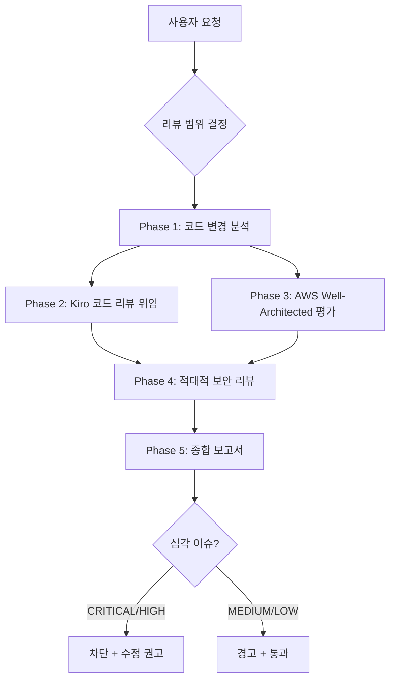

# Architecture Deep Review Skill

Kiro CLI를 활용한 종합 아키텍처 심층 리뷰. 다중 관점(일반 리뷰 + 적대적 보안 리뷰 + AWS Well-Architected)으로 코드와 인프라를 검증합니다.

## Prerequisites

이 스킬은 **Kiro CLI 바이너리**(`kiro-cli`, v2.5.0+ 기준)를 서브프로세스로 호출해 코드/보안 리뷰를 위임합니다. (kiro-cli-plugin 슬래시 커맨드 래퍼도 내부적으로 동일하게 `kiro-cli chat --no-interactive`를 사용합니다.)

```bash
# Kiro CLI 설치 및 headless 인증 확인
command -v kiro-cli >/dev/null 2>&1 && echo "kiro-cli installed" || echo "kiro-cli NOT installed"
[ -n "$KIRO_API_KEY" ] && echo "headless auth OK" || echo "KIRO_API_KEY not set (headless 불가)"
```

- 설치/사용법: https://kiro.dev/docs/cli/ — headless(비대화형) 호출은 `KIRO_API_KEY` 필요(Kiro Pro/Pro+/Power 구독).
- `kiro-cli`가 없거나 `KIRO_API_KEY` 미설정 시: Phase 1(코드 분석), Phase 3(Well-Architected), Phase 5(보고서)와 Phase 2/4의 **자체 패턴 스캔 폴백**으로 독립 실행됩니다.

---

## Review Workflow



---

## Phase 1: 코드 변경 분석

리뷰 대상 파악 및 변경 범위 분석.

```bash
# 현재 브랜치 변경사항 요약
git diff --stat main...HEAD 2>/dev/null || git diff --stat HEAD~5...HEAD

# 변경된 파일 목록 (타입별 분류)
git diff --name-only main...HEAD 2>/dev/null | sort | while read f; do
  ext="${f##*.}"
  echo "$ext: $f"
done | sort

# 변경 규모 파악
git diff --shortstat main...HEAD 2>/dev/null

# 최근 커밋 히스토리
git log --oneline main...HEAD 2>/dev/null || git log --oneline -10
```

### 변경 분류표

| 카테고리 | 파일 패턴 | 리뷰 초점 |
|----------|-----------|-----------|
| 인프라 | `*.tf`, `*.yaml`(CDK), `template.yaml` | Well-Architected 6 필러 |
| 백엔드 | `*.py`, `*.go`, `*.ts`, `*.java` | 로직, 에러 처리, 성능 |
| 프론트엔드 | `*.tsx`, `*.jsx`, `*.vue` | XSS, 접근성, 상태 관리 |
| 설정 | `Dockerfile`, `*.env*`, CI/CD | 시크릿 노출, 빌드 보안 |
| 데이터 | `migrations/`, `*.sql` | 스키마 안전성, 롤백 가능성 |

---

## Phase 2: Kiro 코드 리뷰 위임

Kiro CLI에 변경사항 리뷰를 위임합니다.

### Step 1: Kiro CLI 사용 가능 여부 확인

```bash
command -v kiro-cli >/dev/null 2>&1 && [ -n "$KIRO_API_KEY" ] && echo "AVAILABLE" || echo "NOT_AVAILABLE"
```

### Step 2: 일반 코드 리뷰 위임

**Kiro CLI 사용 가능 시**: `Bash`로 `kiro-cli`를 headless 호출하여 diff를 리뷰합니다.

```bash
# Capture the diff FIRST — a bad base ref must not silently pipe an EMPTY diff into
# the reviewer (a pipe returns kiro-cli's exit code, hiding git-diff failure → the
# agent would report a false "no issues" PASS on zero input).
DIFF=$(git diff main...HEAD 2>/dev/null); [ -z "$DIFF" ] && DIFF=$(git diff origin/main...HEAD 2>/dev/null)
if [ -z "$DIFF" ]; then echo "EMPTY DIFF — verify base ref; do NOT delegate (skip to Phase 1 scope/standalone)"; fi
printf '%s\n' "$DIFF" | kiro-cli chat --no-interactive --trust-tools=read,grep \
  "Review this code diff. Report findings as: [SEVERITY] file:line — description. Cover code quality (complexity, duplication, naming), error handling (missing catches, bad fallbacks), test coverage, and new-dependency license/security risks." \
  || echo "kiro-cli failed (auth/rate/unavailable) — fall back to Step 3 self pattern scan"
```

> **주의**: `kiro-cli:review`는 kiro-cli-plugin이 노출하는 **슬래시 커맨드**(스킬 아님)입니다. 자동 위임에는 위처럼 `kiro-cli chat --no-interactive`를 직접 호출하세요. 대화형 환경에서 래퍼를 쓰려면 사용자가 `/kiro-cli:review`를 실행합니다.

Kiro가 반환하는 리뷰 항목:
- 코드 품질 (복잡도, 중복, 네이밍)
- 에러 핸들링 (누락된 catch, 부적절한 fallback)
- 테스트 커버리지 (변경에 대응하는 테스트 존재 여부)
- 의존성 (새로 추가된 패키지의 라이선스/보안)

### Step 3: Kiro 미설치 시 대체 리뷰

Kiro CLI가 없으면 직접 분석 수행:

```bash
# TODO/FIXME/HACK 잔존 확인
git diff main...HEAD 2>/dev/null | grep -n "^\+" | grep -iE "TODO|FIXME|HACK|XXX"

# 하드코딩된 시크릿 패턴
git diff main...HEAD 2>/dev/null | grep -n "^\+" | grep -iE "(password|secret|api_key|token)\s*=\s*['\"]"

# 미사용 import 탐지
git diff main...HEAD 2>/dev/null | grep -n "^\+.*import " | head -20
```

---

## Phase 3: AWS Well-Architected 평가

변경사항이 인프라 코드를 포함할 경우 AWS Well-Architected Framework 6개 필러로 평가.

### 6 Pillars Checklist

#### 1. 운영 우수성 (Operational Excellence)
- [ ] IaC로 모든 리소스 관리 (수동 생성 없음)
- [ ] 모니터링/알람 설정 포함
- [ ] 롤백 전략 정의
- [ ] 운영 런북 업데이트

#### 2. 보안 (Security)
- [ ] 최소 권한 IAM 정책
- [ ] 전송 중/저장 시 암호화
- [ ] VPC 보안 그룹 최소 오픈
- [ ] 시크릿은 Secrets Manager/SSM 사용

#### 3. 안정성 (Reliability)
- [ ] 멀티 AZ 배포
- [ ] Auto Scaling 설정
- [ ] 헬스체크 구성
- [ ] 장애 복구 테스트 (DR)

#### 4. 성능 효율성 (Performance Efficiency)
- [ ] 적절한 인스턴스/서비스 타입 선택
- [ ] 캐싱 전략 (CloudFront, ElastiCache)
- [ ] 데이터베이스 인덱스/파티셔닝
- [ ] 비동기 처리 패턴 (SQS, EventBridge)

#### 5. 비용 최적화 (Cost Optimization)
- [ ] 리소스 사이징 적정성
- [ ] Savings Plans / Reserved Instance 고려
- [ ] 미사용 리소스 정리
- [ ] 비용 태깅 전략

#### 6. 지속 가능성 (Sustainability)
- [ ] Graviton 프로세서 활용
- [ ] 서버리스 우선 아키텍처
- [ ] 리소스 사용률 최적화
- [ ] 리전 선택 최적화

### 인프라 코드 자동 분석

```bash
# CDK/CloudFormation 파일 탐지
find . -name "*.tf" -o -name "cdk.json" -o -name "template.yaml" -o -name "template.json" 2>/dev/null | head -20

# Terraform: public 서브넷에 직접 노출된 리소스
grep -rn "map_public_ip_on_launch.*true\|associate_public_ip_address.*true" --include="*.tf" 2>/dev/null

# CloudFormation: 과도한 IAM 권한
grep -rn "Effect.*Allow.*Action.*\*\|Resource.*\*" --include="*.yaml" --include="*.json" 2>/dev/null | grep -i "policy"

# Dockerfile: root 사용자 실행
grep -rn "^USER root\|^FROM.*AS root" --include="Dockerfile*" 2>/dev/null
```

---

## Phase 4: 적대적 보안 리뷰 (Adversarial Security Review)

공격자 관점에서 변경사항을 검토합니다.

### Kiro 적대적 리뷰 위임

**Kiro CLI 사용 가능 시**: `Bash`로 적대적 보안 리뷰 프롬프트를 headless 호출합니다.

```bash
# Capture diff first (same empty-diff / pipe-exit-code guard as Phase 2).
DIFF=$(git diff main...HEAD 2>/dev/null); [ -z "$DIFF" ] && DIFF=$(git diff origin/main...HEAD 2>/dev/null)
[ -z "$DIFF" ] && echo "EMPTY DIFF — verify base ref before delegating"
printf '%s\n' "$DIFF" | kiro-cli chat --no-interactive --trust-tools=read,grep \
  "Perform an ADVERSARIAL security review from an attacker's perspective. Check: auth bypass / JWT validation, injection (SQL/command/XSS), privilege escalation (RBAC, horizontal/vertical), data exfiltration (secrets in logs/errors), supply-chain (unverified deps), misconfig (CORS, debug exposed). Report [SEVERITY] file:line — description." \
  || echo "kiro-cli failed — fall back to the adversarial checklist + auto-detection patterns below"
```

> kiro-cli-plugin 래퍼에서 적대적 리뷰는 별도 커맨드 `/kiro-cli:adversarial-review`입니다(대화형 사용 시). 자동 위임은 위 headless 호출을 사용합니다.

Kiro CLI를 쓸 수 없으면 아래 체크리스트와 자동 탐지 패턴으로 자체 수행합니다.

### 적대적 리뷰 체크리스트

| 공격 벡터 | 확인 항목 | 심각도 |
|-----------|-----------|--------|
| 인증 우회 | 인증 미들웨어 누락, JWT 검증 우회 | CRITICAL |
| 주입 공격 | SQL injection, Command injection, XSS | CRITICAL |
| 권한 상승 | RBAC 우회, 수평/수직 권한 상승 | HIGH |
| 데이터 유출 | 로그에 민감정보, 에러 메시지에 내부 정보 | HIGH |
| 서비스 거부 | 무제한 페이지네이션, 대용량 업로드 무제한 | MEDIUM |
| 공급망 공격 | 검증 안 된 의존성, typosquatting | HIGH |
| 설정 오류 | CORS 과도 허용, 디버그 모드 프로덕션 노출 | MEDIUM |

### 자동 탐지 패턴

```bash
# OWASP Top 10 패턴 탐지
git diff main...HEAD 2>/dev/null | grep -n "^\+" | grep -iE \
  "exec\(|innerHTML|\.raw\(|format\(.*%s|subprocess\.call" || true

# 하드코딩된 자격증명
git diff main...HEAD 2>/dev/null | grep -n "^\+" | grep -iE \
  "AKIA[0-9A-Z]{16}|BEGIN.*PRIVATE KEY" || true

# 비보안 통신
git diff main...HEAD 2>/dev/null | grep -n "^\+" | grep -iE \
  "http://[^l][^o][^c]|verify\s*=\s*False|InsecureRequestWarning|NODE_TLS_REJECT_UNAUTHORIZED" || true
```

---

## Phase 5: 종합 보고서

모든 Phase의 결과를 종합하여 보고서를 작성합니다.

### 보고서 형식

```markdown
# Architecture Deep Review Report

## Summary
- **Review Date**: [timestamp]
- **Branch**: [branch name]
- **Changes**: [N files changed, +additions, -deletions]
- **Overall Risk**: CRITICAL / HIGH / MEDIUM / LOW
- **Kiro Review**: Delegated / Standalone

## Findings

| # | Phase | Severity | Category | Finding | Recommendation |
|---|-------|----------|----------|---------|----------------|
| 1 | Code Review | CRITICAL | Security | [Finding] | [Fix] |
| 2 | Well-Architected | HIGH | Cost | [Finding] | [Fix] |
| 3 | Adversarial | MEDIUM | Auth | [Finding] | [Fix] |

## Well-Architected Score

| Pillar | Score | Status |
|--------|-------|--------|
| Operational Excellence | 4/5 | PASS |
| Security | 3/5 | REVIEW |
| Reliability | 5/5 | PASS |
| Performance Efficiency | 4/5 | PASS |
| Cost Optimization | 2/5 | FAIL |
| Sustainability | 3/5 | REVIEW |

## Decision

| Verdict | Condition |
|---------|-----------|
| PASS | CRITICAL=0, HIGH<=2 |
| REVIEW | HIGH>=3 or any CRITICAL with mitigation plan |
| FAIL | Any CRITICAL without mitigation |

## Action Items
- [ ] [Priority action 1]
- [ ] [Priority action 2]
```

### 심각도 판정 기준

| 심각도 | 정의 | 대응 |
|--------|------|------|
| CRITICAL | 즉시 수정 필수 (보안 취약점, 데이터 유실 위험) | 머지 차단 |
| HIGH | 릴리스 전 수정 권고 | 리뷰 필요 |
| MEDIUM | 개선 권고 (기술 부채) | 백로그 등록 |
| LOW | 참고 사항 (스타일, 네이밍) | 선택적 수정 |

---

## Spec-Driven Development Integration

Kiro의 Spec-driven 개발 기능과 연계하여 요구사항부터 검증합니다.

> **위임**: `Bash`로 `kiro-cli chat --no-interactive "<spec 요청>"`을 호출합니다(또는 대화형에서 래퍼 커맨드 `/kiro-cli:spec`). `kiro-cli:spec`은 스킬이 아니라 슬래시 커맨드입니다.

EARS(Easy Approach to Requirements Syntax) 기반:
1. **요구사항 정의** -> EARS 형식으로 구조화
2. **아키텍처 설계** -> 요구사항에서 컴포넌트 도출
3. **구현 태스크** -> 설계에서 태스크 자동 생성
4. **추적성** -> 요구사항 <-> 설계 <-> 구현 매핑

---

## References

- `references/architecture-review-framework.md` -- 리뷰 프레임워크, 심각도 기준, 판정 로직
- `references/aws-well-architected.md` -- AWS Well-Architected 6 필러 상세 체크리스트
- `references/kiro-cli-integration.md` -- Kiro CLI 연동 가이드, 명령어 레퍼런스
