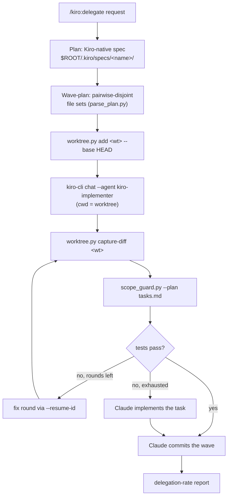

# kiro-delegate — Cost-Savings Implementation Delegation

Claude plans, decomposes, and verifies; **Kiro CLI writes the code**, running on its own
flat-rate subscription credits instead of this session's token budget. The output is
committed, tested code on the main tree plus a delegation-rate report showing what Kiro
finished vs. what Claude had to take over. Excellent means every task ends in exactly one
of those two buckets — never a silent skip — and nothing outside the plan's declared file
set ever lands. Kiro is chosen because it's cheaper for the work, not for a second
opinion (that's `co-agent`).

Trigger note: this skill owns *implementation*-delegation phrasings only. Review
phrasings live on the separate `/kiro:review` command (which never loads this
write-capable skill), and informational phrasings ("kiro credits") are deliberately
absent — a question about the plugin shouldn't load a pipeline that commits. The trigger
set here, in `agents/kiro-delegate-agent.md`'s description, and in
`plugins/kiro/CLAUDE.md`'s tables is one canonical set: change one, change all three.

The step-by-step pipeline (preflight, symlink refusals, per-wave commits) is owned by
`agents/kiro-delegate-agent.md` — this file routes intent and grounds the mechanics.

## Pipeline at a glance



## Commands

| Command | Purpose |
|---------|---------|
| `/kiro:setup` | Detect `kiro-cli`, probe real usability, list available models, write `.kiro/agents/{kiro-implementer,kiro-reviewer}.json`, set `default_delegate`/`review.on_commit` |
| `/kiro:delegate <request>` | Plan → spec → Kiro implements per task → Claude verifies + commits → delegation-rate report |
| `/kiro:review [paths...]` | Run the same Kiro-powered review the pre-commit hook runs, on demand (default: staged changes) |
| `/kiro:configure` | Inspect/change `default_delegate`, delegate/review models + `effort` (kiro-cli `--effort`; delegate `low`, review `high`), `parallel_tasks`, `max_fix_rounds`, `review.on_commit`, `review.on_push`, `review.block`, `review.push_block` |

Size tasks to finish inside `delegate.timeout` in one Kiro call — a multi-layer task
handed off whole dies mid-write with nothing captured, which looks like a broken CLI but
is a sizing problem. Decomposition rules: `references/spec-format.md` → "Task sizing".

## The mechanics that make it enforceable

Isolation and scoping are scripts, not prose (`worktree.py`/`scope_guard.py`/
`parse_plan.py` are verbatim copies of co-agent's — same mechanics, different
implementer CLI). Per task, with `SK` = this skill's `scripts/` dir:

```bash
python3 "$SK/worktree.py" add "$wt" --base HEAD          # isolated checkout of HEAD
# ... Kiro implements with cwd = $wt ...
python3 "$SK/worktree.py" capture-diff "$wt"             # diff of $wt against its base SHA
python3 "$SK/scope_guard.py" --plan "$ROOT/.kiro/specs/$name/tasks.md" -- <path> [<path>...]
python3 "$SK/worktree.py" remove "$wt"                   # after the wave commits
```

The implementer call uses one fixed instruction sentence for every task (canon:
`references/kiro-headless.md` → "Implement (write-mode)"); the actual task text lives in
`$wt/.kiro/task-prompt.md`, which Kiro `fs_read`s itself — task/spec-derived text never
enters argv, where a `$(...)` or backtick would execute on the host shell first:

```bash
# launch in a BACKGROUND Bash and tail the log between polls — a foreground call blocks
# the Bash tool for up to delegate.timeout per task
cd "$wt" && kiro-cli chat \
  "Read .kiro/task-prompt.md via fs_read — it has your task and any spec file pointers — then implement exactly what it describes. Do not touch files outside the task's declared file set." \
  --mode default --no-interactive --wrap never --require-mcp-startup --agent kiro-implementer \
  > "/tmp/kiro-delegate-$task.log" 2>&1        # a pipe severs kiro's auth callback; redirect to a file
```

Fix rounds resume the same Kiro session instead of restarting it:

```bash
python3 "$SK/kiro_run.py" session-id "$wt"   # newest sessionId for that cwd; exit 1 = none
# rewrite $wt/.kiro/task-prompt.md to hold only the failing test output, then:
#   kiro-cli chat "<same fixed sentence>" --resume-id <id> ...
python3 "$SK/kiro_run.py" credits /tmp/kiro-delegate-*.log   # sums 'Credits: <n>' footers for the report
```

## What "safe" means here — and what it doesn't

`co-agent:harness` refuses Kiro as an implementer (`SANDBOX_IMPLEMENTERS = codex, agy`
only) because Kiro has no cwd-confined write sandbox. This plugin narrows the claim
instead of pretending the sandbox exists: **only a change captured from inside the
assigned worktree, and within the plan's declared file set, can ever reach the main
tree** — enforced by `worktree.py capture-diff` + `scope_guard.py` (the latter checks
the plan-wide union of every task's files; per-task boundaries during a wave come from
disjoint file sets, not from the script). Kiro never commits, and an unscoped or
uncaptured patch is never applied. What this does **not** constrain: a granted
`execute_bash` call's host-side side effects (reading credentials, deleting files
outside the worktree, network calls) — trusting `kiro-cli` with a shell is a separate
decision about that CLI itself. See `plugins/kiro/CLAUDE.md` → "Trust decision" before
enabling `default_delegate`.

## Opt-in review hooks — enabling IS the consent

Both hooks are **off by default** because they send diff content to Kiro's backend;
turning one on is a deliberate consent to that egress.

- **Pre-commit** (`review.on_commit`): reviews the staged diff before every `git
  commit`; blocks (exit 2) only on findings at/above `review.block`. **Fails open** —
  a missing/timed-out/unauthenticated Kiro never wedges a commit.
- **Pre-push** (`review.on_push`, separate consent key): fans the push range
  (`@{upstream}...HEAD`, trunk merge-base fallback) across three parallel narrowed
  lenses — correctness, security, scope — because three narrow passes catch more than
  one broad one. Blocks at/above `review.push_block`; a `critical` finding is a plain
  `BLOCKED`, a `warning`-only set is framed `CHAIR JUDGMENT REQUIRED` for whoever chairs
  the session to judge. Enabling warns if co-agent's `push_gate` is also on (two
  independent gates per push).

Guard contract for both: the plugin-generated `kiro-reviewer` agent confines `fs_read`
to an isolated temp dir holding only the diff, so a prompt-injection payload in an
untrusted diff can't read an unrelated path; if that agent file is missing or tampered,
`kiro_review.py` **skips the review entirely** rather than falling back unguarded —
for the hook and the manual `/kiro:review` alike. Only an explicit `--allow-unguarded`,
gated behind an `AskUserQuestion` in `commands/review.md`, overrides the skip. Bypass a
single commit/push with an **inline** `KIRO_REVIEW=off git commit ...` /
`KIRO_REVIEW=off git push ...` prefix — the hook recognizes the literal prefix in the
command text (its own environment never sees a same-line assignment, and shell state
doesn't persist between Bash tool calls, so `export` doesn't work as a bypass).

## Model + effort tiering

| Setting | Default | Why |
|---------|---------|-----|
| `delegate.model` / `delegate.effort` | CLI-routed / `low` | Flat-rate credits — no per-token trade-off; the spec is already written, so applying it is mechanical. Raise effort only if tasks keep exhausting the fix loop (a wall-clock signal) |
| `review.model` / `review.effort` | CLI-routed until set (setup recommends the strongest listed, e.g. `gpt-5.6-sol`) / `high` | The blocking verdict IS the product — the safety net shouldn't be the weak link. Applies to the commit pass and each push lens |

Full tiering rationale and the measured kiro-cli flag surface:
`references/kiro-headless.md`.

## Output: the delegation report

`/kiro:delegate` ends with a report the user reads to judge whether delegation paid off:

- **Delegation rate** — tasks Kiro completed vs. tasks Claude took over (each fallback
  named, with why the fix loop was exhausted).
- **Credits spent** — `kiro_run.py credits` over the run's logs; omitted entirely when
  the script exits 1 (best-effort by contract — never a guessed figure).
- **Spec location** — `$ROOT/.kiro/specs/<name>/` with `tasks.md` checkboxes ticked, so
  the user can continue remaining work natively in Kiro IDE if they want.

## References

- `references/kiro-headless.md` — CLI invocation, auth, trust boundary, model tiering
- `references/spec-format.md` — Kiro spec structure + `tasks.md` format the scripts parse
- `scripts/worktree.py`, `scripts/scope_guard.py`, `scripts/parse_plan.py` — copied
  verbatim from co-agent (the isolation/scoping mechanics are identical; only the
  implementer CLI differs)
- `scripts/kiro_config.py` — layered settings (`kiro.defaults.json` ← `.claude/kiro.local.json`,
  gitignored by convention; if a consumer repo commits it anyway, its
  `default_delegate`/`review.on_commit`/`review.on_push` values are ignored and fall
  back to off — a committed file can't silently opt an installing user into diff
  egress or auto-delegation)
- `scripts/kiro_review.py` — the Kiro-run review used by `/kiro:review` and the hooks
- `scripts/kiro_setup.py` — probe, model listing, `.kiro/agents/*.json` generation
- `scripts/kiro_run.py` — per-run telemetry: `session-id <wt>` for `--resume-id`
  fix-round chaining, `credits <log>...` for the delegation report
